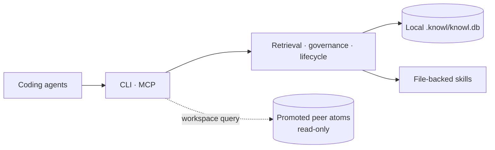

<div align="center">


<br/>

**Local-first, structured project memory for AI coding agents.**

[](https://www.npmjs.com/package/@dat999zx/knowl)
[](LICENSE)
[](package.json)
[](https://modelcontextprotocol.io)
[](#local-data)

[Quick start](#quick-start) ·
[Workspaces](#workspaces) ·
[How it works](#how-it-works) ·
[Benchmarks](#benchmarks) ·
[CLI](#cli-reference) ·
[MCP](#mcp-tools-and-resources)

</div>

---

## Overview

Knowl gives coding agents durable engineering context across sessions. It stores decisions,
architecture, goals, constraints, facts, current state, and reusable skills as structured
knowledge atoms in a repository-local SQLite database under `.knowl/`.

Agents access the same governed memory through the `knowl` CLI or the Model Context Protocol
(MCP). Items carry status, freshness, confidence, tags, history, and optional evidence pointing
to files, commits, tests, commands, URLs, or indexed symbols. Core storage and retrieval do not
require an external AI provider.

Knowl 2.5 also links related repositories into a workspace. Each repository keeps its own
database and ownership boundary; only explicitly promoted knowledge is visible to peers.

## Quick start

Requires Node.js 22 or later.

```bash
npm install -g @dat999zx/knowl
cd your-project
knowl init
```

`knowl init` creates or upgrades `.knowl/`, initializes the database, installs the project
guidance files, updates `.gitignore`, and offers MCP and lifecycle setup for detected agents.
It also prepares the local embedding model on a best-effort basis. If the model is unavailable,
setup still completes and retrieval falls back to BM25.

Record a decision:

```bash
knowl decide "Use SQLite" "Use SQLite for local project memory." \
  --reasoning "Keeps storage repository-local and simple to operate." \
  --alternatives PostgreSQL MongoDB \
  --tags database local-first
```

Inspect and query the project memory:

```bash
knowl status
knowl state
knowl query "why sqlite"
knowl doctor
```

## Workspaces

Workspaces let an agent query promoted knowledge across related repositories without merging
their databases.

```bash
# Create a machine-local workspace.
knowl workspace init product

# Run inside each repository that should join it.
knowl workspace add product
knowl workspace status

# Preview, then promote selected local knowledge.
knowl workspace promote --category decision
knowl workspace promote --category decision --apply
```

For another checkout or machine, copy the workspace manifest and join from each repository:

```bash
knowl workspace join /path/to/workspace.json --name api
```

The shipped workspace commands are:

| Command | Purpose |
| --- | --- |
| `knowl workspace init <name>` | Create a workspace outside its member repositories |
| `knowl workspace add <name> [--name <repo-name>]` | Link the current repository |
| `knowl workspace join <manifest> [--name <repo-name>]` | Adopt a copied manifest and map this checkout |
| `knowl workspace list` | List workspaces known to this machine |
| `knowl workspace status [--verbose]` | Show this repository's membership and peer health |
| `knowl workspace remove <repo-name> [--export-first]` | Unlink the current repository and retire its workspace name |
| `knowl workspace promote (--category <list> \| --id <id...>) [--apply]` | Preview or publish selected locally owned atoms |

Knowledge remains repository-private until it is promoted. Federated query results include a
`repo` field naming the repository that owns each item. Peer items are read-only from the current
repository; update them from their owning repository. Code-symbol indexing and `symbol://`
evidence resolution remain repository-local.

## How it works



1. **Retrieve first.** An agent queries focused project memory before re-reading the repository.
2. **Verify when needed.** A miss, conflict, or stale/low-confidence result sends the agent to
   repository evidence.
3. **Write governed memory.** Durable findings are validated, deduplicated, and recorded with
   knowledge-commit history. Superseded and rejected items stay available to history without
   appearing as active answers.
4. **Resume with context.** Lifecycle hooks, task checkpoints, and bounded session events carry
   useful state across agent turns and sessions.

The CLI and MCP adapters share the same storage and retrieval services. Structured writes pass
secret, sensitive-path, and size validation before reaching the database.

### Local vector search

Local vector search is enabled by default and combined with BM25 retrieval. `knowl init` prepares
the embedding model without making setup depend on a successful download:

- Offline setup continues with BM25.
- New writes are embedded when the model is already cached; write-time embedding never downloads
  the model or fails the write.
- `knowl reindex --vectors` prepares the model and backfills embeddings for existing atoms.

After upgrading an existing project, run `knowl reindex --vectors` once to cover knowledge written
before vector indexing was available.

## Current capabilities

| Area | What is available |
| --- | --- |
| Structured memory | Seven atom categories, status, freshness, confidence, tags, immutable assertions, and knowledge commits |
| Retrieval | Local vector-first ranking with BM25 fallback, exact-identifier support, `--as-of` history, and token-budgeted context packs |
| Governance | Explicit decisions, alternatives, supersession, conflict identities, rejected-state filtering, and evidence-backed updates |
| Agent lifecycle | Automatic host hooks plus manual task loops, checkpoints, session recovery, and subagent context |
| Provenance | File, commit, test, command, URL, and Tree-sitter TS/JS `symbol://` evidence |
| Learned skills | File-backed `SKILL.md` packages with inspected, named entrypoints |
| Operations | Export/import, snapshots, integrity audit, access reporting, PR drift checks, and preview-before-apply GC |
| Inspection | Status and doctor reports plus a read-only graph viewer on `127.0.0.1` |

### Local viewer

Run `knowl view` to inspect atoms, relationships, evidence, freshness, and history without changing
the database.

<p align="center">
  
  
</p>

## Agent setup

`knowl init` detects Codex, Claude Code, Cursor, Gemini CLI, and Claude Desktop. Run it
interactively or name the integrations explicitly:

```bash
knowl init
knowl init codex claude cursor gemini claude-desktop
knowl doctor
```

`KNOWL.md` contains the canonical workflow. `AGENTS.md` receives a synchronized managed section;
`CLAUDE.md` imports `@KNOWL.md`, and `GEMINI.md` imports `@./KNOWL.md`. For Claude Code, the
installed prompt hook invokes `knowl agent-reminder claude --json`. Existing unrelated MCP
servers and host rules are preserved, and changed configuration files are backed up.

Start a new agent session after setup. Re-run `knowl init` after an upgrade that adds lifecycle
events so host registrations and managed guidance are refreshed; database migrations apply when
Knowl next opens the project.

## Benchmarks

The two suites below answer different questions. MemoryAgentBench is an external dataset used for
a controlled governance ablation. The retrieval suite is an internal repository regression suite.

### MemoryAgentBench Conflict Resolution

[MemoryAgentBench](https://github.com/HUST-AI-HYZ/MemoryAgentBench)
([ICLR 2026 paper](https://arxiv.org/abs/2507.05257)) defines a Conflict Resolution track for
retrieving the newest valid fact after updates. Knowl's run uses the checked-in
`factconsolidation_sh_6k` instance: 455 facts, 100 questions, top-*k* 5, and vector+BM25
retrieval.

<div align="center">

</div>

| Configuration | Top-1 accuracy | Stale returns | Active atoms after ingest |
| --- | ---: | ---: | ---: |
| **Supersession ON** | **96.0%** | **3 / 100** | 306 |
| Supersession OFF | 40.0% | 62 / 100 | 455 |

With supersession enabled, 149 of the 455 facts were retired at write time. The two rows otherwise
use the same corpus, retrieval path, and metric. No LLM reader is used, so this is a
retrieval-level ablation, not an end-to-end leaderboard.

See the [protocol and interpretation](docs/evals/memoryagentbench-cr.md) and the raw
[supersession-ON](benchmarks/memoryagentbench/results/cr-sh-6k-supersede-on.json) and
[supersession-OFF](benchmarks/memoryagentbench/results/cr-sh-6k-supersede-off.json) results.

Reproduce from a source checkout with the repository-only benchmark harness:

```bash
npm run bench:cr -- fetch --row 4
npm run bench:cr -- run --instance benchmarks/memoryagentbench/data/cr-sh-6k.json --top-k 5
npm run bench:cr -- run --instance benchmarks/memoryagentbench/data/cr-sh-6k.json --top-k 5 --no-supersede
```

These `npm run bench:cr -- ...` commands are repository scripts, not published `knowl` CLI
commands.

### Internal retrieval regression suite

The checked-in [`retrieval-suite.json`](docs/evals/retrieval-suite.json) contains 500 cases over
168 atoms. It is maintained as a repository regression suite, not third-party evidence.

<div align="center">

</div>

| Recall@3 | Recall@10 | MRR | nDCG | Misses |
| ---: | ---: | ---: | ---: | ---: |
| 98.9% | 99.4% | 96.1% | 96.9% | 8 / 500 |

```bash
knowl eval retrieval --dataset docs/evals/retrieval-suite.json --vector --json
```

The checked-in performance commit `2cc8cd1` kept Recall@10 at 99.4%, MRR at 96.1%, and the
same eight misses while reducing p50 latency
from 57 ms to 26 ms and p95 from 67 ms to 31 ms in that run. Latency depends on hardware,
model cache state, and corpus; rerun the suite for a local measurement.

## CLI reference

### Project and status

| Command | Description |
| --- | --- |
| `knowl init [agents...]` | Initialize or upgrade the project and configure selected agents |
| `knowl upgrade` | Refresh project files, schema, guidance, and `.gitignore` without agent setup |
| `knowl status` | Show repository, memory, AI, commit, and workspace status |
| `knowl doctor` | Check project, vector coverage, agent, and workspace readiness |
| `knowl state` | Print the full active hierarchical project memory |
| `knowl audit` | Run a read-only integrity audit |

### Workspaces

| Command | Description |
| --- | --- |
| `knowl workspace init <name>` | Create a workspace |
| `knowl workspace add <name> [--name <repo-name>] [--force]` | Link the current repository |
| `knowl workspace join <manifest> [--name <repo-name>]` | Join from a copied manifest |
| `knowl workspace list` | List machine-local workspaces |
| `knowl workspace status [--verbose]` | Show membership and resolved peers |
| `knowl workspace remove <repo-name> [--export-first]` | Unlink the current repository |
| `knowl workspace promote (--category <list> \| --id <id...>) [--apply]` | Preview or promote locally owned knowledge |

### Memory and retrieval

| Command | Description |
| --- | --- |
| `knowl decide [title] [content]` | Record a decision, reasoning, alternatives, and tags |
| `knowl query [query] [--as-of <timestamp>] [--limit <count>]` | Query current or historical memory; search text is optional |
| `knowl timeline <item-id>` | Print immutable assertions for one item |
| `knowl conflicts` | List active exclusive conflict identities |
| `knowl supersede <item-id> <replacement-id>` | Retire one item in favor of its replacement |
| `knowl evidence list <item-id>` | List evidence and symbol staleness for an item |
| `knowl context --token-budget <n> [--query <query>] [--task <task>]` | Compose a bounded context pack |
| `knowl eval retrieval --dataset <path> [--vector] [--json]` | Run a retrieval dataset; `--vector` enables vector+BM25 evaluation |
| `knowl access report [--json]` | Report highly used, stale, and correction-causing knowledge |

### Work loops and sessions

| Command | Description |
| --- | --- |
| `knowl task start <title> [-q <query>]` | Start a manual work loop with a focused lookup |
| `knowl task checkpoint <task-id> <summary> [options]` | Store resumable progress, blockers, artifacts, and verification state |
| `knowl task finish <task-id> <summary>` | Finish a manual work loop |
| `knowl task run <title> -- <command...>` | Wrap one bounded command in a work loop |
| `knowl session start\|event\|finish\|recover` | Manage bounded, expiring session scratch and recovery |

### Skills, code, and optional AI

| Command | Description |
| --- | --- |
| `knowl skill list\|read\|create\|run` | Manage file-backed learned skills and their entrypoints |
| `knowl code index` | Incrementally index TS/JS symbols and import/export edges |
| `knowl code symbols <path>` | Print indexed symbols for one repository-relative file |
| `knowl synthesize --scope <path-or-tag>` | Create or refresh one scoped evidence-backed understanding |
| `knowl ask <question>` | Ask a natural-language question using configured AI |
| `knowl ingest <text>` | Extract and merge knowledge from explicitly supplied text using configured AI |

### Data, maintenance, and serving

| Command | Description |
| --- | --- |
| `knowl export <path>` | Write portable, manifest-verified JSONL |
| `knowl import <path> [--dry-run] [--on-divergence newer\|skip\|theirs\|fail]` | Import JSONL with an explicit divergence policy |
| `knowl snapshot create` / `knowl snapshot restore <path> --confirm` | Create or restore a verified SQLite snapshot |
| `knowl config` / `get <key>` / `set <key> <value>` / `reset [key]` | Edit configuration interactively or from scripts |
| `knowl reindex --vectors` | Prepare the local model and backfill existing vector embeddings |
| `knowl gc [--apply] [--stale-days N] [--compress-days N] [--min-bytes N] [--ignore-access] [--tombstone-days N]` | Preview or apply archive, compression, and tombstone cleanup |
| `knowl pr check --since <commit> [--dry-run]` | Find evidence tied to changed files and mark affected knowledge for review |
| `knowl view [--port <port>]` | Start the read-only local viewer |
| `knowl serve` | Start the stdio MCP server |
| `knowl agent-event\|agent-hook\|agent-reminder` | Host-integration commands used by installed lifecycle configuration |

## MCP tools and resources

Run `knowl serve` to expose Knowl over stdio MCP. The recommended agent flow is:

1. Use lifecycle bootstrap context when available; otherwise use `knowl_recent`.
2. Call `knowl_query` with two to six focused keywords before inspecting repository files.
3. Verify misses, conflicts, or stale results against the repository.
4. Store verified durable findings and update contradicted memory promptly.
5. Use the manual task tools only when verified lifecycle hooks are unavailable.

### Tools

Knowl exposes exactly 24 MCP tools:

| Tool | Purpose |
| --- | --- |
| `knowl_query` | Focused retrieval before files and before each new subtask or project area |
| `knowl_recent` | Compact recent context when lifecycle bootstrap is unavailable or a refresh is needed |
| `knowl_state` | Broad active-memory status or full-state summary |
| `knowl_context` | Compose an explicitly token-budgeted context pack |
| `knowl_task_start` | Start one manual work loop when verified lifecycle hooks are unavailable |
| `knowl_task_checkpoint` | Checkpoint meaningful manual-loop progress or blockers |
| `knowl_task_finish` | Finish one manual work loop after verification |
| `knowl_store` | Store one concise structured atom |
| `knowl_ingest_atoms` | Batch-store client-extracted atoms |
| `knowl_decide` | Record a confirmed decision and reasoning |
| `knowl_update` | Correct or supersede stale or contradicted memory |
| `knowl_timeline` | Inspect one item's immutable assertion history |
| `knowl_evidence_list` | Inspect evidence linked to one item |
| `knowl_conflicts` | Inspect active exclusive conflict identities |
| `knowl_feedback` | Record usefulness or correction feedback after an item is used |
| `knowl_skill_list` | List learned file-backed skills |
| `knowl_skill_read` | Inspect one learned skill before running it |
| `knowl_skill_run` | Run a trusted learned-skill entrypoint |
| `knowl_skill_create` | Create a learned skill when explicitly requested |
| `knowl_ingest` | Process explicitly supplied raw source through configured AI |
| `knowl_synthesize` | Create or refresh one explicitly scoped understanding |
| `knowl_session_finish` | Finish an explicitly owned manual memory session |
| `knowl_gc_preview` | Preview duplicate, stale, or cold-memory maintenance |
| `knowl_gc_apply` | Apply previewed maintenance after explicit approval |

### Readable resources

| Resource | Purpose |
| --- | --- |
| `knowl://recent` | Compact recent session context |
| `knowl://brain` | Full active project memory |
| `knowl://category/<name>` | Active atoms for a category such as `decision`, `architecture`, or `state` |

`Auth: Unsupported` is expected for this local stdio server and does not indicate that the tools
are unavailable.

## Optional AI

Structured MCP tools, CLI memory operations, and local vector retrieval work without an AI API
key. Configure an AI provider only for `knowl ask`, `knowl ingest`, MCP `knowl_ingest`, and
AI-assisted decision-conflict handling. Supported providers are `openai`, `anthropic`, `ollama`,
and `custom`.

```bash
knowl config set ai.provider openai
knowl config set ai.model your-model
knowl config set ai.apiKey '${OPENAI_API_KEY}'
```

Environment-variable placeholders are resolved at runtime. Ollama can be configured without an
API key; a custom OpenAI-compatible provider also accepts `ai.baseUrl`.

## Local data

Knowl keeps project data under `.knowl/`, which `knowl init` adds to `.gitignore` by default:

- `.knowl/config.json` — project, search, security, AI, and optional workspace configuration.
- `.knowl/knowl.db` — atoms, assertions, knowledge commits, FTS data, access feedback, and
  optional embeddings.
- `.knowl/skills/` — file-backed learned-skill packages.

Workspace manifests live outside member repositories because their checkout paths are
machine-local. Portable JSONL exports and snapshots are created only when requested.

## License

Knowl is licensed under the [Apache License 2.0](LICENSE). Apache-2.0 does not grant trademark
rights.
