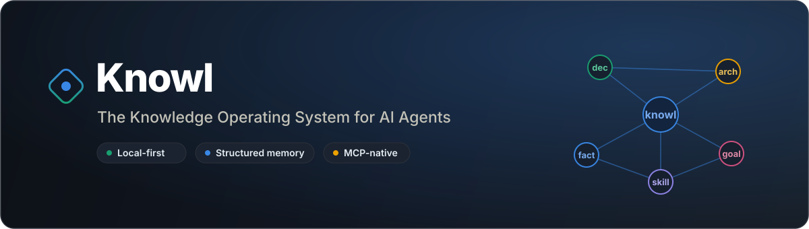
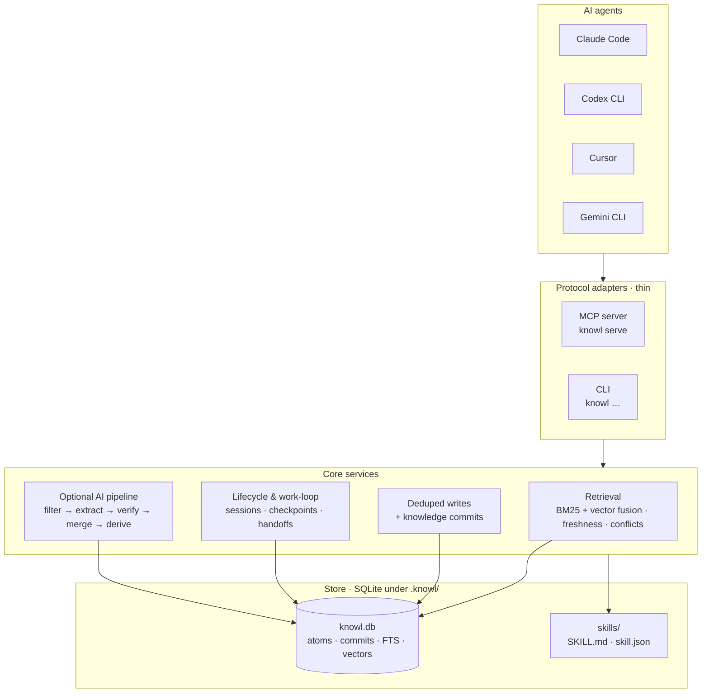
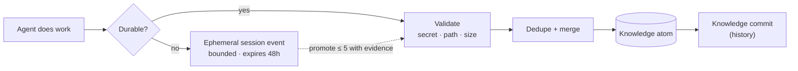
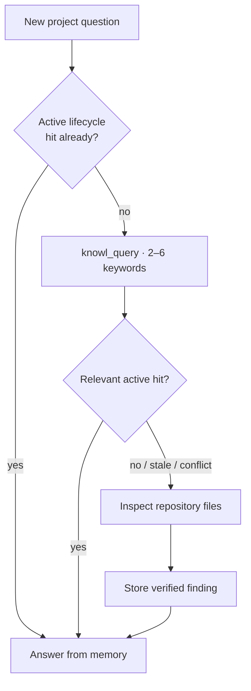
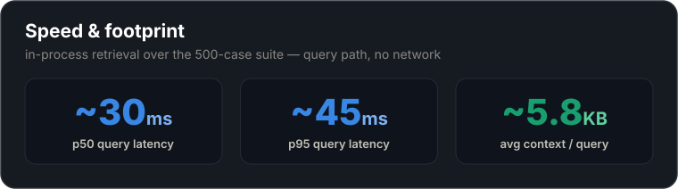
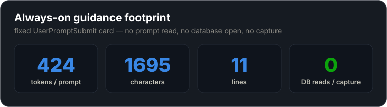

<div align="center">



<br/>

**Durable, local-first project memory for AI coding agents — structured, queryable, and governed.**

[](https://www.npmjs.com/package/@dat999zx/knowl)
[](LICENSE)
[](package.json)
[](https://modelcontextprotocol.io)
[](#-local-data)

[Quick start](#-quick-start) ·
[Features](#-features-in-depth) ·
[Benchmarks](#-benchmarks) ·
[MCP tools](#-mcp-tools--resources) ·
[CLI](#-cli-reference)

</div>

---

## What is Knowl?

Knowl gives an AI coding agent **durable project memory** without shipping that memory to a hosted service by default. It stores structured **knowledge atoms** — decisions, architecture, goals, constraints, facts, current state, and reusable skills — in a per-project SQLite database under `.knowl/`, exposes them through a CLI, and serves them over the **Model Context Protocol (MCP)** so agents such as Claude Code, Codex, Cursor, and Gemini can retrieve and update project context while they work.

The point is *continuity*. A new agent session should answer "why did we pick SQLite?" or "what's the auth architecture?" from memory in milliseconds — instead of re-reading the repository every time. Knowl is built for durable engineering context, **not** for archiving raw chat logs.

```bash
npm install -g @dat999zx/knowl
cd your-project && knowl init
```

> **Local-first by design.** Structured MCP memory works with **zero API keys**. AI providers are optional and only power a couple of natural-language commands.

---

## Why Knowl?

| Without project memory | With Knowl |
| --- | --- |
| Every new session re-reads files to rebuild context | Agents answer stable questions from memory first |
| "Why did we do X?" is lost when the chat ends | Decisions, reasoning, and alternatives are durable atoms |
| Superseded/rejected choices resurface as if current | Freshness, conflicts, and `rejected` status keep memory honest |
| Memory lives in a vendor cloud | Memory lives in your repo's `.knowl/`, git-ignored |
| Context blobs are unbounded and opaque | Compact, token-budgeted, provenance-backed retrieval |

Knowl deliberately **does not** clone the "silently record every transcript" approach. It differentiates on **governed** project knowledge: typed atoms, provenance, reviewable updates, decision/conflict handling, task-scoped context packs, and verifiable retrieval quality.

> **The thesis:** most agent-memory tools are *better RAG* — they retrieve text. Knowl aims to be **the Git of project knowledge**: it doesn't just recall what was said, it tracks *what is true now*, *why it was decided*, and *what was rejected* — as typed, versioned, evidence-backed records living in your repo.

---

## ✨ Highlights

- 🧠 **Structured knowledge atoms** — seven first-class categories with status, freshness, tags, and history.
- 🔌 **MCP-native** — a deterministic MCP server (`knowl serve`) that needs no AI provider for core memory.
- 🔍 **Vector-first retrieval** — default-on local vector search, BM25 as fallback + exact-identifier booster, freshness-aware re-rank.
- 🔁 **Automatic work loop** — agents query memory before work and write back verified state after.
- 🪝 **Agent lifecycle hooks** — verified project-local capture for Claude Code, Codex, and Cursor.
- 🧾 **Evidence & provenance** — link items to files, commits, tests, commands, symbols, and URLs.
- ⏳ **Temporal memory** — immutable assertions, `--as-of` queries, and exclusive conflict identities.
- 🧩 **Learned skills** — file-backed, runnable skill packages under `.knowl/skills/`.
- 🌳 **Symbol index** — Tree-sitter TS/JS symbols with durable `symbol://` evidence locators.
- 🔒 **Secret-safe writes** — every write passes secret, sensitive-path, and size validation.
- 📦 **Portable** — versioned, manifest-verified JSONL export/import.
- 👀 **Neural graph viewer** — a read-only `127.0.0.1` force-directed map of your memory via `knowl view`.

---

## 🧭 How Knowl compares

Most agent memory is **recall**: embed what the agent said, hand back the nearest text. That will happily quote a decision you reversed three months ago. Knowl is **governed knowledge** — typed atoms with a status, a history, and evidence pointing at your code, so answers reflect what is *true now*.

| Capability | **Knowl** | AgentMemory | Mem0 | Zep / Graphiti | Letta |
| --- | :---: | :---: | :---: | :---: | :---: |
| Primary model | Typed **decision** atoms (7 categories) | Observations → 4-tier semantic/procedural | Vector memories (+ graph) | Temporal knowledge graph | Memory tiers / blocks |
| Core reads/writes with **zero API keys** | ✅ | ✅ | ✖ | ✖ | ✖ |
| Local-first (SQLite, no server) | ✅ per-repo `.knowl/` | ✅ local store | ✖ cloud/self-host | ✖ self-host + graph DB | ✖ self-host/cloud |
| Decision + **reasoning + alternatives** | ✅ first-class `decide` | ➖ decision patterns | ✖ | ➖ graph facts | ✖ |
| **Rejected** decisions excluded from active answers | ✅ hard filter | ➖ supersession/eviction | ✖ | ➖ temporal invalidation | ✖ |
| Current-truth over history (temporal) | ✅ freshness + `--as-of` | ➖ versioning/evolution | ➖ | ✅ bi-temporal | ✖ |
| Reviewable history / commits | ✅ knowledge commits | ✅ versioning + git snapshots | ✖ | ➖ edge history | ✖ |
| Provenance to **code** (file·commit·symbol) | ✅ | ➖ to source observations | ✖ | ✖ | ✖ |
| Learned runnable skills | ✅ | ➖ skills | ✖ | ✖ | ➖ tools |
| MCP server | ✅ | ✅ | ✅ | ➖ | ✅ |
| License | Apache-2.0 | Apache-2.0 | Apache-2.0 | Graphiti Apache-2.0 (Zep cloud) | Apache-2.0 |

✅ first-class · ➖ partial/adjacent · ✖ not a feature. <sub>Competitor capabilities from their own public docs and repositories, retrieved 2026-07.</sub>

Where Knowl is deliberately strict: project **decisions** are the unit (reasoning + alternatives, with `rejected` hard-excluded from retrieval), evidence is **code-linked** (file/commit/`symbol://`, flagged stale when the code moves), and everything lives **per-repo in `.knowl/`** with no service to run. Governance is measured, not asserted — see [Benchmarks](#-benchmarks).

---

## 🏗️ Architecture

Knowl keeps **thin protocol boundaries**: the MCP and CLI adapters delegate to shared core services, so retrieval, storage, and write-back rules stay testable and reusable.



| Layer | Path | Responsibility |
| --- | --- | --- |
| Protocol | `src/mcp`, `src/cli` | Thin MCP + CLI adapters that delegate to core |
| Retrieval / store | `src/store` | Schema, repository CRUD, BM25/FTS + vector search, agent-query behavior, deduped writes, commit-backed updates |
| Pipeline (optional AI) | `src/pipeline`, `src/ai` | Filter → extract → verify → merge → optional truth derivation, and `ask` |
| Code intelligence | `src/code` | Tree-sitter symbol indexing and `symbol://` evidence |
| Skills | `src/skills` | File-backed learned skill packages |
| Viewer | `src/viewer` | Read-only localhost inspector |

---

## 🔄 How it works

### Memory lifecycle

Work produces either **ephemeral** session scratch (bounded, expires in 48h) or **durable** atoms. Durable writes are validated, deduped, merged, and recorded as knowledge commits so memory has history. When a terminal session finishes normally, Knowl deterministically promotes **at most five** evidence-backed candidates.



### Knowl-first retrieval policy

Agents are guided to consult memory **before** inspecting repository files, and to fall back to files only on a miss, conflict, or stale/low-confidence result — then store what they verified.



---

## 🚀 Quick start

### 1. Install

```bash
# Published CLI
npm install -g @dat999zx/knowl
knowl --version
```

<details>
<summary>Build and link from source</summary>

```bash
git clone <repo-url>
cd knowl
npm install
npm run build
npm link
```
</details>

### 2. Initialize a project

From your project root:

```bash
knowl init
```

This creates `.knowl/config.json`, bootstraps `.knowl/knowl.db`, installs canonical `KNOWL.md` plus a synchronized managed section in `AGENTS.md`, ensures `.knowl/` is git-ignored, and offers project-local MCP + host setup for every detected agent.

### 3. Record your first decision

```bash
knowl decide "Use SQLite" "Use SQLite for local project memory." \
  --reasoning "Keeps Knowl local-first and simple to install." \
  --alternatives PostgreSQL MongoDB \
  --tags database local-first
```

### 4. Inspect and query

```bash
knowl status        # counts, categories, AI config, recent commits
knowl state         # full active hierarchical memory
knowl doctor        # is this project ready for agent memory?
knowl query "why sqlite"
```

That's it. Start a fresh agent session, and it will pull relevant context at startup and query Knowl before reaching for files.

---

## 🧩 Features in depth

### Structured knowledge atoms

Memory is organized into seven first-class categories, each a durable, typed atom with status, freshness, confidence, tags, and immutable history:

| Category | Holds |
| --- | --- |
| `decision` | Choices with reasoning and alternatives |
| `architecture` | How the system is built |
| `goal` | What the project is trying to achieve |
| `constraint` | Rules and boundaries that must hold |
| `fact` | Stable truths and gotchas |
| `state` | Current status and work-in-progress |
| `skill` | Reusable, sometimes runnable, playbooks |

```bash
knowl decide "Adopt MCP" "Expose memory over MCP." --tags protocol
knowl state
knowl timeline <item-id>     # immutable content assertions over time
```

### Deterministic MCP memory (no API keys)

The MCP server is the preferred surface for agents. Core tools — `knowl_store`, `knowl_ingest_atoms`, `knowl_decide`, `knowl_query`, `knowl_recent`, `knowl_state`, `knowl_update` — are **fully deterministic and require no Knowl-side AI provider**. The client model does the extraction; Knowl does the governed storage and retrieval. See [MCP tools & resources](#-mcp-tools--resources).

### Vector-first retrieval, freshness-aware

Retrieval leads with default-on local vector search (a MiniLM model is lazily downloaded on first use) and layers a bounded freshness/status/confidence/exact-identifier re-rank on top, so the current decision beats its stale sibling. **BM25 is the fallback** — it powers retrieval when vectors are disabled/unavailable and boosts exact filename/`symbol://` lookups where embeddings are weak. (This ordering came from a checked-in [ablation](#-benchmarks); the earlier equal-weight fusion diluted vector's ranking.) Rejected and superseded items never surface as current answers.

```bash
knowl query "auth token design"
knowl query "sqlite persistence" --as-of 2026-01-01T00:00:00Z
knowl reindex --vectors             # rebuild local embeddings
knowl config set search.vector.enabled false   # BM25-only if you prefer
```

Retrieval quality is measured, not asserted — see [Benchmarks](#-benchmarks).

### Automatic work loop

Wrap a command so the agent queries relevant memory first, then writes back success or a failure checkpoint with the child exit code:

```bash
knowl task run "Run tests" --query "test verification" -- npm test
```

Or drive checkpoints manually for resumable work:

```bash
knowl task start "Implement search UI" --query "search retrieval"
knowl task checkpoint <task-id> "Added search UI tests" \
  --goal "Ship search UI" \
  --completed "Added search UI tests" \
  --next-action "Finish implementation" \
  --artifact "src/search-ui.ts" \
  --verification-status "tests-passing"
knowl task finish <task-id> "Verified search UI implementation"
```

### Agent lifecycle automation

`knowl init` installs **verified** project-local hooks for Codex CLI, Claude Code, and Cursor. Lifecycle hooks call short-lived `knowl agent-hook <host> <event>` processes that normalize vendor payloads into bounded session events. MCP tools use a separate host-spawned `knowl serve` process — hooks never launch or manage `serve`.

- **SessionStart** is the sole automatic retrieved-memory injection.
- **Claude Code** additionally gets a fixed prompt-time guidance card (`knowl agent-reminder claude --json`) and a throttled continuation reminder after every eighth accepted tool event in a turn. Neither reads the prompt or opens the database.
- On a **hard-stop failure**, Knowl stores a host-scoped `pending_handoff` state item; the next matching-host SessionStart injects it once, then archives it.

Raw prompts, transcripts, stdout/stderr, and environment variables are **never** retained. Malformed or secret-bearing payloads are rejected; duplicate stop events are idempotently dropped; stale sessions recover at the next session start. Knowl never guesses or writes an unverified host configuration.

> Unsupported hosts keep full MCP access; `knowl task run` is the manual fallback. Gemini uses native `@./KNOWL.md` imports and stays on the manual loop.

### Evidence & provenance

Each atom can link multiple `supports`, `contradicts`, or `derived_from` records against files, commits, tests, commands, URLs, users, agents, or indexed symbols. File evidence reports **stale** when its stored hash no longer matches disk.

```bash
knowl evidence list <item-id>
# e.g. src/auth/token.ts:18-55 supports a JWT decision;
#      commit a18f7c2 derives it; tests/auth-token.spec.ts supports it.
```

### Temporal assertions & conflicts

Content changes are immutable assertions, so you can ask what memory said at a point in time and reconcile mutually exclusive claims through explicit conflict identities.

```bash
knowl timeline <item-id>
knowl conflicts
knowl supersede <old-item-id> <replacement-id>
```

**Current truth is maintained on write, not just on read.** Recording a decision that matches an existing one retires the old decision (`status: superseded`), and a **changed `state` atom supersedes its near-duplicate predecessor** — so "what are we doing now?" resolves to the latest status instead of accumulating stale copies. This also applies to the automatic session→durable promotion. `fact`, `constraint`, `architecture`, and `goal` atoms deliberately **coexist** (two facts can both be true; nothing is silently retired on a fuzzy match) — retire those explicitly with `knowl_update`, `knowl supersede`, or `knowl_store { supersedes: <id> }`. Exclusive `conflictKey`s still reject a colliding write outright so contradictions surface instead of piling up.

### Learned skills

Store reusable, file-backed skill packages under `.knowl/skills/<name>/` (`SKILL.md`, `skill.json`, optional scripts), indexed as `skill` atoms and runnable through stable CLI/MCP bridges — no new tool per skill.

```bash
knowl skill create run_app \
  --purpose "Start the app locally" \
  --markdown "# Run App\n\nUse this to start the app.\n" \
  --file "run.ps1=Write-Output 'run-app'" \
  --script run.ps1

knowl skill list
knowl skill read run_app
knowl skill run run_app
```

### Symbol index

Incrementally index TypeScript/JavaScript symbols and import/export edges locally with Tree-sitter, and attach durable evidence to `symbol://` locators.

```bash
knowl code index
knowl code symbols src/store/repository.ts
```

### Token-budgeted context packs

Compose a compact, bounded context pack with pinned constraints and explicit exclusions — ideal for handing an agent exactly what fits its budget.

```bash
knowl context --token-budget 1500
```

### Portability, snapshots & audit

```bash
knowl export ./knowl-export.jsonl        # versioned, manifest-verified
knowl import ./knowl-export.jsonl --dry-run
knowl snapshot create                    # timestamped DB + SHA-256 manifest
knowl snapshot restore .knowl/snapshots/<snap>.db --confirm
knowl audit                              # read-only integrity check
```

Restore requires `--confirm`, verifies the manifest when present, creates a pre-restore snapshot, then audits the restored store.

### Local viewer — your project brain, wired

`knowl view` opens a read-only, localhost-only inspector that renders memory as a **force-directed neural graph** instead of a wall of JSON: every atom is a node colored by category and sized by how connected it is, every synapse is a shared tag.

```bash
knowl view      # neural memory graph on 127.0.0.1
```

<div align="center">

</div>

Hover a neuron to light up its neighborhood; click to open an inspector with the atom's content, reasoning, tags, linked **evidence**, and full **timeline**. Search highlights matching atoms live, category chips double as filters, and stale atoms get a dashed amber ring.

<div align="center">

</div>

*(Screenshots show Knowl's own project memory: 221 atoms, 593 links.)*

---

## 📊 Benchmarks

Every number below is produced by checked-in tooling and reproducible on your machine — the full datasets ship in [`docs/evals/`](docs/evals/) so you can see exactly which cases pass and which miss. We measure **two** things: ordinary **retrieval quality**, and — more importantly — **governance**, the part other memory systems don't test.

### Retrieval quality

Run against the checked-in **retrieval suite** ([`docs/evals/retrieval-suite.json`](docs/evals/retrieval-suite.json)) — **500 cases** over **168 knowledge atoms** across ~20 engineering domains, adversarial by design: paraphrased and vague queries, **40 near-identical microservices** as mutual distractors, filename/provenance lookups, and `stale`/`rejected` traps the retriever must avoid. The numbers below are the **default path real agents use**: local **vector search fused with BM25**.

<div align="center">

</div>

```bash
knowl eval retrieval --dataset docs/evals/retrieval-suite.json --vector --json
```

```json
{
  "metrics": {
    "recallAt3": 0.989, "recallAt10": 0.994,
    "mrr": 0.961, "ndcg": 0.969,
    "staleHitCount": 15, "forbiddenHitCount": 5,
    "p50LatencyMs": 320, "p95LatencyMs": 1124,
    "averageContextChars": 6524
  },
  "failedCaseIds": [ "db-direct", "fe-state-q", "fe-noredux", "rate-worker-vs-api", "…8 total" ]
}
```

**492 of 500 cases hit** their expected atom in the top results. We keep the **8 honest misses** in the dataset rather than deleting them — they cluster on `stale`-beats-fresh siblings and a couple of the 40 look-alike services. `rejected`/superseded items are **never** returned (filtered from active retrieval), so the residual `forbiddenHitCount` is only stale-but-active distractors, never a rejected decision.

> **Retrieval-engine note.** An ablation (BM25-only vs vector-only vs fused) found the old equal-weight fusion was *diluting* vector's ranking. Knowl now ranks **vector-first**, keeps a bounded freshness/status re-rank for governance, and treats **BM25 as a fallback + exact-identifier booster** — lifting suite MRR from **0.784 → 0.961**. Vector search embeds the query locally (~0.3s p50 on CPU); run **without** `--vector` for the deterministic BM25-only lower bound (Recall@10 0.963, MRR 0.784, ~30ms) that needs no model and backs the CI smoke test. A 10-case smoke dataset ([`docs/evals/retrieval-baseline.json`](docs/evals/retrieval-baseline.json)) is also kept as a fast regression check.

### Governance — the part that actually differentiates

Retrieval asks *"can you find the text?"* Governance asks *"after the project changed its mind, do you return the **current** truth — and never a decision we **rejected**?"* This is Knowl's reason to exist, and it's measurable. The governance suite ([`docs/evals/retrieval-governance.json`](docs/evals/retrieval-governance.json)) seeds **22 migration scenarios** — each with a *current* decision, a *superseded/stale* one, and often a *rejected* alternative on the same topic — then asks "what do we use now?" and "why did we choose it?".

<div align="center">

</div>

- **Current truth wins.** The fresh decision is ranked **#1** with MRR **0.94** (Recall@3 **1.00**) — ask "which database do we use now?" and PostgreSQL comes back on top, not the MySQL you migrated off.
- **Rejected decisions are never surfaced.** Across **24 rejected-decision traps, 0 leaked** — `rejected`/`superseded` status is filtered out of active retrieval entirely. A memory built on raw transcripts *cannot* make that guarantee; the rejected idea is still sitting in the chat log.
- **By design:** the superseded sibling is *downranked below* the current decision but still reachable further down the list — history is preserved, not deleted. Filter by freshness or query `--as-of` when you want only the current answer.

### Speed & footprint

<div align="center">

</div>

Retrieval runs in-process against local SQLite — no network round trip. With local vector search on, p50 is **~0.3s** (dominated by embedding the query on CPU); disable vectors for a **~30ms** BM25-only path. Either way it returns ~10 compact ranked atoms (latency varies with hardware).

### Always-on guidance overhead

Claude Code's fixed prompt-time card is intentionally cheap: it emits static workflow guidance without reading the prompt, opening the database, or capturing a session.

<div align="center">

</div>

Reproduce the card and its size:

```bash
knowl agent-reminder claude --json
```

Launch latency is a short-lived Node process spawned per prompt and runs off the user's critical path: on a warm run this environment measured a **~1.36 s** mean (p50 1.34 s, p95 1.51 s) over 25 launches; a dedicated linked-checkout reference environment previously measured **~0.95 s** mean (p50 0.91 s, p95 1.18 s) over 100 launches, with **zero** lingering reminder processes.

> **How we measure.** Retrieval metrics come from `src/store/retrieval-evaluation.ts` (recall@k, MRR, nDCG, stale/forbidden counts, p50/p95 latency, average context size — all computed without database access inside the metric functions). The eval spins up a throwaway store from the dataset's `fixtures`, runs each case through the same `queryKnowledgeForAgent` path agents use, and tears it down. With `--vector` it reindexes fixture embeddings and embeds each query so the run mirrors the real vector+BM25 fusion path; without it, retrieval is BM25-only and fully deterministic (no model download — the CI path). Numbers vary with hardware; rerun the commands above to get yours.

> **A note on leaderboards.** Every number here is measured on the datasets shipped in this repo, so you can reproduce it. We don't publish a cross-tool leaderboard: memory projects each report on their own corpus with their own protocol, and an LLM-judge score isn't a Recall@k — lining them up in one table would look rigorous and mean nothing. Run our suites against anything you like; the datasets are right there.

### Token efficiency

Memory is only useful if it's cheap enough to keep on. Knowl is bounded at every surface:

| Surface | Token cost | How it's bounded |
| --- | --- | --- |
| Per-prompt reminder | **~131** | Short routing nudge; full 24-tool card lives in `KNOWL.md` + MCP `initialize` (loaded once, not re-injected) |
| Mid-turn continuation nudge | **~55** | One compact line, only after every 8th accepted tool call — never per event |
| `knowl_query` (default 3 atoms) | **~550** | Each atom's content truncated to 600 chars; evidence opt-in |
| `knowl_context --token-budget N` | **≤ N** | Composer adds atoms only while `used + cost ≤ N`; pinned constraints first, `estimatedTokens` returned |
| `knowl_state` (full brain) | ~24K on a 221-atom project | **Never** injected automatically — SessionStart uses compact recent context instead |

The always-on Claude guidance dropped from **424 → 131 tokens/prompt** — over a 50-prompt session that's ~15K tokens saved. Retrieval returns compact, budgeted context by default; ask for `includeEvidence` or a larger `limit` only when you need the detail.

---

## 🔌 MCP tools & resources

MCP is the preferred way for agents to use Knowl. The server publishes this same host-neutral workflow card in its `initialize` instructions. Recommended flow:

1. Lifecycle hooks deliver compact context **once** at session start — call `knowl_recent` only when hooks are unavailable or a refresh is needed.
2. Use `knowl_query` for specific questions with 2–6 concise keywords.
3. Use `knowl_state` only for broad full-state summaries.
4. Re-query before each new subtask or area switch.
5. Store durable findings immediately with `knowl_store`, `knowl_decide`, or `knowl_ingest_atoms`.
6. Use `knowl_update` as soon as you find stale or contradicted memory.

<details open>
<summary><b>Tools</b></summary>

| Tool | Purpose |
| --- | --- |
| `knowl_query` | Focused 2–6 keyword retrieval before files and before each new subtask/area switch |
| `knowl_recent` | Compact recent context when lifecycle bootstrap is unavailable or a refresh is needed |
| `knowl_state` | Broad active project-memory status or full-state summary |
| `knowl_context` | Compose an explicitly token-budgeted context pack |
| `knowl_task_start` | Start one manual work loop when verified lifecycle hooks are unavailable |
| `knowl_task_checkpoint` | Checkpoint meaningful manual-loop progress or blockers with its task ID |
| `knowl_task_finish` | Finish one manual work loop once after verification |
| `knowl_store` | Store one concise structured durable atom; optional `supersedes: <id>` retires the item it replaces |
| `knowl_ingest_atoms` | Batch store client-extracted durable atoms, never raw transcripts |
| `knowl_decide` | Record a confirmed project decision and reasoning |
| `knowl_update` | Correct or supersede stale or contradicted memory |
| `knowl_timeline` | Inspect immutable assertions for one item's history |
| `knowl_evidence_list` | Inspect evidence linked to one item |
| `knowl_conflicts` | Inspect active exclusive conflict identities |
| `knowl_feedback` | Record feedback after an item was actually used, rejected, or corrected |
| `knowl_skill_list` | List learned file-backed skills |
| `knowl_skill_read` | Inspect one learned skill package before running it |
| `knowl_skill_run` | Run a trusted matching learned-skill entrypoint |
| `knowl_skill_create` | Create a reusable learned skill only when explicitly requested |
| `knowl_ingest` | Process explicitly supplied raw source through configured AI; never silently ingest the chat |
| `knowl_synthesize` | Create or refresh one explicitly scoped evidence-backed understanding; never automatic |
| `knowl_session_finish` | Finish an explicitly owned manual memory session, never a hook-owned session |
| `knowl_gc_preview` | Preview duplicate, stale, or cold memory cleanup |
| `knowl_gc_apply` | Apply previewed maintenance after explicit approval |

</details>

<details>
<summary><b>Readable resources</b></summary>

| Resource | Purpose |
| --- | --- |
| `knowl://recent` | Compact recent session context |
| `knowl://brain` | Full active project brain state |
| `knowl://category/<name>` | Active items for a category such as `decision`, `architecture`, or `state` |

</details>

> If an MCP client shows `Auth: Unsupported` for this local stdio server, that is expected and does not mean Knowl is unavailable.

---

## 🤝 Agent setup

`knowl init` detects **Codex, Claude Code, Cursor, Gemini CLI, and Claude Desktop**, then presents a multi-select UI. Re-run it any time to add an agent or repair a stale registration — it preserves unrelated MCP servers and host rules, backs up existing configs before changing them, and never duplicates correct entries.

```bash
knowl init                          # interactive multi-select
knowl init codex claude cursor gemini   # configure explicitly
knowl doctor                        # verify readiness
```

`KNOWL.md` is the canonical full workflow; `AGENTS.md` carries the synchronized managed reference; `CLAUDE.md` imports `@KNOWL.md` and `GEMINI.md` imports `@./KNOWL.md` via native imports. Start a new agent session after setup and trust the repository when the host asks before running project hooks. Rerun `knowl init` after upgrades so imports and hook registrations reload.

---

## ⌨️ CLI reference

<details open>
<summary><b>Project & status</b></summary>

| Command | Description |
| --- | --- |
| `knowl init [agents...]` | Initialize **or** upgrade this project, then register detected agents (`codex`, `claude`, `cursor`, `gemini`, `claude-desktop`). Safe to re-run. |
| `knowl upgrade` | The project-files half of `init` — refresh config, schema, guidance, and `.gitignore` with **no** agent setup or prompts (scriptable/CI-safe) |
| `knowl status` | Repo path, item/category counts, AI config status, recent knowledge commits, and a new-version notice |
| `knowl doctor` | Check whether the project is ready for agent memory usage (also reports a new version) |
| `knowl state` | Print the full active hierarchical project memory |
| `knowl audit` | Read-only validation, reference, JSON, status, and FTS integrity audit |

</details>

<details>
<summary><b>Memory: decisions, queries, history</b></summary>

| Command | Description |
| --- | --- |
| `knowl decide [title] [content]` | Record a decision (interactive if title/content omitted) |
| `knowl query <query> [--as-of <ts>]` | Query current or historically valid content |
| `knowl timeline <item-id>` | Print immutable content assertions for one item |
| `knowl conflicts` | List active exclusive conflict identities |
| `knowl supersede <item-id> <replacement-id>` | Mark one item superseded by an explicit replacement |
| `knowl evidence list <item-id>` | List linked file/commit/test/command/URL/symbol evidence |
| `knowl context --token-budget <n>` | Compose a compact task context pack |
| `knowl eval retrieval --dataset <path> [--json]` | Run a checked-in retrieval evaluation dataset |

</details>

<details>
<summary><b>Work loops & sessions</b></summary>

| Command | Description |
| --- | --- |
| `knowl task start <title>` | Start a work loop, query memory, store active task state |
| `knowl task checkpoint <task-id> <summary> [--goal ...] [--completed ...] [--next-action ...] [--blocker ...] [--artifact ...] [--verification-status ...]` | Store durable progress + optional structured task state |
| `knowl task finish <task-id> <summary>` | Store durable completion state |
| `knowl task run <title> -- <command...>` | Start a loop, run a command, finish on success or checkpoint on failure |
| `knowl session start\|event\|finish\|recover` | Manage bounded, expiring scratch session events and recover stale sessions |

</details>

<details>
<summary><b>Skills, code & AI</b></summary>

| Command | Description |
| --- | --- |
| `knowl skill list\|read\|create\|run` | Manage and run file-backed learned skill packages |
| `knowl code index` | Incrementally index TS/JS symbols and import/export edges |
| `knowl code symbols <path>` | Print indexed symbols for one repo-relative file |
| `knowl synthesize --scope <tag>` | Create/refresh deterministic evidence-backed understanding |
| `knowl ask <question>` | Natural-language question over memory (requires AI config) |
| `knowl ingest <text>` | Extract and merge knowledge from raw text (requires AI config) |

</details>

<details>
<summary><b>Data, config & serving</b></summary>

| Command | Description |
| --- | --- |
| `knowl export <path>` / `knowl import <path> [--dry-run]` | Versioned, manifest-verified JSONL portability |
| `knowl snapshot create` / `knowl snapshot restore <path> --confirm` | Transactional SQLite snapshots with SHA-256 manifest |
| `knowl config [get\|set\|reset] [key] [value]` | Interactive or scriptable configuration |
| `knowl reindex --vectors` | Rebuild local vector embeddings |
| `knowl gc [--apply] [--stale-days N] [--compress-days N] [--min-bytes N] [--ignore-access]` | Preview / apply memory GC; tune the archive/compress thresholds, and use `--ignore-access` to archive stale state even if it's hot (recently retrieved) |
| `knowl view` | Start the read-only local viewer on `127.0.0.1` |
| `knowl serve` | Start the stdio MCP server |
| `knowl agent-event\|agent-hook\|agent-reminder` | Internal host lifecycle capture and the Claude prompt card |

</details>

Every structured and raw write passes deterministic **secret, sensitive-path, and size validation**. `knowl audit` never mutates data.

---

## 🤖 Optional AI configuration

Knowl needs **no** AI configuration for MCP structured tools. Configure a provider only for `knowl ask`, `knowl ingest`, MCP `knowl_ingest`, and AI-assisted decision-conflict handling. Supported providers: `openai`, `anthropic`, `ollama`, `custom`.

```bash
# OpenAI
knowl config set ai.provider openai
knowl config set ai.model gpt-4o-mini
knowl config set ai.apiKey '${OPENAI_API_KEY}'

# Anthropic
knowl config set ai.provider anthropic
knowl config set ai.model claude-3-5-sonnet-latest
knowl config set ai.apiKey '${ANTHROPIC_API_KEY}'

# Ollama (local)
knowl config set ai.provider ollama
knowl config set ai.model llama3.1

# Custom OpenAI-compatible endpoint
knowl config set ai.provider custom
knowl config set ai.model my-model
knowl config set ai.baseUrl http://localhost:8080/v1
knowl config set ai.apiKey my-key
```

Environment-variable placeholders such as `${OPENAI_API_KEY}` are resolved at runtime.

### Update notifications

`knowl status` and `knowl doctor` tell you when a newer version is published:

```
📦 Update available: 1.3.1 → 1.4.0
   npm install -g @dat999zx/knowl
```

True to local-first: the check runs **only** from those two explicit commands — never from hooks, MCP, or `knowl serve` — is cached for 24h in `.knowl/cache/`, times out in 2s, and fails silently offline. Turn it off with `knowl config set updateCheck.enabled false`, or the `KNOWL_NO_UPDATE_CHECK` / `NO_UPDATE_NOTIFIER` environment variables.

---

## 💾 Local data

Knowl stores everything under `.knowl/` (git-ignored by default):

- `.knowl/config.json` — security, AI, and search configuration.
- `.knowl/knowl.db` — memory, knowledge commits, search indexes, optional embeddings. Project scope is implicit from the DB location, so no separate project-name/root-path metadata is persisted.
- `.knowl/skills/` — file-backed learned skill packages (`SKILL.md`, `skill.json`, optional scripts).

`skill.json` defines path-safe metadata plus entrypoints; the `default` entrypoint should point at a repo-local script inside the package (`run.ps1`, `run.sh`, `run.cmd`). A `fallback` shell command is allowed when a direct shell invocation is needed.

---

## 🛠️ Development

```bash
npm install          # dependencies
npm test             # vitest suite
npm run build        # build the CLI (tsup)
npm pack --dry-run   # validate npm package contents
```

On Windows, if the default npm cache has permission issues, use a workspace-local cache:

```bash
npm pack --dry-run --cache .tmp\npm-cache
```

---

## 📦 Package

Published as **`@dat999zx/knowl`**; the installed binary is `knowl`. The package payload is limited to `dist`, `README.md`, and `LICENSE`. `prepublishOnly` runs `npm run build` before publish.

---

## 📄 License

Knowl is licensed under the **Apache License 2.0** — see [LICENSE](LICENSE). Apache-2.0 does not grant trademark rights; the Knowl name and branding are kept separate.

<div align="center">
<br/>
<sub>Built for durable engineering context — local-first, structured, and governed.</sub>
</div>
