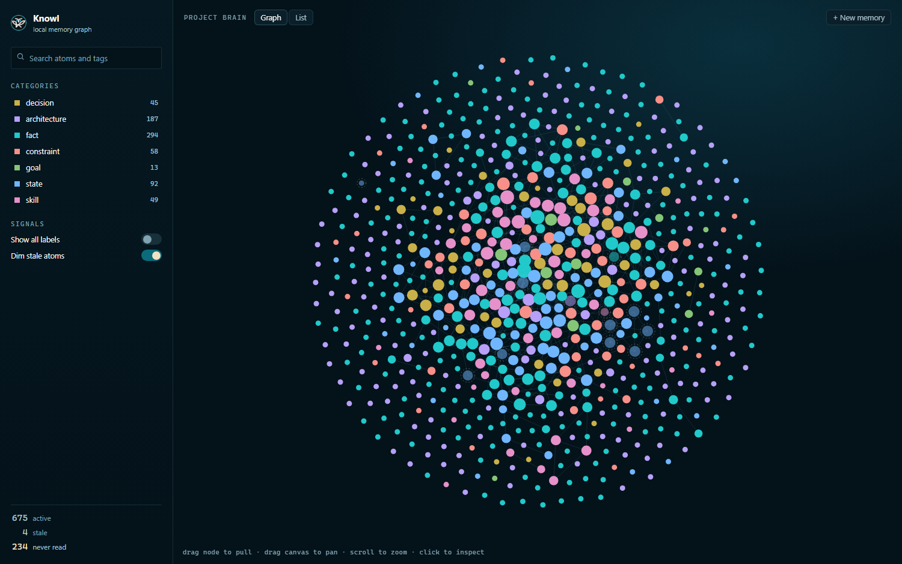
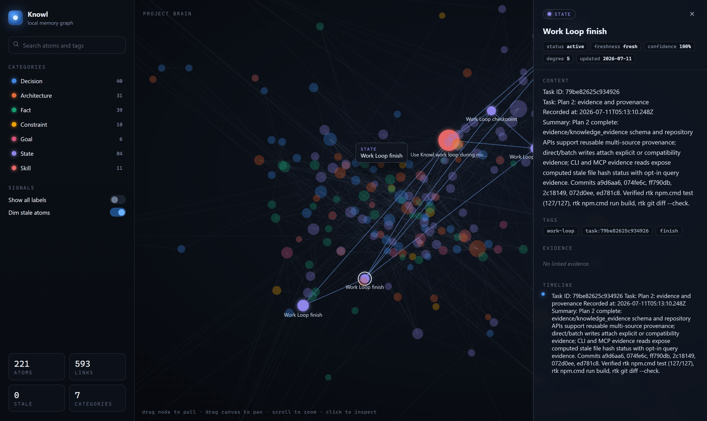
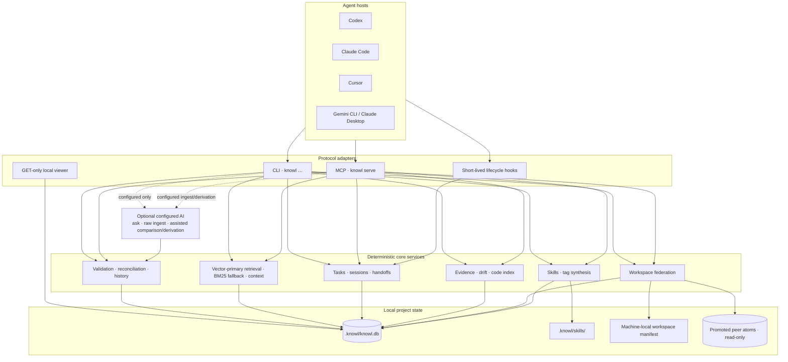
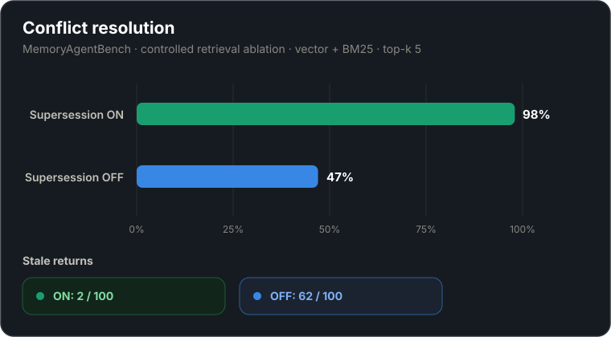
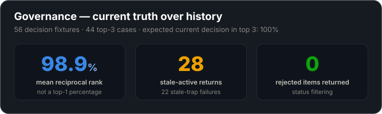
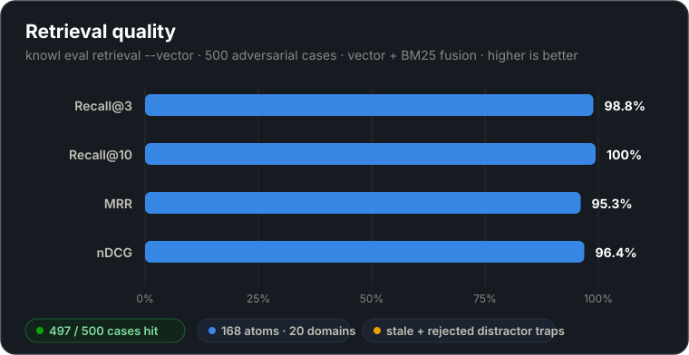

<div align="center">


# Knowl — full reference

**Every shipped feature, in depth: what it does, what it deliberately does not do, and where the
boundaries are.**

[← Back to the main README](../README.md)

</div>

---

This is the complete manual. The [main README](../README.md) is the short version — enough to
install Knowl, understand why it retires stale knowledge, and get an agent talking to it. This
document is where every claim is spelled out, including the limits: which operations stay local,
which paths are lexical rather than semantic, what an import will and will not overwrite, and
which parts of a restore are deliberately not restored.

## Contents

| Section | Covers |
| --- | --- |
| [Overview](#overview) · [Quick start](#quick-start) | What Knowl is and how to install it |
| [Core knowledge model](#core-knowledge-model) | [Atom categories](#atom-categories) · [Metadata, history, ownership](#metadata-history-and-ownership) · [Governed writes](#governed-writes-and-current-truth) |
| [Retrieval and context](#retrieval-and-context) | [Current retrieval](#current-retrieval) · [What a result carries](#what-a-result-carries) · [Embedding models](#choosing-an-embedding-model) · [Historical queries](#historical-retrieval-and-assertions) · [Context packs](#bounded-context-packs) |
| [Tasks, sessions, lifecycle](#tasks-sessions-and-agent-lifecycle) | [Work loops](#manual-work-loops) · [Retention and promotion](#session-retention-recovery-and-promotion) · [Handoffs and resume keys](#leaving-work-for-later) · [Transcript search](#searchable-session-transcripts-optional-off-by-default) · [Host behavior](#host-and-subagent-behavior) |
| [Evidence, code, drift](#evidence-code-intelligence-and-drift) | [Evidence and symbols](#evidence-and-symbols) · [PR drift and feedback](#pull-request-drift-and-retrieval-feedback) |
| [Workspaces](#workspaces) | [Federation and ownership](#federation-and-ownership) · [Ownership stamping](#ownership) |
| [Learned skills and synthesis](#learned-skills-and-synthesis) | [File-backed skills](#file-backed-skills) · [Deterministic synthesis](#deterministic-synthesis) |
| [Portability and maintenance](#portability-and-maintenance) | [Export and import](#jsonl-export-and-import) · [Garbage collection](#garbage-collection) · [Snapshots, audit, doctor](#snapshots-audit-and-doctor) |
| [Local viewer](#local-viewer) · [Architecture](#architecture-and-security-boundaries) | Inspector, component diagram, security boundaries, [write durability](#write-durability) |
| [Agent setup](#agent-setup) · [Benchmarks](#benchmarks) | Host integration, and every evaluation suite with reproduction commands |
| [CLI reference](#cli-reference) · [MCP tools](#mcp-tools-and-resources) | Every shipped command, tool, and resource |
| [Optional AI](#optional-ai) · [Local data](#local-data) | Provider configuration and on-disk layout |

## Overview

Knowl gives coding agents durable engineering context across sessions. It stores decisions,
architecture, goals, constraints, facts, current state, and reusable skills as structured
knowledge atoms in a repository-local SQLite database under `.knowl/`.

Agents access the same governed memory through the `knowl` CLI or the Model Context Protocol
(MCP). Items carry status, freshness, confidence, tags, history, and optional evidence pointing
to files, commits, tests, commands, URLs, users, agents, or indexed symbols. Core storage and
retrieval do not require an external AI provider.

Knowl can also link related repositories into a workspace. Each repository keeps its own
database and ownership boundary; only explicitly promoted knowledge is visible to peers.

A normal workflow queries memory first, verifies misses or stale results against repository
evidence, records durable corrections, and resumes from lifecycle context or a task checkpoint.

## Quick start

Requires Node.js 22 or later.

```bash
npm install -g @dat999zx/knowl
cd your-project
knowl init
```

`knowl init` creates or upgrades `.knowl/`, initializes the database, installs the project
guidance files, updates `.gitignore`, and offers MCP and lifecycle setup for detected agents.
It also prepares the local embedding model on a best-effort basis. If the model is unavailable,
setup still completes; the CLI lexical query remains available, and MCP can run BM25-only after
vectors are disabled.

Record a decision:

```bash
knowl decide "Use SQLite" "Use SQLite for local project memory." \
  --reasoning "Keeps storage repository-local and simple to operate." \
  --alternatives PostgreSQL MongoDB \
  --tags database local-first
```

Inspect and query the project memory:

```bash
knowl status
knowl state
knowl query "why sqlite"
knowl doctor
```

Start a new agent session so the host loads its guidance and lifecycle configuration. MCP
`knowl_query` and the CLI share the same local store and governance rules.

## Core knowledge model

Knowl separates current truth, abandoned choices, temporary status, and supporting evidence into
typed atoms while retaining history.

### Atom categories

Every atom has exactly one of seven categories:

| Category | Use it for |
| --- | --- |
| `fact` | Stable project truths, conventions, and verified behavior |
| `decision` | A selected option with reasoning and alternatives |
| `goal` | An intended outcome that guides future work |
| `constraint` | A rule or boundary that must continue to hold |
| `architecture` | How components are arranged and interact |
| `state` | Current progress, readiness, blockers, or operational status |
| `skill` | A reusable procedure or learned workflow description |

A `skill` atom describes a procedure; it is not automatically an executable file-backed package.

### Metadata, history, and ownership

The item is the current view; related records retain provenance and history:

- **Status:** `active`, `deprecated`, `rejected`, `archived`, or `superseded`. Retrieval defaults
  to `active`; other states remain queryable through explicit history and maintenance paths.
- **Freshness:** `fresh`, `needs_review`, or `stale`, independently of status.
- **Organization:** numeric confidence and free-form tags.
- **Source:** `source`, `sourceCommit`, and repository-relative `affectedPaths`.
- **Conflict identity:** normalized key, sorted scope, and an optional exclusive flag.
- **Ownership:** `originRepo`, `visibility`, and a repository label on peer results.
- **History:** immutable assertions, linked evidence, and knowledge commits for governed changes.

Use a timeline when the question is what an item said before it changed:

```bash
knowl timeline <item-id>
knowl conflicts
knowl supersede <old-item-id> <replacement-id>
```

Supersession retires the predecessor with `status: superseded`; it does not delete the item,
its assertions, or its history.

### Governed writes and current truth

The deterministic MCP write path accepts structured atoms without an AI provider:

```text
knowl_store({
  "category": "constraint",
  "title": "Authentication tokens stay server-side",
  "content": "Browser code must not persist bearer tokens.",
  "tags": ["auth", "security"]
})
```

When a verified correction replaces an item already returned by retrieval, make the relationship
explicit in the same store call with `supersedes`, or store the replacement and then point the old
item at it:

```text
knowl_update({
  "id": "<new-item-id>",
  "supersedeId": "<old-item-id>"
})
```

With the default security configuration, every structured write rejects content that exceeds the
configured size boundary, contains a detected secret, or references a sensitive path.
`security.rejectSecrets=false` disables both secret detection and the sensitive-path check; field
and raw-output size limits still apply. Accepted writes then follow these reconciliation rules:

1. An exact normalized title-and-content match is a no-op.
2. Knowl examines up to the top three active BM25 candidates in the same category.
   A normalized title subset with at least two significant shared tokens and at least `0.35`
   significant-token overlap identifies the same subject and retires the predecessor.
3. If no detected candidate qualifies for supersession, an explicitly named active
   `supersedes` item is retired. A qualifying detected same-subject candidate currently takes
   priority when it differs from that explicit ID.
4. Other semantic or lexical overlaps coexist. The result reports the nearby active item so the
   caller can reconcile it explicitly if necessary.
5. An exclusive write is rejected before insertion when another active exclusive item has the
   same normalized conflict key and sorted conflict scope.

These rules apply across atom categories rather than assigning special fuzzy behavior to only
decisions or state. Batch ingestion and update-plus-supersede sequences should not be treated as
an atomic multi-record transaction: current operations may commit individual records
separately. Use explicit IDs and inspect the returned result when a correction spans records.

## Retrieval and context

Memory is useful only if the current, relevant item ranks ahead of stale history without making
the system dependent on a network service. Knowl therefore uses a local vector-primary path with
a bounded lexical fallback.

### Current retrieval

Agent retrieval through MCP `knowl_query` is vector-primary by default, using the repository's
configured local embedding profile. New repositories default to Granite Small English R2. Its
project candidate set is reranked with bounded BM25 lexical results plus
exact-identifier, freshness, status, confidence, and recency adjustments. Normal MCP queries
return active items unless another status is requested. Exact filenames, item IDs, and
`symbol://` locators receive lexical support even when semantic similarity is weak.

In a single repository, the public `knowl query` CLI uses a project-local FTS/BM25/LIKE candidate
path. A current query in a linked workspace also fans out to peers; when vectors are enabled, it
attempts a query embedding and local vectors for federated semantic ranking, then falls back to
lexical results if embedding preparation fails. Historical `--as-of` queries remain local.

### What a result carries

Each `knowl_query` result is compacted before it is returned:

- **`content`** — up to 2,000 characters of the stored fact, with **`truncated: true`** present
  only when it was cut. Around 91% of items on a typical store arrive whole. The ceiling was 600
  until 3.1.0, which returned roughly half of every fact with nothing saying so.
- **`affectedPaths`** — up to six repository-relative files the item depends on, each up to 120
  characters. Withheld for an item owned by another repo in a workspace: its paths are relative
  to a checkout that is not yours, and linked repos are often fork siblings where the same path
  exists in both and means something different.
- **`score`** — the ranker's fused relevance in [0,1] when a calibrated one exists, or the
  string `uncalibrated (<reason>)` when it does not. A string means the ranker has an order but
  no opinion on strength, so judge the content rather than the position. Reasons are
  `lexical-only` (no semantic half ran), `not embedded` (vector ran but never saw this row), and
  `layered namespaces` (each namespace scored against its own corpus, so the numbers are not
  comparable to each other).

Titles are capped separately at 200 characters, and previews of things retrievable in full
elsewhere — evidence excerpts, timeline assertions, skill markdown, `knowl_skill_run` output —
stay at 600.

```bash
# Current CLI query; single-repository candidates are lexical.
knowl query "auth token design"

# Prepare and control vectors used by MCP/agent retrieval.
knowl reindex --vectors
knowl config set search.vector.enabled false
```

#### Choosing an embedding model

`search.vector.preset` selects the local embedding model. A preset bundles model, dtype and
pooling together, because pooling is not discoverable at runtime and the wrong value produces
plausible-looking vectors that rank badly with no error.

| Preset | Model | Size (q8) | Context | Languages |
| --- | --- | --- | --- | --- |
| `granite-small-en-r2` *(default)* | `onnx-community/granite-embedding-small-english-r2-ONNX` | ~52MB | 8k | English |
| `granite-97m-multilingual` | `onnx-community/granite-embedding-97m-multilingual-r2-ONNX` | ~98MB | 32k | 200+ |
| `bge-small-en` | `Xenova/bge-small-en-v1.5` | ~34MB | 512 | English |
| `minilm-l6-en` | `Xenova/all-MiniLM-L6-v2` | ~23MB | 512 | English |
| `custom` | whatever you name | varies | varies | varies |

Every preset emits 384-dimension vectors, so switching never changes the stored vector width.

```bash
knowl config                                          # interactive picker
knowl config set search.vector.preset granite-97m-multilingual
knowl config set-model onnx-community/your-model-ONNX  # verifies, then downloads
```

The default is **English-only**. If you store knowledge in other languages, pick
`granite-97m-multilingual`.

`knowl config set-model` is the path for a model of your own: it checks the repository exists and
ships `onnx/model_quantized.onnx`, reads its pooling method from `1_Pooling/config.json`, and asks
you which to use when the repository does not say. Setting `search.vector.model` directly has no
effect while a named preset is active — the preset decides it — and Knowl says so rather than
reporting a silent no-op.

Changing the model makes every stored embedding stop matching, so vector search falls back to
keyword-only results until `knowl reindex --vectors` runs. Knowl offers that rebuild as soon as the
change is saved. Nothing is ever mis-scored in the meantime: each row records a fingerprint of the
model, dtype and pooling that produced it, and only rows matching the active profile are searched.
That also means an interrupted rebuild leaves a smaller searchable set rather than a mixed one.

Existing repositories are never migrated. `knowl upgrade` cannot change your preset, and a
configuration written before presets existed keeps its model and its original pooling.

In a workspace, every repository must share one embedding profile, since cross-repo ranking
compares vectors directly. `knowl workspace repin-embedding` moves the whole workspace to the
current repository's model and lists the peers that must then reindex.

`knowl init` tries to warm the model cache but does not make initialization depend on a download.
Offline BM25 retrieval remains available. A normal write embeds the item only when the model is
already cached: write-time embedding never downloads a model and never fails the write.
`knowl reindex --vectors` is the explicit model-preparation and backfill path for existing items.

Two environment controls support offline or deliberately lexical operation:

```bash
KNOWL_SKIP_MODEL_DOWNLOAD=1 knowl init
KNOWL_DISABLE_WRITE_EMBEDDING=1 knowl decide "Title" "Content"
```

`KNOWL_SKIP_MODEL_DOWNLOAD` prevents setup from fetching the model; it does not prevent a later
enabled MCP vector query from initializing or downloading it. An enabled vector query can fail
when the model cannot be prepared. For guaranteed offline retrieval, use the lexical CLI or set
`search.vector.enabled` to `false` before calling MCP.
`KNOWL_DISABLE_WRITE_EMBEDDING` skips best-effort embedding during writes; BM25 still indexes the
content.

### Historical retrieval and assertions

An `asOf` query returns historical content assertions for project items selected through their
current lexical metadata:

```bash
knowl query "sqlite persistence" --as-of 2026-01-01T00:00:00Z
```

This is intentionally narrower than a current query. Selection uses the item's current
title/content/reasoning and current status, then replaces only content and confidence from the
assertion valid at the requested time. It does not reconstruct historical title, category,
status, or freshness. Historical lookup is project-only and lexical: it does not use vectors,
workspace peers, session/organization/global namespaces, linked evidence, ranking explanations,
or access logging. Pair it with `knowl timeline <item-id>` when the history of one atom matters.

### Bounded context packs

`knowl context` composes a handoff-sized selection instead of printing the full store:

```bash
knowl context \
  --query "authentication rollout" \
  --task "Review token migration" \
  --token-budget 1500
```

The composer loads up to 30 ranked candidates from the current session and project, then prepends
all active project constraints and removes duplicate constraints from the ranked set. Constraints
are pinned first, so non-negotiable rules consume the budget before ranked facts, decisions,
architecture, or state. The budget is an estimate based on `characters / 4`, not a model-specific
tokenizer; callers should leave headroom for their own prompt envelope.

`knowl_context` does not include workspace peers or organization/global namespaces. For a peer
fact, run an explicit current `knowl_query`, then construct the downstream prompt deliberately.

## Tasks, sessions, and agent lifecycle

Repository work often spans commands, turns, or agent processes. Knowl records bounded event
state and explicit checkpoints so work can resume without retaining raw conversations.

### Manual work loops

For one bounded command, `task run` performs the initial focused lookup and records success or a
failure checkpoint with the child exit code:

```bash
knowl task run "Run tests" --query "test verification" -- npm test
```

For resumable work, start once, checkpoint meaningful progress or blockers, and finish after
verification:

```bash
knowl task start "Implement search UI" --query "search retrieval"

knowl task checkpoint <task-id> "Search tests are in place" \
  --goal "Ship the search UI" \
  --completed "Added empty and error-state tests" \
  --next-action "Implement the result list" \
  --artifact "src/search-ui.ts" \
  --verification-status "tests-passing"

knowl task finish <task-id> "Search UI implemented and verified"
```

Use these manual tools only when verified lifecycle hooks are unavailable. Hook-owned sessions
must be left to their host lifecycle; a manual `task finish` or `knowl_session_finish` must not
close them.

### Session retention, recovery, and promotion

Lifecycle events are temporary scratch records and expire after 48 hours. Active session rows
receive a nominal seven-day `expiresAt`, but the current implementation does not automatically
purge those rows. A session idle for more than two hours can be marked `recovered`; recovery does
not finalize the session or promote candidates.

At a normal terminal event, deterministic promotion selects at most eight durable candidates.
Decision candidates outrank generic outcomes. A repeatedly successful command becomes a `skill`
atom candidate after three runs, but that promoted atom is still descriptive knowledge, not an
executable `.knowl/skills` package. Failed terminal events create a handoff for the next matching
host session.

Hooks run as separate, short-lived `knowl agent-hook` processes. They normalize host events and
never start, stop, or supervise the long-lived stdio `knowl serve` process. Lifecycle capture
itself stores no raw prompts, transcripts, stdout, stderr, or environment variables. When
transcript indexing is explicitly enabled, the separate transcript index reads supported host
transcript files already present on the machine; it does not create them.

### Leaving work for later

Two different shapes, deliberately not merged:

| | `knowl_handoff` | `knowl_park` / `knowl_resume` |
| --- | --- | --- |
| How many | One per project | Many at once |
| Who holds it | The project | The user, as a short key |
| Delivery | Pushed to the next session here | Pulled on demand, by key |
| Spent on use | Yes, one-shot | No, resume repeatedly |
| Reach | Next session in this repository | Any session, any directory, any time later |

"I am stopping for the night, whoever picks this up should know where I left it" is a handoff.
"Park this branch of work, I will come back to it in a fortnight" is a resume point. A parked
baton reads as planned work rather than as a crash, because a session told it "ended before a
clean finish" goes looking for damage that does not exist.

Both are passes, not durable notes. Anything worth keeping goes to `knowl_store`.

### Searchable session transcripts (optional, off by default)

Atoms are distilled and therefore lossy: whatever the writer did not judge salient is gone. The
raw Claude Code `.jsonl` transcripts are the complete record underneath. Indexing them turns a
memory miss into a slower lookup instead of amnesia.

Off by default, and off means nothing exists — no database file, no registered tools, no tokens
spent in the guidance card.

```jsonc
// .knowl/config.json
"search": {
  "transcripts": {
    "enabled": false,   // nothing is created, no MCP tools are registered
    "share": false      // let linked workspace repos read this index
  }
}
```

```bash
knowl config                                  # toggle it interactively
knowl reindex --transcripts --budget 5        # build the index, resumable
```

What it indexes and what it costs, measured on this repository's own archive: prose is **2.7% of
80.9 MB** across 75 transcripts. Only user messages and assistant prose are indexed; `tool_use`
and `tool_result` blocks are skipped entirely. Rows are pointers — `(session, line, role)` — and
message bodies stay in the `.jsonl`, so the whole index is **under 3 MB**.

Ranking fuses BM25 with whole-corpus semantic search over int8 vectors, so a message that shares
no word with your query can still win. Semantic ranking follows `search.vector.enabled`; with
vectors off, transcript search is keyword-only and every result says so.

Three tools appear only when the feature is enabled, which is why they are absent from the
canonical tool table below:

- **`knowl_session_list`** — browse past sessions: best-known name, opening ask, status, and what
  each one promoted into memory.
- **`knowl_transcript_search`** — search prose across sessions; returns
  `transcript://<repo>/<session>#L<line>` locators.
- **`knowl_transcript_read`** — open one locator with the surrounding turns.

Disabling the feature **deletes** `.knowl/transcripts.db`. An index nothing will refresh is not
something to leave on the disk of the person who just turned it off.

Workspace peers may opt in with `share: true`, which lets linked repositories open the index
read-only. Sharing is re-checked on every read, so revoking it revokes previously issued
locators too.

### Host and subagent behavior

| Host | MCP | Automatic lifecycle | Subagent lifecycle | Current session behavior or limit |
| --- | --- | --- | --- | --- |
| Codex | Yes | Yes | Yes | Main turns share one memory session |
| Claude Code | Yes | Yes | Yes | Main turns share one memory session; prompt guidance is also installed |
| Cursor | Yes | Yes | No | Finalizes per turn; supplied `additional_context` may not surface to the model |
| Gemini CLI | Yes | No | No | MCP plus the manual work loop |
| Claude Desktop | Yes | No | No | MCP plus the manual work loop |

Claude Code and Codex subagents share their parent's memory session, but each subagent has its own
binding, reminder counter, change watermark, and lifecycle identity. Their retrieved memory is
capped at half of the normal 3,000-character context allowance, plus a compact workflow card.
Cursor does not expose a corresponding subagent event.

Each accepted successful non-Knowl tool event advances a per-agent drift counter. After 12
consecutive events, a mid-turn card reminds the agent to re-query. A Knowl call or an emitted
change card resets the counter. Change cards report new knowledge commits since that agent's
watermark; matched writes made through that agent's own MCP call are suppressed so the caller is
not notified about its own change.

## Evidence, code intelligence, and drift

An atom can remain active after the code it describes changes. Evidence and drift checks make
that gap visible without treating every external source as automatically verifiable.

### Evidence and symbols

Evidence types are `file`, `symbol`, `commit`, `test`, `command`, `url`, `user`, and `agent`.
Each link has a `supports`, `contradicts`, or `derived_from` relationship.

```bash
knowl evidence list <item-id>
knowl code index
knowl code symbols src/store/repository.ts
```

Automatic staleness is limited to hashed file evidence and indexed symbol evidence. URL, commit,
test, command, user, and agent records do not become stale automatically. File evidence compares
its stored hash with the current file. Symbol evidence uses a `symbol://` locator against the
local index.

The incremental Tree-sitter index supports `.ts`, `.tsx`, `.js`, and `.jsx`. It records relevant
symbols and import/export relationships for local inspection; code indexing and symbol
resolution never fan out to workspace peers.

### Pull-request drift and retrieval feedback

Preview affected knowledge before changing freshness:

```bash
knowl pr check --since origin/main --dry-run
knowl pr check --since origin/main
```

The check considers `affectedPaths`, source strings, path-like tags, and stale symbol evidence.
Without `--dry-run`, matching candidates are changed to `needs_review`. It does not rewrite their
content or decide a replacement.

Retrieval access logging stores a query fingerprint rather than the raw query. Agents can append
feedback only after using or rejecting a result:

```text
knowl_feedback({
  "itemId": "<item-id>",
  "used": true,
  "useful": true,
  "causedCorrection": false
})
```

`knowl access report` summarizes frequently used, stale, and correction-causing items. Garbage
collection also uses this heat: an item is hot when it has at least three retrievals or was
retrieved within the last 21 days.

## Workspaces

Knowl workspaces provide linked federation across related repositories without merging their
databases.

```bash
# Create a machine-local workspace.
knowl workspace init product

# Run inside each repository that should join it.
knowl workspace add product
knowl workspace status

# Preview, then promote selected local knowledge.
knowl workspace promote --category decision
knowl workspace promote --category decision --apply
```

For another checkout or machine, copy the workspace manifest and join from each repository:

```bash
knowl workspace join /path/to/workspace.json --name api
```

The shipped workspace commands are:

| Command | Purpose |
| --- | --- |
| `knowl workspace init <name>` | Create a workspace outside its member repositories |
| `knowl workspace add <name> [--name <repo-name>] [--force]` | Link the current repository |
| `knowl workspace join <manifest> [--name <repo-name>] [--force]` | Adopt a copied manifest and map this checkout |
| `knowl workspace list` | List workspaces known to this machine |
| `knowl workspace status [--verbose]` | Show this repository's membership and peer health |
| `knowl workspace remove <repo-name> [--export-first]` | Unlink the current repository, retiring its name if it still owns atoms |
| `knowl workspace promote (--category <list> \| --id <id...>) [--apply]` | Preview or publish selected locally owned atoms |
| `knowl workspace repin-embedding [--yes]` | Move the workspace to this repository's embedding model and list the peers that must reindex |

### Federation and ownership

The external manifest contains machine-local checkout paths. Membership is two-sided: the
manifest names the repository, and that repository's configuration points back to the workspace.
Every member continues to own a separate `.knowl/knowl.db`.

Normal `workspace add` refuses to link when `.knowl/config.json` is tracked by Git.
`--force` bypasses only that tracked-config guard; it does not repair embedding-identity
mismatches or item ownership.

Only an explicit current query fans out to available peers. A promoted peer result is labeled
with its `repo` and is read-only from the querying repository. Mutations, historical `asOf`
queries, recent context, context packs, work loops, synthesis, code indexing, and implicit
lifecycle context remain local. Missing, unreadable, or schema-incompatible peers are skipped and
disclosed in the response rather than causing healthy local retrieval to fail.

**One ranker, pointed at each repo.** Retrieval takes an explicit database handle, so a linked
repository is searched by the same code that searches the local one: the same FTS and vector
selection, and the same recency, confidence, freshness, category and exact-identifier scoring.
Candidates are selected per repository, then **scored in a single pass over all of them together**
— recency is normalized against the candidate set it is given, so ranking each repository
separately and combining the results would make every repository's newest atom equally recent.
Identical content held by two repositories is deduplicated before the result cap, keeping the local
copy, so a shared fact cannot consume two slots and return a short list. A peer handle is opened
`query_only`, and the `visibility` predicate is applied inside the SQL, so a peer's repo-private
row is never read into the querying process at all.

**Cross-repository overlap is reported on write.** A knowledge write inside a workspace also checks
the linked repositories, and reports an exclusive conflict key or a same-subject atom held
elsewhere, naming the owning repository. Both the single-atom and batch writers do this, the batch
per atom. It is advisory and never mutates: that atom belongs to another repository, `knowl_update`
refuses foreign ids, and only its owner can retire it. Bounded to a few candidates per peer, and
non-fatal — an unreadable peer yields no report rather than a failed write. Outside a workspace it
costs one check.

Promotion is preview-first and accepts active, private, locally owned atoms selected by category
or ID. Both `workspace add` and `workspace join` enforce a compatible embedding identity, reject a
nested checkout, and refuse a Git-tracked `.knowl/config.json` without `--force`. There is no
cross-repository mutation, demote/unshare command, or workspace-wide historical view.

`workspace remove --export-first` is an acknowledgement that the repository still owns
knowledge; it does not create an export. A removed name is retired only when the repository
still owns active atoms, since the name is the ownership key on everything it wrote. A repository
that owned nothing releases its name for anyone; a repository that owned atoms keeps exclusive
claim on the name and reclaims it by re-linking, while every other repository is refused.

### Ownership

`origin_repo` is stamped when an atom is created, so every write made while linked is owned and
promotable. Joining additionally backfills the rows that already existed, which are by definition
the joining repository's own.

## Learned skills and synthesis

Knowl represents reusable procedure knowledge in two forms: a durable `skill` atom for retrieval,
and an optional file-backed package for inspected execution.

### File-backed skills

A package lives below the project database directory:

```text
.knowl/skills/<name>/
├── SKILL.md
├── skill.json
└── optional scripts and support files
```

Create and inspect a package before running it:

```bash
knowl skill create run_app \
  --purpose "Start the app locally" \
  --markdown "# Run App" \
  --file "run.mjs=console.log('run-app')" \
  --script run.mjs

knowl skill list
knowl skill read run_app
knowl skill run run_app
```

Package names, file paths, and entrypoint paths are validated to stay within the package.
Entrypoints can invoke a trusted local script or shell command and run without a sandbox.
`autoRun: false` blocks execution. When a declared primary entrypoint fails, a declared fallback
entrypoint may run. Knowl records usage and result statistics so operators can inspect how the
package behaved; path validation is not a security boundary for untrusted script content.

### Deterministic synthesis

Synthesis builds one scoped architecture item from existing atoms without calling an AI provider:

```bash
knowl synthesize --scope storage
```

The current scope is an exact tag, not a filesystem path. Eligible sources are active, `fresh`,
non-`state`, and not themselves synthesized. A run requires at least two sources, uses at most
eight, and takes at most 500 content characters from each. It creates or refreshes one
`architecture` item and replaces its derived evidence.

Synthesis does not read session namespaces or workspace peers and does not create a knowledge
commit. Use `knowl_synthesize` only for an explicit scope; it is not part of normal write
reconciliation.

## Portability and maintenance

Long-lived project memory needs a transport format, recoverable snapshots, and bounded cleanup.
These operations intentionally cover different subsets of local state.

### JSONL export and import

```bash
knowl export ./knowl-export.jsonl
knowl import ./knowl-export.jsonl --dry-run
knowl import ./knowl-export.jsonl --on-divergence newer
```

The checksummed JSONL export is at **format version 2**. It includes complete item objects in
every status, with `originRepo`, `visibility` and `lifecycleHash` written on import as well as
read on export. It also includes assertions, evidence and links, file-backed skill files, and
tombstones. It excludes knowledge commits, access telemetry, sessions, code indexes, vector
embeddings, project configuration, workspace manifests, and workspace membership.

This build reads format versions 1 and 2. A version-1 file imports with ownership defaulted —
`originRepo` null and `visibility` `repo` — which is what a file written before those fields
existed means. A version it does not recognise is refused rather than imported with the unknown
fields dropped.

Import only JSONL that you created or otherwise trust. The checksum detects corruption; it does
not authenticate the source or make malicious skill-package paths safe. `--dry-run` checks the
database import plan but returns before skill-package files are validated or written.

After checking the checksum, header, and item records, import supports four divergence policies:

- `newer` compares an incoming item with the same ID and different `contentHash`, then chooses by
  `updatedAt`, by version when timestamps tie, and otherwise keeps the local tie.
- `skip` keeps the local divergent item.
- `theirs` selects the incoming item.
- `fail` aborts the import when divergence is found.

Use `--dry-run` to see `wouldApply` counts without applying records. Only `fail` treats a
divergence as an import-wide abort condition; the other policies select or skip individual
records. When `newer` or `theirs` selects an incoming item, Knowl writes supported content and
history columns with the incoming `contentHash`, version, and timestamps without normal
reconciliation.

Content and lifecycle diverge independently. `contentHash` covers title, content, reasoning,
source and paths; `lifecycleHash` covers status, freshness, supersession, `originRepo` and
`visibility`. An item whose content matches but whose lifecycle does not is **metadata-divergent**,
resolved by the same policy and applied to the lifecycle columns only, leaving `contentHash`
untouched so the next round classifies as identical instead of trading updates. A promotion,
retirement or supersession therefore propagates; before this it did not, because content-only
comparison called it identical and skipped it. Promotion also advances `updatedAt`, since `newer`
has nothing to order by otherwise.

After checksum, header, and item validation, non-dry-run database changes apply in one SQL
transaction and roll back together on failure. Imported skill-package files are filesystem
writes and are not covered by that database rollback.

Tombstones are monotonic. `deletedAt` only moves forward, whether written locally or received in
an import, so replaying an older delete cannot rewind a newer one. Import also consults local
tombstones before inserting: an item whose export predates a local delete is not reinstated, and
the count is reported as `blockedByTombstone` rather than folded into `identical`. A tie favours
the item, matching the delete path, so knowledge deliberately re-recorded after a delete still
lands. Best-effort vector indexing after import uses only the locally available model.

### Garbage collection

`knowl gc` previews by default:

```bash
knowl gc
knowl gc --apply
```

The default policy:

- removes exact active duplicates only in `fact`, `state`, and `goal`;
- archives non-hot active `state` older than 60 days;
- protects an item as hot after at least three retrievals or a retrieval within 21 days;
- compresses archived content after 30 days when it is at least 180 bytes; and
- removes tombstones after 90 days.

Flags adjust these thresholds, and `--ignore-access` disregards access heat for stale-state
archival. Review the preview before applying it; GC does not infer semantic equivalence across
different content.

### Snapshots, audit, and doctor

```bash
knowl snapshot create
knowl snapshot restore .knowl/snapshots/<snapshot>.db --confirm
knowl audit
knowl doctor
```

Snapshot creation uses SQLite `VACUUM INTO` and writes a checksum manifest. The manifest is
**required** on restore, not optional: restore verifies its schema version, byte size and
SHA-256, copies the snapshot out of the snapshot directory, and re-verifies the copy it is
about to read — then checks that copy's own SQLite `integrity_check` and `user_version` before
any destructive statement runs. Restore also takes a pre-restore snapshot first, and refuses to
delete the snapshot it was asked to restore from.

Restore is a **partial** operation, and which half is which is a decision recorded in
`src/store/snapshot-tables.ts` rather than a side effect of the schema. Restored: knowledge
items, assertions, evidence and its links, access telemetry, knowledge commits and the
commit-to-item index, skill rows, and embeddings. Preserved at their current values: memory
sessions and their events, host bindings, tombstones, MCP call watermarks, the code index, and
the drift watermark — each describes the machine and working tree you are on now, not the
knowledge. Full-text search indexes rebuild themselves as rows land. A test fails if any table
in the schema is missing from that registry, so restore behaviour cannot drift by accident.

A restore runs an audit after committing the restored data. An audit failure is diagnostic and
does not roll back that commit. `knowl audit` itself is read-only and performs a limited set of
secret, JSON/status, dangling-row, and FTS checks; it is not a complete reconstruction of every
history or evidence invariant.

`knowl doctor` checks initialization, configuration, guidance, `.gitignore`, integrity, schema,
stale sessions, retrieval, the MCP inventory, agents and lifecycle registration, vector
coverage, and workspace health. Warnings mean the project is not reported ready; they should not
be treated as an all-clear.

## Local viewer

`knowl view` starts a browser inspector on `127.0.0.1`:

```bash
knowl view
knowl view --port 4312
```

The viewer binds to `127.0.0.1`, answers only `GET`, and mints a fresh access token per launch.
The printed URL carries that token; knowing the port is not enough to read anything. It exposes
full local atom content across all statuses, so loopback binding is still the privacy boundary;
do not expose it through a public proxy or tunnel.

The graph connects atoms through shared tags and category-derived links. It is a synthetic
navigation graph, not a causal graph and not the evidence graph. Search, category filters, stale
rings, neighborhood focus, and the item inspector help locate content, evidence, and timeline
assertions.

<p align="center">
  
  
</p>

The graph and filter UI do not write telemetry. A direct GET to `/api/retrieval` records retrieval
access telemetry, so GET-only does not mean every endpoint is free of database writes.

## Architecture and security boundaries

CLI and MCP delegate to shared deterministic services; optional AI remains outside that path.



| Layer | Source | Responsibility |
| --- | --- | --- |
| Protocol and commands | `src/mcp`, `src/cli` | MCP registration, CLI parsing, host setup, lifecycle envelopes |
| Core contracts | `src/core` | Types, validation boundaries, formatting, configuration, token budgets |
| Store and retrieval | `src/store` | SQLite schema, assertions, evidence, ranking, sessions, portability, maintenance |
| Workspace federation | `src/workspace` | External manifests, membership, ownership, promotion, peer resolution |
| Code intelligence | `src/code` | Tree-sitter indexing and `symbol://` resolution |
| Learned skills | `src/skills` | File-backed package validation, registry, entrypoint execution |
| Viewer | `src/viewer` | Loopback-only graph and inspection APIs |
| Optional AI | `src/pipeline`, `src/ai` | Filter → extract → verify → merge pipeline, question answering, assisted derivation |

Storage, retrieval, governance, lifecycle, skills, and synthesis need no provider. Writes always
pass size validation and, by default, secret and sensitive-path checks. The database and skills
are local; workspace manifests hold external machine paths; the unauthenticated viewer is
loopback-only.

### Write durability

All three SQLite databases — the knowledge store, the transcript index, and the resume store —
run in WAL with `synchronous = NORMAL`.

NORMAL does not fsync on every commit. An application crash, a killed `knowl serve`, `Ctrl-C`, or
a closed laptop lid still lose nothing: SQLite's documentation is explicit that "transactions are
durable across application crashes regardless of the synchronous setting or journal mode", and
that "WAL mode is safe from corruption with `synchronous=NORMAL`". Only a power cut or an OS
crash can drop the last seconds of writes, and the file still opens cleanly afterwards. Measured
against FULL on this schema, NORMAL is 4.19× on un-batched writes — the common shape here, since
one `knowl_store` or one hook capture is a single write — and better under contention.

| Variable | Default | Meaning |
| --- | --- | --- |
| `KNOWL_SQLITE_SYNCHRONOUS` | `NORMAL` | `NORMAL` or `FULL`. Set `FULL` to fsync every commit, buying durability across power loss at roughly 4× the per-write cost. `OFF` is refused: it can corrupt the database on power loss and measured no faster than NORMAL. An unrecognised value stops the command rather than silently falling back. |

## Agent setup

`knowl init` detects Codex, Claude Code, Cursor, Gemini CLI, and Claude Desktop. Run it
interactively or name the integrations explicitly:

```bash
knowl init
knowl init codex claude cursor gemini claude-desktop
knowl doctor
```

`KNOWL.md` contains the canonical workflow. `AGENTS.md` receives a synchronized managed section;
`CLAUDE.md` imports `@KNOWL.md`, and `GEMINI.md` imports `@./KNOWL.md`. For Claude Code, the
installed prompt hook invokes `knowl agent-reminder claude --json`. Existing unrelated MCP
servers and host rules are preserved, and changed configuration files are backed up.

Start a new agent session after setup. Re-run `knowl init` after an upgrade that adds lifecycle
events so host registrations and managed guidance are refreshed; database migrations apply when
Knowl next opens the project. Gemini CLI and Claude Desktop retain MCP access but require the
manual work loop for lifecycle capture.

## Benchmarks

These retrieval-level suites use no answer-generating reader. MemoryAgentBench supplies an
external conflict fixture; the other two suites are internal regression data.

### MemoryAgentBench conflict resolution

[MemoryAgentBench](https://github.com/HUST-AI-HYZ/MemoryAgentBench)
([ICLR 2026 paper](https://arxiv.org/abs/2507.05257)) defines a Conflict Resolution track for
retrieving the newest valid fact after updates. The Knowl harness uses the
`factconsolidation_sh_6k` row: 455 facts, 156 detected conflict groups, 100 questions, active-only
top-5 vector+BM25 retrieval, and no LLM reader.

<div align="center">

</div>

| Configuration | Top-1 | Any rank | Stale returns | Active atoms | Stored p50 / p95 |
| --- | ---: | ---: | ---: | ---: | ---: |
| **Supersession ON** | **96.0%** | 100% | **3 / 100** | 306 | 19 / 21 ms |
| Supersession OFF | 40.0% | 100% | 62 / 100 | 455 | 20 / 24 ms |

Supersession retired 149 facts at write time; both rows otherwise use the same corpus, path, and
metric. The instance covers dynamic single-hop latest-fact conflicts, not static, conditional,
multi-hop, or reader behavior.

The two result JSON files are checked in:
[supersession ON](../benchmarks/memoryagentbench/results/cr-sh-6k-supersede-on.json) and
[supersession OFF](../benchmarks/memoryagentbench/results/cr-sh-6k-supersede-off.json).
The fetched dataset fixture is ignored by Git and is not checked in. `fetch --row 4` reads the
current Hugging Face row without a pinned dataset revision, so future fetches depend on that
upstream row remaining unchanged. The stored results contain no hardware metadata; their timing
fields are run artifacts, not portable latency claims.

See the [protocol and interpretation](evals/memoryagentbench-cr.md). Reproduce from a source
checkout with the repository-only harness:

```bash
npm run bench:cr -- fetch --row 4

# --json prints the full run result.
npm run bench:cr -- run \
  --instance benchmarks/memoryagentbench/data/cr-sh-6k.json \
  --top-k 5 --json
npm run bench:cr -- run \
  --instance benchmarks/memoryagentbench/data/cr-sh-6k.json \
  --top-k 5 --no-supersede --json

# --out writes a result snapshot.
npm run bench:cr -- run \
  --instance benchmarks/memoryagentbench/data/cr-sh-6k.json \
  --top-k 5 --out ./memoryagentbench-result.json
```

These `npm run bench:cr -- ...` commands are repository scripts, not published `knowl` CLI
commands.

### Internal governance regression suite

The checked-in [`retrieval-governance.json`](evals/retrieval-governance.json) has 56
decision fixtures: 22 current decisions, 22 stale predecessors, and 12 rejected decisions. It
defines 44 top-3 cases.

<div align="center">

</div>

| Recall@3 | MRR | nDCG | Stale-active returns | Stale-trap failures | Rejected items returned |
| ---: | ---: | ---: | ---: | ---: | ---: |
| 100% | 94.3182% | 95.8060% | 43 | 22 | 0 |

MRR is reciprocal rank, not top-1 accuracy. Stale predecessors remain active, so all 22 stale
traps failed and produced 43 stale-active returns; rejected items test a separate status filter
and never appeared. Recall@3 means every top three contained the expected current decision, not
that every result was current.

```bash
knowl eval retrieval \
  --dataset docs/evals/retrieval-governance.json \
  --vector --json
```

### Internal retrieval regression suite

The checked-in [`retrieval-suite.json`](evals/retrieval-suite.json) contains 500 cases over
168 fixtures. It is a repository regression suite with expected items, stale traps, and forbidden
items; it is not third-party evidence.

<div align="center">

</div>

| Retrieval path | Recall@3 | Recall@10 | MRR | nDCG | Stale hits | Forbidden hits | Failed criteria |
| --- | ---: | ---: | ---: | ---: | ---: | ---: | ---: |
| Vector + BM25 | 98.8667% | 99.4% | 96.09% | 96.8895% | 15 | 5 | 8 |

The vector figures were reproduced from the checked-in dataset on 2026-07-28; no result snapshot
is checked in. The run passed 492 of 500 evaluator cases, including expected, stale, and forbidden
conditions rather than only search hits.

Fresh BM25-only runs varied under equal-score ordering, including their failure counts. Exact
BM25 outcome and rank values are therefore not published; rerun the command below in the target
environment. No cross-hardware latency is claimed.

```bash
knowl eval retrieval --dataset docs/evals/retrieval-suite.json --vector --json
knowl eval retrieval --dataset docs/evals/retrieval-suite.json --json
```

## CLI reference

### Project and status

| Command | Description |
| --- | --- |
| `knowl init [agents...]` | Initialize or upgrade the project and configure selected agents |
| `knowl upgrade` | Refresh project files, schema, guidance, and `.gitignore` without agent setup |
| `knowl status` | Show repository, memory, AI, commit, and workspace status |
| `knowl doctor` | Check project, vector coverage, agent, and workspace readiness |
| `knowl state` | Print the active hierarchical project memory |
| `knowl audit` | Run a read-only, limited integrity audit |

### Workspaces

| Command | Description |
| --- | --- |
| `knowl workspace init <name>` | Create a workspace |
| `knowl workspace add <name> [--name <repo-name>] [--force]` | Link the current repository |
| `knowl workspace join <manifest> [--name <repo-name>]` | Join from a copied manifest |
| `knowl workspace list` | List machine-local workspaces |
| `knowl workspace status [--verbose]` | Show membership and resolved peers |
| `knowl workspace remove <repo-name> [--export-first]` | Unlink the current repository |
| `knowl workspace promote (--category <list> \| --id <id...>) [--apply]` | Preview or promote locally owned knowledge |

### Memory and retrieval

| Command | Description |
| --- | --- |
| `knowl decide [title] [content]` | Record a decision, reasoning, alternatives, and tags |
| `knowl query [query] [--as-of <timestamp>] [--limit <count>]` | Query current or historically valid project memory |
| `knowl timeline <item-id>` | Print immutable assertions for one item |
| `knowl conflicts` | List active exclusive conflict identities |
| `knowl supersede <item-id> <replacement-id>` | Retire one item in favor of its replacement |
| `knowl evidence list <item-id>` | List evidence and symbol staleness for an item |
| `knowl context --token-budget <n> [--query <query>] [--task <task>]` | Compose a bounded local context pack |
| `knowl eval retrieval --dataset <path> [--vector] [--json]` | Run a retrieval dataset; `--vector` enables vector+BM25 evaluation |
| `knowl access report [--json]` | Report highly used, stale, and correction-causing knowledge |

### Work loops and sessions

| Command | Description |
| --- | --- |
| `knowl task start <title> [-q <query>]` | Start a manual work loop with a focused lookup |
| `knowl task checkpoint <task-id> <summary> [options]` | Store resumable progress, blockers, artifacts, and verification state |
| `knowl task finish <task-id> <summary>` | Finish a manual work loop |
| `knowl task run <title> -- <command...>` | Wrap one bounded command in a work loop |
| `knowl session start\|event\|finish\|recover` | Manage bounded, expiring session scratch and recovery |

### Skills, code, and optional AI

| Command | Description |
| --- | --- |
| `knowl skill list\|read\|create\|run` | Manage file-backed learned skills and their entrypoints |
| `knowl code index` | Incrementally index TS/JS symbols and import/export edges |
| `knowl code symbols <path>` | Print indexed symbols for one repository-relative file |
| `knowl synthesize --scope <tag>` | Create or refresh one deterministic tag-scoped understanding |
| `knowl ask <question>` | Ask a natural-language question using configured AI |
| `knowl ingest <text>` | Extract and merge knowledge from explicitly supplied text using configured AI |

### Data, maintenance, and serving

| Command | Description |
| --- | --- |
| `knowl export <path>` | Write portable, checksum-verified JSONL |
| `knowl import <path> [--dry-run] [--on-divergence newer\|skip\|theirs\|fail]` | Import JSONL with an explicit divergence policy |
| `knowl snapshot create` / `knowl snapshot restore <path> --confirm` | Create a checksummed SQLite snapshot, or restore one after verifying its manifest, size, checksum, and SQLite integrity |
| `knowl config` / `get <key>` / `set <key> <value>` / `reset [key]` | Edit configuration interactively or from scripts |
| `knowl config set-model <model>` | Verify, download and select a custom embedding model |
| `knowl reindex --vectors` | Prepare the local model and embed items that have no current vector; `--force` re-embeds every item |
| `knowl reindex --transcripts [--budget <minutes>]` | Build or update the optional session transcript index; resumable, so a budget is a stopping point rather than a rollback |
| `knowl resume [key]` | Resume a parked workstream from its key, or list what is parked here |
| `knowl gc [--apply] [--stale-days N] [--compress-days N] [--min-bytes N] [--ignore-access] [--tombstone-days N]` | Preview or apply duplicate, archive, compression, and tombstone maintenance |
| `knowl pr check --since <commit> [--dry-run]` | Find drift candidates and, unless dry-run, mark them for review |
| `knowl view [--port <port>]` | Start the local GET-only viewer |
| `knowl serve` | Start the stdio MCP server |
| `knowl agent-event\|agent-hook\|agent-reminder` | Host-integration commands used by installed lifecycle configuration |

## MCP tools and resources

Run `knowl serve` to expose Knowl over stdio MCP. The recommended agent flow is:

1. Use lifecycle bootstrap context when available; otherwise use `knowl_recent`.
2. Call `knowl_query` before inspecting repository files, using the words that name the subject.
   Another on-subject term retrieves better and an off-subject one retrieves worse, so do not pad
   a query to reach a length and do not trim a real term to shorten it.
3. Verify misses, conflicts, or stale results against the repository.
4. Store verified durable findings and update contradicted memory promptly.
5. Use manual task tools only when verified lifecycle hooks are unavailable.

### Tools

Knowl exposes the core tools below. Two transcript search tools and a session listing tool are
registered in addition when transcript indexing is enabled for the repository.

| Tool | Purpose |
| --- | --- |
| `knowl_query` | Focused retrieval before files and before each new subtask or project area |
| `knowl_recent` | Compact recent context when lifecycle bootstrap is unavailable or a refresh is needed |
| `knowl_state` | Broad active-memory status or hierarchical project summary |
| `knowl_context` | Compose an explicitly token-budgeted local context pack |
| `knowl_task_start` | Start one manual work loop when verified lifecycle hooks are unavailable |
| `knowl_task_checkpoint` | Checkpoint meaningful manual-loop progress or blockers |
| `knowl_task_finish` | Finish one manual work loop after verification |
| `knowl_store` | Store one concise structured atom |
| `knowl_ingest_atoms` | Batch-store client-extracted atoms |
| `knowl_decide` | Record a confirmed decision and reasoning |
| `knowl_update` | Correct or supersede stale or contradicted memory |
| `knowl_timeline` | Inspect one item's immutable assertion history |
| `knowl_evidence_list` | Inspect evidence linked to one item |
| `knowl_conflicts` | Inspect active exclusive conflict identities |
| `knowl_feedback` | Record usefulness or correction feedback after an item is used |
| `knowl_skill_list` | List learned file-backed skills |
| `knowl_skill_read` | Inspect one learned skill before running it |
| `knowl_skill_run` | Run a trusted learned-skill entrypoint |
| `knowl_skill_create` | Create a learned skill when explicitly requested |
| `knowl_ingest` | Process explicitly supplied raw source through configured AI |
| `knowl_synthesize` | Create or refresh one explicitly tag-scoped understanding |
| `knowl_session_finish` | Finish an explicitly owned manual memory session |
| `knowl_gc_preview` | Preview duplicate, stale, or cold-memory maintenance |
| `knowl_gc_apply` | Apply previewed maintenance after explicit approval |
| `knowl_handoff` | Park a workstream for the next session in this project, delivered once |
| `knowl_park` | Park a workstream under a short key the user keeps |
| `knowl_resume` | Resume a parked workstream from its key, from any directory |

There is no MCP `ask` tool. An MCP client model can query structured results directly; raw-source
processing is the separate provider-backed `knowl_ingest` tool.

### Resources

Resource discovery advertises only:

| Resource | Purpose |
| --- | --- |
| `knowl://brain` | Local active project memory, formatted and capped at 3,000 characters |
| `knowl://recent` | Compact local recent session and project context |

`knowl://category/<name>` is directly readable for active items in a category, but it is not
advertised by discovery and there is no resource template. These resources are local views, not
workspace-federated views; `knowl://brain` is bounded rather than a complete database dump.

`Auth: Unsupported` is expected for this local stdio server and does not indicate that the tools
are unavailable.

## Optional AI

Structured CLI/MCP storage, retrieval, governance, lifecycle, file-backed skills, and synthesis
operate without a generative AI provider. AI is required for `knowl ask`, explicitly supplied raw
text through CLI or MCP `ingest`, and the configured filter → extract → verify → merge pipeline.
When configured, AI can also assist CLI decision comparison and best-effort MCP state derivation.
Deterministic writes remain available without it.

Use provider-specific model identifiers appropriate to the service rather than relying on a
hard-coded recommendation:

```bash
# OpenAI
knowl config set ai.provider openai
knowl config set ai.model provider-model-id
knowl config set ai.apiKey '${OPENAI_API_KEY}'

# Anthropic
knowl config set ai.provider anthropic
knowl config set ai.model provider-model-id
knowl config set ai.apiKey '${ANTHROPIC_API_KEY}'

# Ollama's OpenAI-compatible local endpoint
knowl config set ai.provider ollama
knowl config set ai.model local-model-name
knowl config set ai.baseUrl http://localhost:11434/v1

# A custom OpenAI-compatible endpoint
knowl config set ai.provider custom
knowl config set ai.model provider-model-id
knowl config set ai.baseUrl https://provider.example/v1
knowl config set ai.apiKey '${CUSTOM_API_KEY}'
```

Environment-variable placeholders are resolved at runtime. Ollama can run without an API key.
Deterministic `knowl synthesize` does not use this configuration.

## Local data

Knowl keeps project data under `.knowl/`, which `knowl init` adds to `.gitignore` by default:

- `.knowl/config.json` — project, search, security, AI, and optional workspace configuration.
- `.knowl/knowl.db` — atoms, assertions, knowledge commits, FTS data, access feedback, and
  optional embeddings.
- `.knowl/skills/` — file-backed learned-skill packages.

Workspace manifests live outside member repositories because their checkout paths are
machine-local. Portable JSONL exports and snapshots are created only when requested.

## Contributing

See [CONTRIBUTING.md](../CONTRIBUTING.md) for setup, the checks to run before a pull request, and
the conventions this codebase follows. Contributors are asked to agree to the
[Contributor License Agreement](../CLA.md) once, on their first pull request.

## License

Knowl is licensed under the [Apache License 2.0](../LICENSE). Apache-2.0 does not grant trademark
rights.
