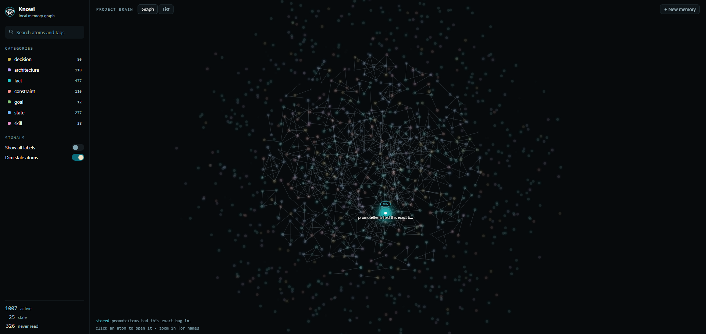
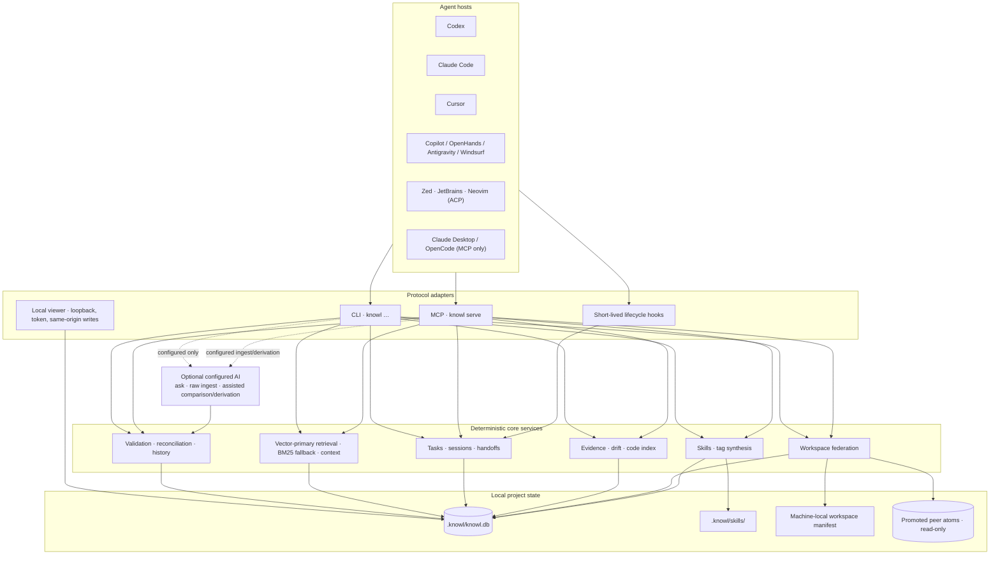
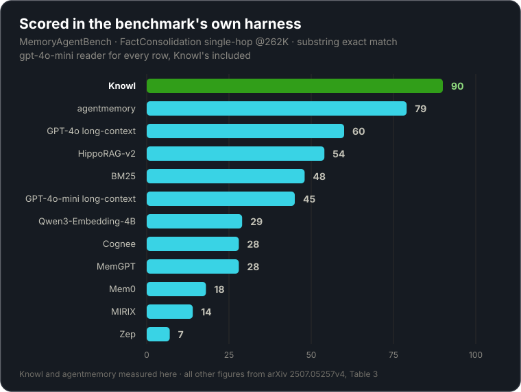

<div align="center">

<picture>
  <source media="(prefers-color-scheme: dark)" srcset="assets/logo.png">
  
</picture>

# Knowl — full reference

**Every shipped feature, in depth: what it does, what it deliberately does not do, and where the
boundaries are.**

[← Back to the main README](../README.md)

</div>

---

This is the complete manual. The [main README](../README.md) is the short version — enough to
install Knowl, understand why it retires stale knowledge, and get an agent talking to it. This
document is where every claim is spelled out, including the limits: which operations stay local,
which paths are lexical rather than semantic, what an import will and will not overwrite, and
which parts of a restore are deliberately not restored.

## Contents

| Section | Covers |
| --- | --- |
| [Overview](#overview) · [Quick start](#quick-start) | What Knowl is and how to install it |
| [Core knowledge model](#core-knowledge-model) | [Atom categories](#atom-categories) · [Metadata, history, ownership](#metadata-history-and-ownership) · [Governed writes](#governed-writes-and-current-truth) |
| [Retrieval and context](#retrieval-and-context) | [Current retrieval](#current-retrieval) · [What a result carries](#what-a-result-carries) · [Embedding models](#choosing-an-embedding-model) · [Historical queries](#historical-retrieval-and-assertions) · [Context packs](#bounded-context-packs) |
| [Tasks, sessions, lifecycle](#tasks-sessions-and-agent-lifecycle) | [Work loops](#manual-work-loops) · [Retention and promotion](#session-retention-recovery-and-promotion) · [Handoffs and resume keys](#leaving-work-for-later) · [Transcript search](#searchable-session-transcripts-optional-off-by-default) · [What exists and what is on](#seeing-what-exists-and-what-is-on--knowl-config-list) · [Host behavior](#host-and-subagent-behavior) · [The fleet](#who-else-is-running--the-fleet) |
| [Evidence, code, drift](#evidence-code-intelligence-and-drift) | [Evidence and symbols](#evidence-and-symbols) · [PR drift and feedback](#pull-request-drift-and-retrieval-feedback) |
| [Workspaces](#workspaces) | [Federation and ownership](#federation-and-ownership) · [Reading a peer's atom by id](#reading-a-linked-repos-atom-by-id) · [Doing a peer's work](#doing-a-linked-repos-work-from-here) · [Ownership stamping](#ownership) |
| [Knowl Cloud](#knowl-cloud) | [Identity and connection](#identity-and-connection) · [Publishing and drift](#publishing-works-from-any-branch-reporting-drift-does-not) · [Staying current](#staying-current) |
| [Learned skills and synthesis](#learned-skills-and-synthesis) | [File-backed skills](#file-backed-skills) · [Deterministic synthesis](#deterministic-synthesis) |
| [Portability and maintenance](#portability-and-maintenance) | [Export and import](#jsonl-export-and-import) · [Garbage collection](#garbage-collection) · [Snapshots, audit, doctor](#snapshots-audit-and-doctor) |
| [Local viewer](#local-viewer) · [Architecture](#architecture-and-security-boundaries) | [Browsing](#browsing-and-finding-what-you-cannot-name) · [Editing](#editing) · [What protects it](#what-protects-it) · component diagram, security boundaries, [write durability](#write-durability) |
| [Agent setup](#agent-setup) · [Benchmarks](#benchmarks) | Host integration, and every evaluation suite with reproduction commands |
| [CLI reference](#cli-reference) · [MCP tools](#mcp-tools-and-resources) | Every shipped command, tool, and resource |
| [Optional AI](#optional-ai) · [Local data](#local-data) | Provider configuration and on-disk layout |

## Overview

Knowl gives coding agents durable engineering context across sessions. It stores decisions,
architecture, goals, constraints, facts, current state, and reusable skills as structured
knowledge atoms in a repository-local SQLite database under `.knowl/`.

Agents access the same governed memory through the `knowl` CLI or the Model Context Protocol
(MCP). Items carry status, freshness, confidence, tags, history, and optional evidence pointing
to files, commits, tests, commands, URLs, users, agents, or indexed symbols. Core storage and
retrieval do not require an external AI provider.

Knowl can also link related repositories into a workspace. Each repository keeps its own
database and ownership boundary; only explicitly promoted knowledge is visible to peers.

A normal workflow queries memory first, verifies misses or stale results against repository
evidence, records durable corrections, and resumes from lifecycle context or a task checkpoint.

## Quick start

Requires Node.js 22 or later.

```bash
npm install -g @dat999zx/knowl
cd your-project
knowl init
```

`knowl init` creates or upgrades `.knowl/`, initializes the database, installs the project
guidance files, updates `.gitignore`, and offers MCP and lifecycle setup for detected agents.
It also prepares the local embedding model on a best-effort basis. If the model is unavailable,
setup still completes; the CLI lexical query remains available, and MCP can run BM25-only after
vectors are disabled.

Record a decision. **Title the subject, not the claim** — the reconciliation rules below
explain why `"Database choice"` supersedes cleanly later and `"Use SQLite"` does not:

```bash
knowl decide "Database choice" "Use SQLite for local project memory." \
  --reasoning "Keeps storage repository-local and simple to operate." \
  --alternatives PostgreSQL MongoDB \
  --tags database local-first
```

Inspect and query the project memory:

```bash
knowl status
knowl state
knowl query "why sqlite"
knowl doctor
```

Start a new agent session so the host loads its guidance and lifecycle configuration. MCP
`knowl_query` and the CLI share the same local store and governance rules.

## Core knowledge model

Knowl separates current truth, abandoned choices, temporary status, and supporting evidence into
typed atoms while retaining history.

### Atom categories

Every atom has exactly one of seven categories:

| Category | Use it for |
| --- | --- |
| `fact` | Stable project truths, conventions, and verified behavior |
| `decision` | A selected option with reasoning and alternatives |
| `goal` | An intended outcome that guides future work |
| `constraint` | A rule or boundary that must continue to hold |
| `architecture` | How components are arranged and interact |
| `state` | Current progress, readiness, blockers, or operational status |
| `skill` | A reusable procedure or learned workflow description |

A `skill` atom describes a procedure; it is not automatically an executable file-backed package.

### Metadata, history, and ownership

The item is the current view; related records retain provenance and history:

- **Status:** `active`, `deprecated`, `rejected`, `archived`, or `superseded`. Retrieval defaults
  to `active`; other states remain queryable through explicit history and maintenance paths.
- **Freshness:** `fresh`, `needs_review`, or `stale`, independently of status.
- **Organization:** numeric confidence and free-form tags.
- **Source:** `source`, `sourceCommit`, and repository-relative `affectedPaths`.
- **Conflict identity:** normalized key, sorted scope, and an optional exclusive flag.
- **Ownership:** `originRepo`, `visibility`, and a repository label on peer results.
- **History:** immutable assertions, linked evidence, and knowledge commits for governed changes.

Use a timeline when the question is what an item said before it changed:

```bash
knowl timeline <item-id>
knowl conflicts
knowl supersede <old-item-id> <replacement-id>
```

Supersession retires the predecessor with `status: superseded`; it does not delete the item,
its assertions, or its history.

### Governed writes and current truth

The deterministic MCP write path accepts structured atoms without an AI provider:

```text
knowl_store({
  "category": "constraint",
  "title": "Authentication tokens stay server-side",
  "content": "Browser code must not persist bearer tokens.",
  "tags": ["auth", "security"]
})
```

When a verified correction replaces an item already returned by retrieval, make the relationship
explicit in the same store call with `supersedes`, or store the replacement and then point the old
item at it:

```text
knowl_update({
  "id": "<new-item-id>",
  "supersedeId": "<old-item-id>"
})
```

With the default security configuration, every structured write rejects content that exceeds the
configured size boundary, contains a detected secret, or references a sensitive path.
`security.rejectSecrets=false` disables both secret detection and the sensitive-path check; field
and raw-output size limits still apply. Accepted writes then follow these reconciliation rules:

1. An exact normalized title-and-content match is a no-op.
2. Knowl examines up to the top three active BM25 candidates in the same category.
   A normalized title subset with at least two significant shared tokens and at least `0.35`
   significant-token overlap identifies the same subject and retires the predecessor.
   **That two-token floor is why a title should name the subject rather than assert the claim.**
   `"Database choice"` and `"Cache backend"` carry two significant tokens and reconcile;
   `"Redis"` and `"Use SQLite"` carry one (`use` is a stopword), so a later decision on the same
   subject is left active beside the first. Rule 4 reports it and prints the `knowl supersede`
   command, so nothing is lost silently — but the title decides whether it is automatic.
3. If no detected candidate qualifies for supersession, an explicitly named active
   `supersedes` item is retired. A qualifying detected same-subject candidate currently takes
   priority when it differs from that explicit ID.
4. Other semantic or lexical overlaps coexist. The result reports the nearby active item so the
   caller can reconcile it explicitly if necessary.
5. An exclusive write is rejected before insertion when another active exclusive item has the
   same normalized conflict key and sorted conflict scope.

These rules apply across atom categories rather than assigning special fuzzy behavior to only
decisions or state. Batch ingestion and update-plus-supersede sequences should not be treated as
an atomic multi-record transaction: current operations may commit individual records
separately. Use explicit IDs and inspect the returned result when a correction spans records.

## Retrieval and context

Memory is useful only if the current, relevant item ranks ahead of stale history without making
the system dependent on a network service. Knowl therefore uses a local vector-primary path with
a bounded lexical fallback.

### Current retrieval

Agent retrieval through MCP `knowl_query` is vector-primary by default, using the repository's
configured local embedding profile. New repositories default to Granite Small English R2. Its
project candidate set is reranked with bounded BM25 lexical results plus
exact-identifier, freshness, status, confidence, and recency adjustments. Normal MCP queries
return active items unless another status is requested. Exact filenames, item IDs, and
`symbol://` locators receive lexical support even when semantic similarity is weak.

In a single repository, the public `knowl query` CLI uses a project-local FTS/BM25/LIKE candidate
path. A current query in a linked workspace also fans out to peers; when vectors are enabled, it
attempts a query embedding and local vectors for federated semantic ranking, then falls back to
lexical results if embedding preparation fails. Historical `--as-of` queries remain local.

### What a result carries

Each `knowl_query` result is compacted before it is returned:

- **`content`** — up to 2,000 characters of the stored fact, with **`truncated: true`** present
  only when it was cut. Around 91% of items on a typical store arrive whole. The ceiling was 600
  until 3.1.0, which returned roughly half of every fact with nothing saying so.
- **`affectedPaths`** — up to six repository-relative files the item depends on, each up to 120
  characters. Withheld for an item owned by another repo in a workspace: its paths are relative
  to a checkout that is not yours, and linked repos are often fork siblings where the same path
  exists in both and means something different.
- **`score`** — the ranker's fused relevance in [0,1] when a calibrated one exists, or the
  string `uncalibrated (<reason>)` when it does not. A string means the ranker has an order but
  no opinion on strength, so judge the content rather than the position. Reasons are
  `lexical-only` (no semantic half ran), `not embedded` (vector ran but never saw this row), and
  `layered namespaces` (each namespace scored against its own corpus, so the numbers are not
  comparable to each other). **`score` orders one page and nothing more.** The semantic half is
  min-max scaled across the candidates, so the top row sits near 1.0 whatever its similarity
  was — on a two-item store an off-topic query and a perfect match both publish 0.96.
- **`cosine`** — the raw similarity in [0,1], on the absolute scale `MODEL_RELEVANCE_FLOORS` is
  measured against, so it means the same thing on every query and against every store. This is
  the number to gate on when deciding whether memory holds the answer at all: for the pair
  above, the cosines were 0.7928 and 0.9296. Present only where the row was actually judged
  semantically — that is, absent on exactly the rows `score` reports as `uncalibrated`, because
  an unjudged row's similarity is 0 by absence rather than by verdict. Unlike `score` it
  survives layering, since an absolute similarity stays comparable across namespaces.

Titles are capped separately at 200 characters, and previews of things retrievable in full
elsewhere — evidence excerpts, timeline assertions, skill markdown, `knowl_skill_run` output —
stay at 600.

#### The assumption checkpoint

`capture.checkpoint` (`off` by default, `ask` to arm; `knowl posture maximal` arms it) asks one
question every 20 assistant turns: **what is this session currently relying on that it never
verified?**

It is looking for claims that became load-bearing without being checked — a number taken from a
summary rather than the source, a fix called done without re-running its proof, an attribution
never confirmed, one observation generalised into a rule.

It **asks the agent**, and calls no model. The proposal it came from measured a separate judge
reading recorded sessions, because offline that is the only thing that can answer; in a live
session the agent already holds the context, so a prompt costs nothing and keeps the capture path
free of network calls. That matters concretely: `agent-hook` is a fresh process per tool call, and
an inline model call there would block every tool the agent runs.

The honest caveat: a self-audit is not the same instrument as an independent judge, so the ~90%
precision measured for the judge version does not transfer, and this ships unmeasured on that axis.

It **never withholds a stop.** Checkpoint flags are recorded as pending lessons so a durable write
settles them, but they are excluded from the gate that can block — that gate is for things that
happened, and a checkpoint fires on a counter. In the mid-turn channel it ranks below every
observed-event card and above the generic continuation reminder.

#### Cross-repo search when repos embed differently

Each linked repo is searched under **its own** embedding profile, and its results are ranked
against its own scale and judged against its own floor.

This matters because a workspace does not in fact pin one embedding identity, though the code
assumed it did. The link-time check compares provider, model, dtype and pooling; the filter
applied to a peer's vectors compares a fingerprint that also covers the embedding recipe version.
Two repos with identical vector config therefore diverge as soon as they sit on different knowl
versions, and nothing re-checks after linking. A cloud-connected repo cannot converge even in
principle — its atoms must stay on the model its workspace serves.

Before this, a mismatched peer contributed **no vector candidates at all** and cross-repo search
quietly fell back to keyword-only while still returning rows, so it read as healthy.

Two consequences worth knowing:

- **Cosines from different models are never compared.** Ranges are normalised per profile, so a
  model whose scores naturally run high cannot outrank one whose scores run low on scale alone.
  Repos sharing a profile still share one range, because their scores genuinely are comparable.
- **A peer whose model cannot be loaded here degrades to keyword-only for that repo**, rather
  than failing the search.

The cost is one extra forward pass per distinct profile and both models' weights resident.

#### What `abstained` means, and what it does not

`abstained` (and the `NO CONFIDENT MATCH` notice that reports it) means **the query does not look
like it is about this store**. It does **not** mean the store lacks the answer, and it must not be
built on as though it did.

The difference is not a caveat, it is the measured result. A question phrased in a store's own
vocabulary is close to that store whether or not anything in it answers the question — so a score
above the floor cannot mean "the answer is here", and one below it only weakly suggests the
question reads as foreign. Two candidate signals were measured and both fail, for different
reasons:

- **Cosine similarity** — on-topic and off-topic distributions overlap on all five shipped presets,
  and the current default has the *smallest* overlap of them, so there is no better preset to move
  to. See [`evals/preset-floor-sweep.md`](evals/preset-floor-sweep.md).
- **Lexical coverage** — quantized at `1 / terms`, so short vague on-topic questions land on the
  same values as partially-matching junk. `why is startup slow` scores 0.500 against a store that
  answers it in full. See [`evals/query-coverage-probe.md`](evals/query-coverage-probe.md).

**So: do not drop abstained rows on the assumption they are irrelevant, and do not treat their
absence as a relevance claim.** The rows are returned rather than withheld precisely because the
floor is wrong often enough to matter. An agent reading three results can judge whether any answers
its question far better than a single threshold can, and that is the intended use — the floor
narrows what to read, it does not decide it.

The honest consumer pattern is to surface abstained rows with the caveat attached rather than to
filter on it, and to fall back to the files when nothing read actually answers the question.

#### Reading `knowl query` from a script

**`knowl query` writes pure JSON to stdout and every advisory line to stderr.** All four are
`Note:` lines: this repo returned nothing and the rows belong to a peer, every result fell below
the relevance floor, linked repos hold matches the limit cut, and a linked repo was not searched.
The split is deliberate, so a programmatic consumer gets a parseable stream without losing the
advisories a human wants.

It bites because most shells and wrappers merge the two by default, and an advisory line is not
JSON wherever it lands relative to the document. A parser fed the merged stream throws, and the
natural diagnosis — "the CLI emitted bad JSON" — sends you into the CLI instead of into your own
stream handling. Read `stdout` explicitly:

```bash
knowl query "auth token design" 2>/dev/null | jq .
```

The parsed value is a **bare array** when every row belongs to this repo and an **object keyed by
repo name** when at least one does not, so a parser that assumes one shape silently returns
nothing in the other. The distinction carries meaning worth keeping: a fact under another repo's
key describes *that* repo. The MCP tool takes a `scope` argument to force one shape; the CLI
does not, so a script must handle both.

```bash
# Current CLI query; single-repository candidates are lexical.
knowl query "auth token design"

# Prepare and control vectors used by MCP/agent retrieval.
knowl reindex --vectors
knowl config set search.vector.enabled false
```

#### Choosing an embedding model

`search.vector.preset` selects the local embedding model. A preset bundles model, dtype and
pooling together, because pooling is not discoverable at runtime and the wrong value produces
plausible-looking vectors that rank badly with no error.

<!-- generated:embedding-presets -->
| Preset | Model | Size (q8) | Context | Languages |
| --- | --- | --- | --- | --- |
| `arctic-embed-m-v2` | `Snowflake/snowflake-arctic-embed-m-v2.0` | ~305MB | 8k | English + multilingual |
| `granite-small-en-r2` *(default)* | `onnx-community/granite-embedding-small-english-r2-ONNX` | ~52MB | 8k | English |
| `granite-97m-multilingual` | `onnx-community/granite-embedding-97m-multilingual-r2-ONNX` | ~98MB | 32k | 200+ languages |
| `bge-small-en` | `Xenova/bge-small-en-v1.5` | ~34MB | 512 | English |
| `minilm-l6-en` | `Xenova/all-MiniLM-L6-v2` | ~23MB | 512 | English |
| `custom` | whatever you name | varies | varies | varies |
<!-- /generated:embedding-presets -->

Every preset except `arctic-embed-m-v2` emits 384-dimension vectors; arctic is 768. Switching
between the 384-dimension presets never changes the stored vector width.

```bash
knowl config                                          # interactive picker
knowl config set search.vector.preset granite-97m-multilingual
knowl config set-model onnx-community/your-model-ONNX  # verifies, then downloads
```

The default is **English-only**. If you store knowledge in other languages, pick
`granite-97m-multilingual`.

`knowl config set-model` is the path for a model of your own: it checks the repository exists and
ships `onnx/model_quantized.onnx`, reads its pooling method from `1_Pooling/config.json`, and asks
you which to use when the repository does not say. Setting `search.vector.model` directly has no
effect while a named preset is active — the preset decides it — and Knowl says so rather than
reporting a silent no-op.

Changing the model makes every stored embedding stop matching, so vector search falls back to
keyword-only results until `knowl reindex --vectors` runs. Knowl offers that rebuild as soon as the
change is saved. Nothing is ever mis-scored in the meantime: each row records a fingerprint of the
model, dtype and pooling that produced it, and only rows matching the active profile are searched.
That also means an interrupted rebuild leaves a smaller searchable set rather than a mixed one.

Existing repositories are never migrated. `knowl upgrade` cannot change your preset, and a
configuration written before presets existed keeps its model and its original pooling.

In a workspace, every repository must share one embedding profile, since cross-repo ranking
compares vectors directly. `knowl workspace repin-embedding` moves the whole workspace to the
current repository's model and lists the peers that must then reindex.

`knowl init` tries to warm the model cache but does not make initialization depend on a download.
Offline BM25 retrieval remains available. A normal write embeds the item only when the model is
already cached: write-time embedding never downloads a model and never fails the write.
`knowl reindex --vectors` is the explicit model-preparation and backfill path for existing items.

Two environment controls support offline or deliberately lexical operation:

```bash
KNOWL_SKIP_MODEL_DOWNLOAD=1 knowl init
KNOWL_DISABLE_WRITE_EMBEDDING=1 knowl decide "Title" "Content"
```

`KNOWL_SKIP_MODEL_DOWNLOAD` prevents setup from fetching the model; it does not prevent a later
enabled MCP vector query from initializing or downloading it. An enabled vector query can fail
when the model cannot be prepared. For guaranteed offline retrieval, use the lexical CLI or set
`search.vector.enabled` to `false` before calling MCP.
`KNOWL_DISABLE_WRITE_EMBEDDING` skips best-effort embedding during writes; BM25 still indexes the
content.

### Historical retrieval and assertions

An `asOf` query returns historical content assertions for project items selected through their
current lexical metadata:

```bash
knowl query "sqlite persistence" --as-of 2026-01-01T00:00:00Z
```

This is intentionally narrower than a current query. Selection uses the item's current
title/content/reasoning and current status, then replaces only content and confidence from the
assertion valid at the requested time. It does not reconstruct historical title, category,
status, or freshness. Historical lookup is project-only and lexical: it does not use vectors,
workspace peers, session/organization/global namespaces, linked evidence, ranking explanations,
or access logging. Pair it with `knowl timeline <item-id>` when the history of one atom matters.

### Bounded context packs

`knowl context` composes a handoff-sized selection instead of printing the full store:

```bash
knowl context \
  --query "authentication rollout" \
  --task "Review token migration" \
  --token-budget 1500
```

The composer loads up to 30 ranked candidates from the current session and project, then prepends
all active project constraints and removes duplicate constraints from the ranked set. Constraints
are pinned first, so non-negotiable rules consume the budget before ranked facts, decisions,
architecture, or state. The budget is an estimate based on `characters / 4`, not a model-specific
tokenizer; callers should leave headroom for their own prompt envelope.

`knowl_context` does not include workspace peers or organization/global namespaces. For a peer
fact, run an explicit current `knowl_query`, then construct the downstream prompt deliberately.

## Tasks, sessions, and agent lifecycle

Repository work often spans commands, turns, or agent processes. Knowl records bounded event
state and explicit checkpoints so work can resume without retaining raw conversations.

### Manual work loops

For one bounded command, `task run` performs the initial focused lookup and records success or a
failure checkpoint with the child exit code:

```bash
knowl task run "Run tests" --query "test verification" -- npm test
```

For resumable work, start once, checkpoint meaningful progress or blockers, and finish after
verification:

```bash
knowl task start "Implement search UI" --query "search retrieval"

knowl task checkpoint <task-id> "Search tests are in place" \
  --goal "Ship the search UI" \
  --completed "Added empty and error-state tests" \
  --next-action "Implement the result list" \
  --artifact "src/search-ui.ts" \
  --verification-status "tests-passing"

knowl task finish <task-id> "Search UI implemented and verified"
```

Use these manual tools only when verified lifecycle hooks are unavailable. Hook-owned sessions
must be left to their host lifecycle; a manual `task finish` or `knowl_session_finish` must not
close them.

### Session retention, recovery, and promotion

Lifecycle events are temporary scratch records and expire after 48 hours. Active session rows
receive a nominal seven-day `expiresAt`, but the current implementation does not automatically
purge those rows. A session idle for more than two hours can be marked `recovered`; recovery does
not finalize the session or promote candidates.

At a normal terminal event, deterministic promotion selects at most eight durable candidates.
Decision candidates outrank generic outcomes. A repeatedly successful command becomes a `skill`
atom candidate after three runs, but that promoted atom is still descriptive knowledge, not an
executable `.knowl/skills` package. Failed terminal events create a handoff for the next matching
host session.

Hooks run as separate, short-lived `knowl agent-hook` processes by default. They normalize host
events and never start, stop, or supervise the long-lived stdio `knowl serve` process. Lifecycle
capture itself stores no raw prompts, transcripts, stdout, stderr, or environment variables. When
transcript indexing is explicitly enabled, the separate transcript index reads supported host
transcript files already present on the machine; it does not create them.

### Hook transport — `hooks.transport`

A hook process costs ~230ms of Node startup, paid twice per tool call (`PreToolUse` and
`PostToolUse`) and serialized against the agent's own work, because the host waits on the
pre-tool hook. Measured over 102 real Claude Code sessions that is 31s at the median session
and 190s at the 90th percentile. Claude Code (2.1.257+) and Codex (0.148+) can instead run a
hook as a call to a tool on an MCP server they already hold open — which is the `knowl serve`
process, with its database open and its embedding model loaded.

```jsonc
// .knowl/config.json
"hooks": {
  "transport": "mcp"   // "command" (default) spawns a process per event
}
```

With `mcp`, `knowl init claude` and `knowl init codex` (and `knowl doctor --fix`) write the
mid-session events — `PreToolUse`, `PostToolUse`, `Stop`, `PreCompact`, the subagent events —
as `mcp_tool` hooks calling `knowl_hook`, and the server registers that tool. Two things stay
processes on purpose: `SessionStart`, because both hosts document that it fires before their MCP
servers finish connecting, and `SessionEnd`, because nothing documents whether the server is
still up when it fires. The prompt-time reminder is unchanged. Every other host keeps its process
hooks whatever the setting says; only hosts with the hook type declare the events that may move.

The cost is one entry in the server's tool list. MCP has no hidden-tool concept, so `knowl_hook`
is visible to the model in repositories that turned this on; its description says not to call
it, and calling it while the transport is `command` is refused rather than run, so a client
holding a stale tool list cannot capture every event twice. A hook that fires from a directory
that is not the server's project is answered with silence, where a process hook would have
opened that project's store — the one case the two transports differ in, and the reason this is
a choice rather than a default. The setting takes effect at the next `knowl init <host>` and the
next server start.

### Leaving work for later

Two different shapes, deliberately not merged:

| | `knowl_handoff` | `knowl_park` / `knowl_resume` |
| --- | --- | --- |
| How many | One per project | Many at once |
| Who holds it | The project | The user, as a short key |
| Delivery | Pushed to the next session here | Pulled on demand, by key |
| Spent on use | Yes, one-shot | No, resume repeatedly |
| Reach | Next session in this repository | Any session, any directory, any time later |

"I am stopping for the night, whoever picks this up should know where I left it" is a handoff.
"Park this branch of work, I will come back to it in a fortnight" is a resume point. A parked
baton reads as planned work rather than as a crash, because a session told it "ended before a
clean finish" goes looking for damage that does not exist.

Both are passes, not durable notes. Anything worth keeping goes to `knowl_store`.

### Searchable session transcripts (optional, off by default)

Atoms are distilled and therefore lossy: whatever the writer did not judge salient is gone. The
raw Claude Code `.jsonl` transcripts are the complete record underneath. Indexing them turns a
memory miss into a slower lookup instead of amnesia.

Off by default, and off means nothing exists — no database file, no registered tools, no tokens
spent in the guidance card.

```jsonc
// .knowl/config.json
"search": {
  "transcripts": {
    "enabled": false,   // nothing is created, no MCP tools are registered
    "share": false,     // let linked workspace repos read this index
    "fallback": false   // a missed knowl_query runs transcript search itself
  }
}
```

```bash
knowl config                                  # toggle it interactively
knowl reindex --transcripts --budget 5        # build the index, resumable
```

What it indexes and what it costs, measured on this repository's own archive: prose is **2.7% of
80.9 MB** across 75 transcripts. Only user messages and assistant prose are indexed; `tool_use`
and `tool_result` blocks are skipped entirely. Rows are pointers — `(session, line, role)` — and
message bodies stay in the `.jsonl`, so the whole index is **under 3 MB**.

Ranking fuses BM25 with whole-corpus semantic search over int8 vectors, so a message that shares
no word with your query can still win. Semantic ranking follows `search.vector.enabled`; with
vectors off, transcript search is keyword-only and every result says so.

**The two halves are indexed on different schedules, and only one of them is automatic.** The
lexical half rides the turn-stop hook, which needs no model and costs little. The semantic half
does not: a hook is a fresh process per turn, so the embedding model would be cold every time, and
loading it cost more than the whole catch-up budget — measured at ~1.8s against a 1.5s budget, in
a repository with nothing to index. The pass then found its deadline already spent and embedded
nothing, every turn. Before 5.14.0 that was the shipped behaviour and it was silent: one real
store held 12,598 indexed messages and 4 vectors.

So embedding now happens where a model stays warm — inside the long-lived `knowl serve` process,
as a short top-up when you actually run `knowl_transcript_search` — or in bulk, under a budget you
chose, with `knowl reindex --transcripts`. **If you enabled transcript search before 5.14.0, run
that once**; the change stops coverage decaying but does not backfill what never landed.

Three tools appear only when the feature is enabled, which is why they are absent from the
canonical tool table below:

- **`knowl_session_list`** — browse past sessions: best-known name, opening ask, status, and what
  each one promoted into memory.
- **`knowl_transcript_search`** — search prose across sessions; returns
  `transcript://<repo>/<session>#L<line>` locators.
- **`knowl_transcript_read`** — open one locator with the surrounding turns.

Transcript hits carry `cosine`, the absolute similarity on a stable scale — the one number that
means the same thing from one search to the next, where the fused `score` is a rank-position total
and cannot. Use it to judge how strong a match actually is.

**There is currently no relevance verdict on transcript search, deliberately.** The machinery
exists and is wired, but its floor is `null`, so no `NO CONFIDENT MATCH` notice fires and the
`search.transcripts.fallback` chain withholds nothing. The per-model floors are measured over
knowledge-atom fixtures, and a floor cannot be borrowed across corpora any more than across models
— applied to transcripts it judged *every* query off-subject, including ones the archive answers,
which through the fallback chain reported "nothing here" over an archive holding the answer.

Arming it needs a measurement on transcript data using the two-class probe method in
[`evals/preset-floor-sweep.md`](evals/preset-floor-sweep.md). If the classes overlap there as they
did for knowledge atoms, it stays off — `cosine` published with no verdict is the honest answer.

Disabling the feature **deletes** `.knowl/transcripts.db`. An index nothing will refresh is not
something to leave on the disk of the person who just turned it off.

Workspace peers may opt in with `share: true`, which lets linked repositories open the index
read-only. Sharing is re-checked on every read, so revoking it revokes previously issued
locators too.

Both Claude Code and Codex archives are discovered. They are found by different mechanisms
because they are laid out differently: Claude Code names a directory after the project
(`~/.claude/projects/<encoded-root>/`), while Codex partitions by date
(`~/.codex/sessions/YYYY/MM/DD/`) and records the project inside each file as
`session_meta.payload.cwd`. Every Codex candidate is therefore opened, with a bounded header read.

### Seeing what exists and what is on — `knowl config list`

Most of what Knowl can do is a setting, and several of the useful ones ship off. Until this
command there was no surface that said so: `knowl status` reports item counts, capture health
and workspace, `knowl doctor` reports readiness, and the one-line descriptions of every setting
were reachable only from inside the interactive editor, which needs a TTY.

```bash
knowl config list          # every switch, whether it is on, and the command that changes it
knowl config list --all    # plus values that are filled in rather than switched
knowl config --help        # the same settings as a reference, with allowed values and defaults
```

`knowl status` carries the count and points here, because that is where `knowl init` sends a
new repository and a feature the product never mentions there is a feature nobody finds.

**When a change takes effect.** Transcript search, the cloud connection and workspace
membership are obeyed immediately by a running agent session — those three gates re-read the
config file on every call and fail closed if either the captured or the on-disk value says off.
Every other setting is read when a session starts, so a session already running keeps the value
it started with. A setting that decides whether a *tool exists* — the cloud and workspace tools
are registered only when their config is present — can only add or remove that tool at session
start, because the tool list is sent once when the connection opens.

### The recall and capture posture — `knowl posture`

How much memory should do on its own is a stance, not a matrix, so the stance has one command.
Every key it touches exists on its own in `knowl config` and stays the contract; `posture` is
the convenience over them.

```bash
knowl posture            # show the current values of the posture keys
knowl posture maximal    # the all-knowing stance
knowl posture frugal     # reset the same keys -- knowl exactly as it ships
```

`maximal` sets, and `frugal` resets:

- **`search.transcripts.enabled` + `search.transcripts.fallback`** — the recall chain. With
  `fallback` on, a `knowl_query` that missed runs transcript search itself instead of
  suggesting the second tool in prose, and a miss in **both** stores returns
  `RECALL CHAIN — VERIFIED NEGATIVE` with coverage lines: "that never happened" becomes a
  claim checked against the atoms *and* the archive, not a guess over one of them. An AND
  with `enabled`, by the same rule as `share`.
- **`capture.nudge: enforce`** — the end-of-conversation silence nudge, delivered by
  withholding one stop.
- **`capture.events: enforce`** — event-shaped lessons. A destructive command (a broad
  process kill, a git command that discards work, a recursive force-delete, a `DROP TABLE`)
  or a prompt that reads as the user correcting the agent becomes a *pending lesson* that
  only a subsequent durable write settles. In `enforce` the agent is nudged mid-turn while
  it still knows what else the command matched, and an unstored lesson withholds one stop —
  at most three per conversation, with "no such event actually happened" always a legal
  answer. `shadow` records what it would have said and says nothing; the correction detector
  runs in the host hook and forwards only a derived boolean, never the prompt text.
- **`capture.scope: turn`** — the silence question asked per turn, through the free mid-turn
  channel rather than a blocked stop, when a turn does substantial work and stores nothing.
  Its defining property: a `knowl_query` does not quiet it, only a durable write does — the
  memory-active session is precisely the one every other reminder goes silent for.
- **`impact.enabled` + `impact.gate: shadow`** — change-impact detection on, with the write
  gate in shadow: even the maximal stance does not arm a blocking gate ahead of its measured
  precision bar. What that bar currently reads is printed by `knowl status`, below.
- **`fleet.digest: on` + `fleet.nudge: enforce`** — the fleet's two quiet-by-default surfaces
  (see [the fleet](#who-else-is-running--the-fleet)): the per-turn delta of what the other
  sessions on this machine moved on to, and the stop-time nudge when this turn's writes changed
  code another live session had read. The nudge withholds a stop rather than refusing a tool
  call, which is the line maximal draws — the same one that keeps `impact.gate` in shadow.

#### Whether the write gate is good enough to enforce

Shadow mode runs the real verdict and withholds the refusal, so every refusal an enforcing gate
*would* have issued is recorded. The bar in front of enforcing it is **≥95% precision over ≥40
adjudicated findings**, and `knowl status` prints where the store stands against it:

```
🛡️  WRITE GATE (shadow)
  Refusals withheld:     60
  Adjudicated:           48 of 60
  Precision:             87.5% (6 false positive(s))
  Bar to enforce:        ≥95% over ≥40 adjudicated — not cleared
```

The bar is printed beside the number on purpose. A precision figure alone invites "87% sounds
fine"; against the bar it reads as what it is.

**Unresolved findings count in neither half.** Nothing forces adjudication, so early on the
unresolved set is the larger one, and treating those withheld refusals as justified is how a
precision number talks its way past the bar it was meant to clear. Adjudicate with
`knowl_impact({resolve})`; until something has been, the line reads *not yet measured* rather
than a percentage, because no evidence is not a perfect score.

Both halves of the bar fail differently and are reported separately: 100% over three findings is
not evidence, so it shows as **not cleared** with the number of further adjudications that would
decide it. That prompt is withheld when precision itself is what is failing — telling someone
below the bar to gather more evidence is advice for a verdict already reached.

The block is absent entirely on a store whose gate has never withheld anything. Such a repo has
not measured 0%, it has measured nothing.

Query results also annotate staleness whatever the posture says: a row whose `affectedPaths`
were modified after the row was stored carries `pathsChanged`, absent when clean. The marker
names the files rather than only counting them, because a count leaves the reader to diff
`affectedPaths` against the working tree to find out where to look:

```
Open src/auth.ts, src/session.ts, then verify this still holds: 2 of 6 affectedPaths modified
since this was stored.
```

Three names at most, then `and N more`, so an atom citing thirty paths still reads as one line.
The count stays behind them: it is what separates "one of nine cited files was touched" from
"every file this rests on is gone". The field says *verify*, never *wrong*. Paths that cannot be
resolved against this checkout — absolute, escaping the root — are skipped rather than counted,
because an unreadable path is absence of evidence, not evidence.

This one is **on by default**, alone among the keys on this page: it adds a field rather than a
message, so it spends no mid-turn slot and withholds no stop. It is not free either — every
returned local row costs an `fs.stat` per cited path — so it has a switch:

```bash
knowl config set search.pathsChanged false
```

Worth turning off in a repository whose atoms cite generated or build-time files, where the
marker would be present on every row forever and stop meaning anything.

### The recall gap — what the store held and nobody asked for

Every gate on the write path decides what gets *in*. `capture.nudge` measures the opposite: what
a session was given the chance to store and did not. The read path now has the same twin, and it
answers a question no session can answer about itself — **how often did the agent act on a file
this store already knew something about, without having retrieved it?**

An agent that never retrieved an atom has no way to notice the atom exists. So the failure is
invisible from the inside, and worst when the mistake does not fail loudly: wrong approach, tests
green, shipped, and nobody ever learns the store held the answer the whole time.

On every tool call that reads or writes a file, the touched paths are matched against active
atoms citing them, and one row records whether the store held anything and whether it had already
been retrieved. Read it with `knowl status`:

```
📌 RECALL GAP
  Tool touches observed: 340
  Store held something:  91
  ...already retrieved:  62
  ...missed:             29 (32%)
  Lower bound — only knowledge citing a file path can be counted here.
  Retrieved when held — main thread: 62% (128 held)
                        subagents:   31% (44 held)
```

**The last two lines split the same ratio by who was working**, and subagents are the half worth
watching. A subagent receives no prompt reminder and no MCP server instructions — the
`SubagentStart` card is the only guidance channel that reaches it — so its share is the closest
thing to a controlled read on whether that card alone carries the habit.

They print **only when both sides have observations**. Against one population it is not a
comparison, and rows written before the attribution existed are unattributed, so a freshly
upgraded store would otherwise report "100% main thread" as though that had been measured. A host
that does not identify its subagents therefore shows nothing here rather than something wrong.

The identity is recorded at the hook, which is the only place it exists: **hooks know the agent,
MCP calls do not.** A subagent shares its parent's session id, so the conversation key cannot
separate them — the attribution is a column beside it rather than a change to it, because a dozen
other counters read that same key and splitting it would fragment all of them to answer a question
none of them asked.

**Nothing is shown to the agent, and there is no configuration key.** It is a measurement, and it
has no switch for the same reason `capture_outcomes` has none: a count gated behind the feature it
exists to justify can never justify it. Only what is *done* with a count is ever configurable, and
today nothing is done with this one.

Three properties worth knowing before quoting the number:

- **It counts touches, not atoms.** Three atoms naming one file is one moment where the agent
  could have been told something and was not, not three misses.
- **The share is taken over `held`, never over touches.** Dividing by every tool call reports a
  figure that falls as the agent works in files the store says nothing about — which is activity,
  not improvement.
- **It is a lower bound, printed as one.** Only knowledge carrying `affectedPaths` can be matched
  to a file, so a decision atom naming no file never counts as a miss. "Already retrieved" is
  judged on a time window rather than a session join, which errs toward *retrieved* — so the proxy
  understates the gap and cannot invent one.

The rows are `preserved` across snapshot restore, never refilled: a ratio assembled from two
different histories is not a floor on anything.

### The claims no drift check can reach

Drift watches files. An atom that cites a file can be told when that file changes; roughly half
the store cites none, and nothing can watch those. `knowl status` dates them instead — not by
whether they went stale, which nothing observed, but by **how long since anyone last restated the
claim**:

```
🕰️  UN-RESTATED CLAIMS
  Prose (cites no code): 573 of 1072
  Days since anyone restated the claim, by category:
    goal          n=   7  p50   45.5d
    skill         n=  12  p50   32.2d
    state         n= 137  p50     31d
    constraint    n=  22  p50   24.4d
    decision      n=  54  p50     24d
    fact          n= 267  p50   20.2d
    architecture  n=  74  p50     18d
  Furthest past its own category's cadence:
      2.7x p50    54.5d  fact          Use knowl.cmd on Windows PowerShell
      2.5x p50    45.4d  architecture  Competitor normalized adapter capability matrix
  Not a staleness signal: nothing here observed a claim becoming false.
  Store history is 54.5d, so ages beyond that cannot be distinguished from absence.
  17 counted as prose despite citing paths, because every path is a prose file.
```

**Report only. Nothing here flips `freshness`, and there is no threshold.** For prose there is no
evidence a claim became false, only the absence of anyone reaffirming it — flagging would assert a
defect nothing observed, and losing knowledge nobody can recover is strictly worse than carrying a
stale atom that ranks slightly lower.

That is also why the list ranks rather than flags. A cutoff ("past N days is stale") cannot pick N
on a store younger than the cadence it is measuring. An **ordering** needs no cutoff, so it is
correct at any store age and sharpens on its own as the corpus ages.

Four things worth knowing before quoting it:

- **The clock is `valid_from`, not `updated_at`.** A new assertion generation is written only when
  title, content, reasoning or confidence change, so it moves on restatement and nothing else.
  Visibility promotion, supersession and status changes leave it alone — on a measured store 72%
  of items have an `updated_at` newer than their `valid_from`.
- **The named list ranks on the ratio to a category median, not on age.** Ranking on age is
  degenerate: a store is seeded in one batch, and that batch is permanently its oldest cohort, so
  an age-ranked list is the seed with every row tied at the store's own age. The ratio asks
  whether a claim is unusual *for its kind* — an architecture note at 54.5d against an 18d cadence
  is three cadences past due; a goal at 54.5d against a 45.5d cadence is ordinary.
- **Store history prints beside the ages because it bounds them.** Nothing can be older than the
  store it lives in, so an empty tail cannot distinguish "nothing rots past 60 days" from "no
  store is old enough to say".
- **Citing a path is not citing code.** An atom whose only path is `docs/research/x.md` is exactly
  the prose this exists for, so it counts as prose and the last line reports how many items that
  distinction moves.

Retrieval counts are deliberately not an input. A read-count prior is a feedback loop in which an
atom that ranks high is read more and therefore ranks higher, with nothing in the loop asking
whether it is true.

### What Knowl says mid-turn — `reminders.*`

Separate from what Knowl *stores*: these are the messages it sends the agent between tool
calls. Both are **on by default**, and both share the single mid-turn slot with the change card
and the capture prompts — turning one off does not give the others more room, it gives the turn
back.

Since 5.14.0 the same two keys also govern the **turn-start card**, the one a host's prompt hook
delivers. It used to be unconditional: the same paragraph on every prompt, and because turn-start
context accumulates in the transcript rather than replacing the previous copy, a 40-turn session
carried 40 identical copies. It is also a restatement of `KNOWL.md`/`AGENTS.md`, which every host
already carries in its system prompt. It now lands on the first prompt of a conversation and then
follows the schedule below, counted in completed turns rather than tool calls — so `driftEvery 0`
silences it too.

```bash
knowl config set reminders.driftEvery 24        # remind half as often; 0 turns it off
knowl config set reminders.driftBackoff false   # repeat at that cadence forever
knowl config set reminders.skills false         # stop the two skill nudges
```

- **`reminders.driftEvery`** (default `12`) — how many consecutive successful tool calls that
  used no Knowl tool trigger the continuation reminder. Any Knowl tool call resets the count,
  so a session already using memory never sees it. The cadence *is* the switch: `0` is off, and
  raising it is the lever for a long mechanical session that pays the reminder repeatedly for a
  rule it followed the first time. Measured against a 197-session archive, the shipped cadence
  fires ~19 times per session and ~1,750 tokens with it — more than three times the guidance
  card, and unbounded, because it scales with how long the session runs rather than sitting at a
  fixed size. The heaviest session in that archive took it 242 times.
- **`reminders.driftBackoff`** (default `true`) — double the gap after each delivery, so the
  reminder lands at 12, 36, 84, 180, 372 rather than every 12 forever. The message is
  byte-identical every time it is sent: after two or three the agent has either adopted the rule
  or decided against it, and the rest is furniture. Over the same archive this removes 86% of
  deliveries, and the worst session drops from 242 to 7.

  It backs off rather than stopping, and that is the point. A hard cap of three would remove 89%
  — barely more — but goes permanently silent after event 36 and says nothing across the
  remaining 2,868 events of a long session, which is the same structural blind spot the capture
  work exists to close. Set `false` for the old every-N-forever behaviour.
- **`reminders.skills`** (default `true`) — the two skill nudges: *"you have run this three
  times, save it as a skill"* and *"a saved skill matches this command"*. One key for both,
  because both are the skills subsystem speaking. Worth turning off in a repository that does
  not use skills, where they are pure context cost.

### `knowl transcripts` — turning sessions into candidates

Searching a transcript answers a question. This turns one into memory. Extraction runs the
configured model over indexed sessions and **stages** what it finds; nothing reaches the knowledge
store until you approve it.

```bash
knowl transcripts extract --limit 10        # prints the estimate, then stops
knowl transcripts extract --limit 10 --yes  # actually runs
knowl transcripts candidates                # review what was staged
knowl transcripts approve <id>...           # promote, or --all
knowl transcripts discard <id>...           # reject, or --all
```

**Extraction spends your model quota, so it tells you first.** `extract` prints the session count,
the character estimate and the provider it would call, and does nothing without `--yes`. The
default is 10 sessions, not the archive. It requires `ai.provider` and `ai.model`; without them,
distil a session yourself with `knowl_transcript_read` and store the result through
`knowl_ingest_atoms`, which needs no AI configuration.

**Nothing is promoted automatically, and that is the point.** A first run over a real archive
produces on the order of a thousand atoms. An unreviewed corpus that size would be answering every
future query while nobody had yet decided any of it was true, so approval is a separate, explicit
act — one candidate at a time, each passing the same secret validation, confidence range and dedup
checks that every other write does.

Runs are resumable and never pay twice. An extracted session is watermarked, including one that
yielded nothing — short sessions yield nothing most often and would otherwise dominate the bill. A
session whose extraction *failed* is deliberately left unwatermarked, because a provider error is
not a verdict about that session. Long sessions are truncated from the start, keeping the tail,
where a session's conclusions are.

Promoted atoms carry `provenance: inferred` and `source: transcript:<harness>:<session>`. A model
distilled them from a conversation nobody re-read at approval time; calling that `observed` would
rank it above knowledge somebody actually verified.

Candidates live in `.knowl/transcripts.db`, not the knowledge store, so speculative rows never
reach a query and disabling transcript search discards them with the index. They are regenerable
from the transcripts, which is what makes that safe.

### Host and subagent behavior

| Host | MCP | Automatic lifecycle | Subagent lifecycle | Current session behavior or limit |
| --- | --- | --- | --- | --- |
| Codex | Yes | Yes | Yes | Main turns share one memory session |
| Claude Code | Yes | Yes | Yes | Main turns share one memory session; prompt guidance is also installed |
| Cursor | Yes | Yes | No | Finalizes per turn; supplied `additional_context` may not surface to the model |
| GitHub Copilot | Yes | Yes | Yes | Reuses Claude Code's hook format |
| OpenHands | Yes | Yes | No | MCP entry is added by hand |
| Antigravity | Yes | Yes | No | No prompt event upstream |
| Windsurf | Yes | Yes | No | No stop event upstream |
| Claude Desktop | Yes | No | No | MCP plus the manual work loop |

Claude Code and Codex subagents share their parent's memory session, but each subagent has its own
binding, reminder counter, change watermark, and lifecycle identity. Their retrieved memory is
capped at half of the normal 3,000-character context allowance, plus a compact workflow card.
Cursor does not expose a corresponding subagent event.

Each accepted successful non-Knowl tool event advances a per-agent drift counter. After 12
consecutive events, a mid-turn card reminds the agent to re-query. A Knowl call or an emitted
change card resets the counter. Change cards report new knowledge commits since that agent's
watermark; matched writes made through that agent's own MCP call are suppressed so the caller is
not notified about its own change.

### Who else is running — the fleet

Several agent sessions on one machine do not know about each other. Claude Code keeps a registry
of its live sessions and lets one message another, but records nothing about what each is doing —
and every other host records nothing at all — so two sessions hit the same `SQLITE_BUSY`, both
start fixing it, and a third upgrades the hook every one of them is standing on. Knowl keeps the
half no host has: what each session was asked, what it wrote this turn, the last error it saw,
and which problem it has claimed by editing files after seeing that error. One machine-level
file, `~/.knowl/fleet.db`, beside the resume keys — not a project table, because the collision
that matters most crosses repositories.

**Every host with Knowl hooks is in the fleet**, and they see each other: a Codex session appears
on a Claude session's roster and the reverse. Liveness is answered exactly where a host publishes
a session registry (Claude Code does; a row its registry does not list is a dead process and is
dropped) and by recency where none does — a session with no registry drops off the roster two
hours after its last event, and a clean exit closes its row immediately. Only sessions the
host's own messaging can actually reach are offered as something to `SendMessage`; the rest are
listed, marked, and raised with the user instead.

**On by default**, along with `fleet.cards` below — and what separates those two from everything
else here is what a surface can *cost*. Anything that refuses a tool call or withholds a stop
ships silent: `impact.gate` and `capture.nudge` are `off` when unset, and the fleet's own
`fleet.nudge` is `shadow`, recording what it would have said. A roster costs a directory listing
and prints nothing at all when a session is alone, and a card is advice on a channel the agent is
already reading — neither is on that ladder, and nobody opts into "tell me other sessions exist"
until after the collision has happened to them.

```bash
knowl fleet                 # every live session: host, repo, state, what it is on, what it is editing
knowl fleet --repo web      # one repo's sessions
knowl fleet --json          # the report as JSON
```

`knowl fleet` needs no Knowl project: the fleet is machine-level, and the terminal you ask from is
often outside every repo. Run from inside a Claude Code session, the listing marks that session
`(you)`; other hosts publish no session id to read, so there the label is simply absent.

- **`knowl_fleet`** — the same listing as an MCP tool, registered unless `fleet.enabled` is
  `false`. Use it before fixing an error that may be shared, before changing hooks, config,
  migrations or the knowl install, or when the user asks who else is running. `inRepo` narrows
  to one repo (not `repo`, which on every Knowl tool means *act as that linked repo*). Messaging
  a session is the host's own `SendMessage(to:name)`, and `notify_when_idle:true` waits for it to
  finish — offered only for the sessions it can reach. It is absent from the canonical tool table
  below for the reason the transcript tools are: a gated tool is not a promise every session can
  rely on.

```jsonc
// .knowl/config.json
"fleet": {
  "enabled": true,      // absent means on; false silences every fleet surface at once
  "digest": "off",      // "on": a per-turn delta of what the other sessions moved on to
  "cards": "enforce",   // same-problem and shared-surface cards; "shadow" records, "off" never
  "nudge": "shadow"     // stop-time stale-read nudge; "enforce" withholds one stop
}
```

- **`fleet.enabled`** (default on) — the roster at session start, the tool, the command, and the
  three switches below. `false` turns all of it off.
- **`fleet.digest`** (default `off`) — at each turn start, a few lines on what the other sessions
  moved on to since this one last looked. Off because it costs lines on every turn of a busy
  fleet; `knowl posture maximal` turns it on.
- **`fleet.cards`** (default `enforce`) — a *same-problem* card when another live session has
  claimed the failure this one just hit, and a *shared-surface* card before a change to
  something every session stands on: hooks, config, migrations, the knowl install. Advice on the
  mid-turn channel the agent already gets, never a refusal, which is why it ships armed;
  `shadow` records what would have been said and says nothing.
- **`fleet.nudge`** (default `shadow`) — at stop, when this turn's writes changed code another
  live session had read: `enforce` withholds the stop once and asks the agent to tell that
  session, which costs a turn. Shadow by default on the same ladder as `capture.nudge`, for the
  same reason: how often it would fire is measured before it is allowed to.

## Evidence, code intelligence, and drift

An atom can remain active after the code it describes changes. Evidence and drift checks make
that gap visible without treating every external source as automatically verifiable.

### Evidence and symbols

Evidence types are `file`, `symbol`, `commit`, `test`, `command`, `url`, `user`, and `agent`.
Each link has a `supports`, `contradicts`, or `derived_from` relationship.

```bash
knowl evidence <item-id>
knowl index-code
knowl symbols src/store/repository.ts
```

Automatic staleness is limited to hashed file evidence and indexed symbol evidence. URL, commit,
test, command, user, and agent records do not become stale automatically. File evidence compares
its stored hash with the current file. Symbol evidence uses a `symbol://` locator against the
local index.

The incremental Tree-sitter index supports `.ts`, `.tsx`, `.js`, and `.jsx`. It records relevant
symbols and import/export relationships for local inspection; code indexing and symbol
resolution never fan out to workspace peers.

### Change impact, when two sessions touch the same code

**Off by default.** `impact.enabled` is absent from a new configuration rather than present and
false, so upgrading Knowl cannot switch it on. Turn it on with `knowl config set impact.enabled
true`; the MCP tool below is registered only when it is on.

While it is on, Knowl records which files a session actually read, and tells a session when
another one has since changed code underneath it — the case where you are working from something
that was true when you read it and is not any more.

A read counts whether it came through the agent's file tools or through the shell, so a session
whose agent prefers `cat`, `head` and `sed -n` is seen. Shell reads are recorded at file
granularity rather than per symbol: the shell says *which* file was opened and never how much of
it, and expanding a slice into one row per symbol would assert beliefs about signatures that
never reached the agent. What the parser declines is the more important half — `grep`, `rg`,
`find`, `ls` and `wc` return matches or names rather than contents, `git show <ref>:<path>`
serves a ref's text and not the working tree's, an in-place `sed -i` is a write, a redirect makes
a segment a write whatever its verb reads, and a glob or a `$variable` is not a filename until
the shell has run. A read piped into anything that reports on the text instead of passing it on
(`cat f | grep x`, `cat f | wc -l`) is declined for the same reason the direct form is.

Findings come in three tiers. `certain` and `likely` are returned by default; `possible` is
unmeasured path matching and is returned only when asked for by name. A `certain` finding also
refuses the next edit to that file until you have re-read it, which is the one place this feature
does more than report.

- **`knowl_impact`** — `scope: "mine"` (the default) lists findings against reads still held open,
  which is the work someone can still act on; `scope: "all"` includes findings whose session has
  since ended and which nobody has adjudicated. Pass `resolve` to close one.

Closing a finding is the only way it ever closes, and the resolution is the measurement:
`repaired` (you reconciled your work with the change), `false_positive` (the change does not
affect what you were doing), `dismissed` (it does, and you are proceeding anyway), or `expired`
(the work it concerned is gone). `false_positive` is what makes a precision number possible, so
it is worth using when it is the true answer.

### Pull-request drift and retrieval feedback

Preview affected knowledge before changing freshness:

```bash
knowl pr --since origin/main --dry-run
knowl pr --since origin/main
```

The check considers `affectedPaths`, source strings, path-like tags, and stale symbol evidence.
Without `--dry-run`, matching candidates are changed to `needs_review`. It does not rewrite their
content or decide a replacement.

What survives the check is narrower than "a file this atom cites appeared in the diff". An atom
whose cited file was merely **edited** is dropped: that was 226 of 339 observations on the measured
store, and reporting it is what made the signal unreadable. What is reported is a cited path that
is **gone** — deleted, or moved somewhere a rename cannot account for — a symbol locator that no
longer resolves, or an untracked directory that moved since the atom was written. So an empty
result means nothing an atom cites went away, not that nothing changed.

- **`knowl_drift`** — the same check as an MCP tool, for the agent that just wrote the branch. Use
  it before opening a pull request and before `knowl_task_finish` on work that touched code. It
  takes `since` and previews by default; `apply: true` is the equivalent of dropping `--dry-run`.
  It deliberately does **not** tell the team, which the CLI does: publishing a retirement is
  visible to every member of the workspace, and sending stays the user's to run — the same line
  `knowl_cloud` draws by exposing status and stage and stopping there.

The automatic session-start check is a different question and does not replace either. It asks
what drifted while you were away; these ask what the work you just did made false, and the diff
that answers it does not exist until the branch does.

When a repo is connected to a workspace, `knowl pr` also tells the team, so a flag it raises is
visible to everyone. The other end of that is:

```bash
knowl reviewed <itemId>
knowl reviewed <itemId> --note "still true, the rename did not change the behaviour"
```

This records that you re-read the item and it still holds: locally it clears the review flag, and
on a connected repo it discharges the one `knowl pr` raised for the team. It is the only way to
clear a team review flag — republishing an item says nothing about freshness and leaves the flag
standing.

It is a command you type rather than something an edit does for you, and deliberately so: it
vouches for specific text, so it should be the act of someone who just read that text. If the
team's copy has changed since it was published, the review is refused and says so — what you
vouched for is not what is there.

Retrieval access logging stores a query fingerprint rather than the raw query. Agents can append
feedback only after using or rejecting a result:

```text
knowl_feedback({
  "itemId": "<item-id>",
  "used": true,
  "useful": true,
  "causedCorrection": false
})
```

`knowl access` summarizes frequently used, stale, and correction-causing items. Garbage
collection also uses this heat: an item is hot when it has at least three retrievals or was
retrieved within the last 21 days.

Feedback also moves standing. An item reported useful on two separate days is promoted from
`asserted` to `verified` — days rather than events, so a burst of confirmations inside one
session counts once — and a correction demotes it immediately. Promotion is checked when the
feedback lands and again at every session start, so an item whose confirmations accumulated
while nothing was evaluating them is promoted on the next session rather than never. Items are
also promoted on observed use alone when they answer distinct questions across distinct days and
cite files the drift check has had the chance to contradict.

## Workspaces

Knowl workspaces provide linked federation across related repositories without merging their
databases.

```bash
# Create a machine-local workspace.
knowl workspace init product

# Run inside each repository that should join it.
knowl workspace add product
knowl workspace status

# Bare: pick from a list, with the categories worth sharing already ticked.
knowl workspace promote

# Or name them, which skips the picker and dry-runs until --apply.
knowl workspace promote --category decision
knowl workspace promote --category decision --apply
```

A repository joining a `linked` workspace records `defaultVisibility: workspace`, so the knowledge
it writes from then on is readable by its peers. The command prints that a default decided it and
how to decline; `--default-visibility repo` opts out, and `knowl workspace set` with no flags
prints the current value. Repositories already listed in a manifest are never moved: an absent
`defaultVisibility` still resolves to `repo`, because changing what omission means would publish
every linked repository's next write on account of an upgrade rather than a decision, and there is
no demote. Knowledge written before the default, or under `--default-visibility repo`, stays
private until it is promoted.

For another checkout or machine, copy the workspace manifest and join from each repository:

```bash
knowl workspace join /path/to/workspace.json --name api
```

The shipped workspace commands are:

| Command | Purpose |
| --- | --- |
| `knowl workspace init <name>` | Create a workspace outside its member repositories |
| `knowl workspace add <name> [--name <repo-name>] [--default-visibility <repo\|workspace>] [--promote-existing] [--force]` | Link the current repository; shares its new writes by default in a `linked` workspace |
| `knowl workspace set [--role <text>] [--default-visibility <repo\|workspace>] [--kin <group>]` | Change what this repo records about itself; with no flags, prints the current values |
| `knowl workspace join <manifest> [--name <repo-name>] [--force]` | Adopt a copied manifest and map this checkout |
| `knowl workspace list` | List workspaces known to this machine |
| `knowl workspace status [--verbose]` | Show this repository's membership and peer health |
| `knowl workspace remove <repo-name> [--export-first]` | Unlink the current repository, retiring its name if it still owns atoms |
| `knowl workspace promote [--category <list> \| --id <id...>] [--apply]` | Share locally owned atoms with linked repos. Bare opens a picker with `decision, constraint, architecture, goal, skill` preticked and confirming applies; `--apply` is only needed on the flag path |
| `knowl workspace demand [--limit <n>] [--json]` | What the linked repos have queried each other for, most-repeated first — the knowledge this repo owes its peers |
| `knowl workspace repin-embedding [--yes]` | Move the workspace to this repository's embedding model and list the peers that must reindex |

### Federation and ownership

The external manifest contains machine-local checkout paths. Membership is two-sided: the
manifest names the repository, and that repository's configuration points back to the workspace.
Every member continues to own a separate `.knowl/knowl.db`.

Normal `workspace add` refuses to link when `.knowl/config.json` is tracked by Git.
`--force` bypasses only that tracked-config guard; it does not repair embedding-identity
mismatches or item ownership.

Only an explicit current query fans out to available peers. A promoted peer result is labeled
with its `repo` and is read-only from the querying repository — unless the call names that repo,
which runs it *as* that repo rather than reaching across from this one; see
[Doing a linked repo's work from here](#doing-a-linked-repos-work-from-here). A shared peer atom
can also be opened whole by id, without acting as anything: see
[Reading a linked repo's atom by id](#reading-a-linked-repos-atom-by-id). Mutations, historical
`asOf` queries, recent context, context packs, work loops, synthesis, code indexing, and implicit
lifecycle context remain local. Missing, unreadable, or schema-incompatible peers are skipped and
disclosed in the response rather than causing healthy local retrieval to fail.

**One ranker, pointed at each repo.** Retrieval takes an explicit database handle, so a linked
repository is searched by the same code that searches the local one: the same FTS and vector
selection, and the same recency, confidence, freshness, category and exact-identifier scoring.
Candidates are selected per repository, then **scored in a single pass over all of them together**
— recency is normalized against the candidate set it is given, so ranking each repository
separately and combining the results would make every repository's newest atom equally recent.
Identical content held by two repositories is deduplicated before the result cap, keeping the local
copy, so a shared fact cannot consume two slots and return a short list. A peer handle is opened
`query_only`, and the `visibility` predicate is applied inside the SQL, so a peer's repo-private
row is never read into the querying process at all.

**Cross-repository overlap is reported on write.** A knowledge write inside a workspace also checks
the linked repositories, and reports an exclusive conflict key or a same-subject atom held
elsewhere, naming the owning repository. Both the single-atom and batch writers do this, the batch
per atom. It is advisory and never mutates: that atom belongs to another repository, `knowl_update`
refuses foreign ids, and only its owner can retire it. Bounded to a few candidates per peer, and
non-fatal — an unreadable peer yields no report rather than a failed write. Outside a workspace it
costs one check.

Promotion is preview-first and accepts active, private, locally owned atoms selected by category
or ID. Both `workspace add` and `workspace join` enforce a compatible embedding identity, reject a
nested checkout, and refuse a Git-tracked `.knowl/config.json` without `--force`. Nothing reaches
across from one repository into another: a foreign id is refused, and the only way to change a
linked repository's knowledge is to run the call *as* that repository, which makes the atom local
and the guard satisfied rather than bypassed. There is no demote/unshare command, and no
workspace-wide historical view.

`workspace remove --export-first` is an acknowledgement that the repository still owns
knowledge; it does not create an export. A removed name is retired only when the repository
still owns active atoms, since the name is the ownership key on everything it wrote. A repository
that owned nothing releases its name for anyone; a repository that owned atoms keeps exclusive
claim on the name and reclaims it by re-linking, while every other repository is refused.

### Reading a linked repo's atom by id

A federated query returns rows from every linked repository, each labeled with its owner. Asking
for one of those rows *whole* — `knowl_query { id }` — resolves it too, so reading a federated
result no longer means switching repositories.

The record crosses; the checkout-relative fields do not. A foreign atom arrives with its content,
reasoning and alternatives, and **without** `affectedPaths` or evidence, because those name files
in the owning repository's checkout and resolve against its database and working tree — answered
here they would be measured against the wrong tree. It carries a `foreign` block naming the owner,
so an absent `affectedPaths` reads as deliberate rather than as an atom that cites nothing, and so
the agent knows where the item can be changed.

**It reaches exactly the rows a query reaches, and no others.** A repository's private knowledge
stays private until `workspace promote` shares it; knowing an id is not a way around that, since
ids are not secret — they travel in supersession chains and conflict reports. A private row is
reported as *not found* rather than as a refusal, because "that one is private" would confirm it
exists.

Reading is all this grants. Updating, superseding or retiring another repository's item is refused
by the same guard as before, with the same message. A miss says the linked repositories were
searched too, and says "readable from here": a repository that is not checked out on this machine
was never asked, and must not be reported as one that answered no.

### Ownership

`origin_repo` is stamped when an atom is created, so every write made while linked is owned and
promotable. Joining additionally backfills the rows that already existed, which are by definition
the joining repository's own.

`written_by` records the repository whose session authored an atom, when that is not the one that
owns it — the case that arises from naming a repo on a call. Ownership is unaffected: the atom is
the target's, and the target promotes and retires it. `NULL` means the owner wrote it, which is
the ordinary case, so the column is set only when author and owner genuinely differ; stamping a
repository's own name on its own atoms would make the field say nothing on almost every row. Rows
predating the column are `NULL` for the same reason rather than as a gap — they were written
before a repository could act as another, so their owner is exactly who wrote them. It is not part
of the lifecycle fingerprint: authorship is fixed at write time and never diverges, so including
it would make every cross-repository atom look changed to a peer holding the same one.

## Knowl Cloud

A hosted workspace shares knowledge across a team. It is entirely opt-in: a repository that never
runs `knowl cloud connect` behaves exactly as it did before, and nothing here costs it anything.

**Agents read a local replica, never the server.** Connecting syncs the team's published knowledge
into a machine-local database under `~/.knowl/cloud/<workspace>/`, and queries search that copy
alongside your own. No search request leaves the machine, so retrieval stays as fast offline as
on, and your query text is never sent anywhere. The web console is what queries the server live.

The replica is a replica: deleting it is always safe, and the next pull rebuilds it from scratch.

**An organisation is what carries the plan, not a workspace.** Signing in creates one free
organisation for you, and every workspace inside it draws on that one allowance — published atoms a
period, stored atoms, and how many workspaces the organisation may hold. So adding a workspace
divides the allowance rather than adding to it, and a team that outgrows its plan upgrades the
organisation once rather than each workspace separately.

Your first organisation is free. Starting a second is a separate subscription — its own plan, its
own bill, its own allowance — which is what you buy when work needs a wallet of its own, such as a
different company. You may own as many as you are willing to pay for; there is no limit and no
second free one.

Members are the exception, and are counted per workspace rather than per organisation. Repositories
inside a workspace are unlimited on every plan, and queries are never metered because they never
reach the server.

| Command | Purpose |
| --- | --- |
| `knowl cloud login [--api <host>]` | Sign in once, by device code. The credential lives in `~/.knowl`, never in `.knowl/config.json` |
| `knowl cloud logout [--api <host>]` | Clear the stored credential |
| `knowl cloud workspaces [--api <host>]` | List the workspaces this machine can reach, before connecting to one |
| `knowl cloud connect [--workspace <id>] [--remote <name>] [--repo <name>]` | Point this project at a workspace. Publishes nothing |
| `knowl cloud pull` | Fetch team knowledge into the local replica |
| `knowl cloud stage [--id <ids...>] [--category <list>] [--apply]` | Queue knowledge for the team. Bare opens the same picker; naming flags dry-runs until `--apply` |
| `knowl cloud unstage <id> [--forever]` | Take an atom back out of the queue. Publishes and unpublishes nothing; `--forever` also stops it being queued again automatically |
| `knowl cloud push [--yes]` | Send staged knowledge. Works from any branch; `--yes` is required without a terminal to ask |
| `knowl cloud autopush <on\|off>` | Record standing consent to push automatically, on this machine only — never written to `.knowl/config.json` |
| `knowl cloud retract <id> --reason <text>` | Remove a published atom for good. Works from any branch |
| `knowl cloud send [--id <ids...>] [--query <text>] [--expires-in <hours>] [--words <count>]` | Seal a few atoms for one person and print a code. Expires; collected once |
| `knowl cloud send --list` / `--revoke <code-or-id>` | What you have in flight and whether it was collected; destroy one early |
| `knowl cloud receive <code>` | Collect atoms somebody sent you. Shows who and how many before taking it |
| `knowl cloud status` | What is connected, how stale the replica is, and what is staged |

### Pointing at a different server

Every command takes `--api <host>`, and `knowl cloud connect` records the host in the repository's
config, so `pull`, `push` and `status` remember it afterwards. `knowl cloud login` is per-machine rather
than per-repository and remembers nothing, so for a self-hosted or tunnelled server set it once:

```bash
export KNOWL_API_HOST=https://knowl.example.internal
```

`--api` still wins where it is given. Unset, the default is the hosted service.

### Identity and connection

A project publishes under one identity, resolved by the first of these that applies:

1. `--repo <name>`, if you give one.
2. Its **normalized git remote**, when it has one. This is the best answer available, because it is
   identical for everyone who clones — two people who cloned to different paths publish to the same
   place without anyone typing anything. In a fork, `origin` is yours and `upstream` is the team's;
   `--remote` picks, and the choice is recorded in config. A project below the git root is qualified
   with `#subpath`, so a monorepo's packages do not pool their knowledge.
3. Its **directory name**.

**Git is not required.** A folder of notes is a project, and so is work that has never been pushed
anywhere; neither needs a remote, a `.git`, or git on `PATH`. The identity is a label the server
groups by, not a claim about version control.

A directory name is not unique across machines, so two people who each keep notes in `~/notes` and
connect to one workspace would share a bucket. `knowl cloud connect` says when it fell back to the
directory, and `--repo <name>` settles it.

Because the identity is derived, it can move on its own — add a remote to a project that had none
and the answer changes. `connect` refuses that rather than re-keying silently, because anything
already pushed stays filed under the old name and the server rejects writes to it from a different
one. Re-run with `--repo <old-name>` to keep publishing as before.

Naming a remote that does not exist is still an error: `--remote upstream` on a repo without an
`upstream` is a typo, and answering it with the directory name would file the knowledge somewhere
nobody is looking.

The pointer written into `.knowl/config.json` holds the API host, workspace and repo identity and
**never a credential**. That file is deliberately committable, so a teammate clones, runs
`knowl cloud login`, and is in. Someone who clones without membership still gets a fully working local
Knowl; the team half simply reports itself unavailable.

### Knowledge stages itself; sending stays yours

Once a repository is connected, knowledge written from then on is **queued for the team as it is
written**. You do not have to remember to stage it. Nothing is sent by that: staging records an
intent, and a separate push is what puts it in front of anyone.

```
knowl cloud status                # what is queued
knowl cloud push                  # send it — from any branch
```

Three ways to say "not this one", in the order you will want them:

```
knowl store "..." --local         # at write time: never publish this atom
knowl cloud unstage <id>          # after the fact: take it back out of the queue
knowl cloud unstage <id> --forever   # and never queue it again automatically
```

`--local` is the one to reach for. An atom that is only true of this machine — an absolute path,
an environment quirk — has to say so when it is written, because that is the only moment anyone
knows. An agent says the same thing with `local: true` on `knowl_store`.

Turn the whole thing off for a repository with `knowl config set cloud.autoStage false`, or at
connect time with `knowl cloud connect --no-auto-stage`.

**Backfilling an existing store is a separate act.** Connecting queues nothing that already
existed, so a store that predates the connection is caught up deliberately:

```
knowl cloud stage                                # pick categories from a list
knowl cloud stage --category decision --apply    # or name them
```

A bare call opens a picker with the categories worth sharing already ticked and a count beside
each; confirming it is the apply. Naming categories skips the picker and dry-runs until `--apply`.

### Publishing works from any branch; reporting drift does not

Staging and sending are both ungated:

```
knowl cloud push                  # from any branch, at any time
```

Publishing **adds** an atom, and the worst case is knowledge that arrives early — which an update,
a supersede or `knowl cloud retract` all answer. This used to refuse from anything but an
up-to-date default branch. The gate could not tell knowledge about code from knowledge about
anything else, so a pricing decision or a piece of market research waited on a merge it had
nothing to do with, and auto-push skipped without saying why.

**Reporting drift upward is still gated**, and the line is what the act does rather than which
branch you are on. A drift report **retires** a colleague's atom for the whole workspace, and from
a checkout behind the default branch, code that was merged and code that was deleted look
identical. Adding from a bad vantage is recoverable; retiring from one is not.

`knowl cloud push` shows what it is about to send and asks, because sending cannot be undone
except by `knowl cloud retract`, which is a hard delete. `--yes` skips the question; without a
terminal it is required, so silence is never read as consent.

**Automatic sending is off, and turning it on is per machine.** `knowl cloud autopush on` records
standing consent for this workspace **on this machine only** — it is not written to
`.knowl/config.json` and no teammate or CI inherits it. It still sends only what it showed
itself: a queue that changed underneath it is refused, not sent.

**A big queue goes in small requests, and a slow server makes them smaller rather than fatal.**
Publishing embeds each atom on the server, so a large batch can outrun the request budget. The
push sends 20 at a time, and on a timeout it halves the batch and tries again rather than failing
the whole backlog. Anything already accepted is recorded before the failure, so running the push
again resumes where it stopped instead of starting over.

**A staged atom you then replace locally can no longer be sent, and both commands now say so.**
`knowl cloud stage` reports how many named ids were replaced by a newer write, and `knowl cloud
status` splits the queue into what a push can still move and what it cannot:

```
Staged:    118 staged (118 new, 0 correction(s)) on main, not yet sent.
           109 of those can still be sent; 9 were replaced by a newer write after being staged.
```

Without that split the count never reaches zero by pushing, and no command explains why. Stage the
atom that replaced them instead.

### Handing knowledge to a person

`push` is *everyone on this team, permanently*. `send` is *you, specifically, right now* — a
handful of atoms, sealed, collected once, and expiring whether or not anybody takes them.

```
knowl cloud send --query "retry policy"
  3 atom(s) sealed. Hand this to them:
      knowl cloud receive owl-cascade-ridge-plum-tin

knowl cloud receive owl-cascade-ridge-plum-tin
  From: platform · 3 atom(s) · expires 2026-08-14T09:00:00Z
  ◆  Collect it? This can only be done once.
  │  ● Decline (the code still works until it expires)
  │  ○ Accept (import the atoms and spend the code)
```

Both ends ask before the irreversible half — `receive` always, `send` when `--query` chose the
atoms rather than `--id`. Decline is preselected, so a bare Enter costs nothing. `--yes` skips the
menu. Without a terminal to ask, neither command guesses: it prints what it would have done and
exits non-zero, so a script that only meant to look at a bundle cannot spend it.

**A send carries the atoms you chose and nothing else** — not your learned skills, and not your
forget-log. A backup means everything, which is what `knowl export` is for; handing a few atoms to
one person means those atoms. The recipient may share no workspace with you, so the bundle carries
no record of knowledge you deleted and no copy of a skill you never offered.

**The server cannot read what you send.** Your machine mints a five-word code, derives an
encryption key and a mailbox id from it under separate labels, and uploads only the id and the
sealed bytes. The code travels between two humans over whatever channel they already use, and it
is printed once — it is not stored, not logged, and cannot be recovered if lost.

**Guessing the code is made expensive, not just improbable.** Five words is about 2⁵⁵, which a
GPU rig could once have ground through against a stolen database inside a bundle's own 24–72 hour
life — because the derivation was fast. Both halves now come off **Argon2id at 64 MiB**, so each
guess costs about a second and a rig's worth of memory rather than a hash. That is why `send` and
`receive` pause for a moment before they do anything.

`--words 6` mints a six-word code instead, about 2⁶⁶. Worth having alongside the slow derivation
and no substitute for it: what made 2⁵⁵ reachable was the cost per guess.

Codes minted by knowl 5.1.0 still work. A receiver looks for the new mailbox first and the old one
second, so an in-flight bundle from an un-upgraded sender is collected exactly as before.

**Both ends need a Knowl Cloud account; neither needs the same workspace.** That is the whole
capability `push` does not have. Requiring an account is what makes guessing a code rate-limited
and attributable, so possession of the code is never the only thing standing between a stranger
and a bundle.

**What arrives is marked as imported.** Received atoms carry an origin no repo name can equal, so
they can never be promoted or published from your repo as your own work. That is the same
machinery `knowl import` uses, and it means a handoff cannot launder provenance.

`--query` prints what it matched and asks before sealing: retrieval is fuzzy, and sending the
wrong three atoms to a colleague is not undone by an expiry.

**`--list` is how a leaked code announces itself.** It shows what you have in flight and whether
each has been collected. A bundle you never handed to anybody, marked collected, means somebody
else had the code — nothing can un-send it, so treat what was in it as disclosed.

```
knowl cloud send --list
  2 bundle(s) in flight:
    3f7c…  3 atom(s)  sent 2026-08-14T09:00:00Z  expires 2026-08-15T09:00:00Z
    a19b…  1 atom(s)  sent 2026-08-14T09:04:00Z  collected 2026-08-14T09:31:00Z

knowl cloud send --revoke owl-cascade-ridge-plum-tin
  Revoked. The code is dead and whoever holds it now sees nothing.
```

`--revoke` takes either the code or an id from `--list`. The ids are opaque on purpose: codes are
never stored, so the list answers *was anything taken*, not *which of mine was it*.

### Two kinds of sharing, and they are independent

`knowl workspace promote` shares an atom with the **linked repositories on this machine**, by
setting its `visibility`. Nothing leaves the machine.

`knowl cloud stage` and `knowl cloud push` share it with **the team, over the network**, and that
state lives in a local ledger rather than in `visibility`.

Neither implies the other. Promoting publishes nothing, and publishing does not make your other
local repositories see it.

`knowl cloud stage` records an intent and sends nothing. `knowl cloud push` sends it, from any
branch and whatever state your checkout is in.

Only atoms this repository wrote can be published. A reader is refused before anything is sent.
A version conflict names the atom and stops rather than overwriting; a detected secret fails the
whole batch and is never retried in altered form.

#### Taking something back

```
knowl cloud retract <id> --reason "leaked a customer name"
```

`knowl cloud retract` removes a published atom from the workspace. The server deletes the row and
writes a tombstone in one transaction, then refuses every later publish of that id; teammates lose
it on their next sync. It cannot be undone, and the id can never be used again — this is for
knowledge that must not remain readable, not for knowledge that stopped being true. Supersede that
instead, which keeps the lineage.

**It has no branch gate, deliberately.** Only drift reports do, because they retire knowledge the
rest of the team is relying on. A removal is true from every vantage, and the case that brings you
here is a secret sitting in a shared workspace right now — answering that with "switch to the
default branch and pull first" would hold the leak open for the length of a rebase.

`--reason` is required and stored on the tombstone. `expectedVersion` comes from the local ledger,
so if a colleague edited the atom after you published it the retraction stops with a conflict
rather than destroying an edit you never read.

#### From an agent

Once a repository is connected, the MCP server offers one more tool:

- **`knowl_cloud`** — `action: "status"` reports whether this machine is signed in and as whom,
  the workspace and your role, how many atoms are queued split into new and corrections, when the
  background pull is next due, and what a push is currently waiting for. It touches no network, so
  it answers instantly and offline. `action: "stage"` is `knowl cloud stage`: it records an intent
  and is a dry run unless you pass `apply: true`. `action: "unstage"` takes atoms back out of the
  queue, and is always safe — it sends nothing and unpublishes nothing.

It stops there deliberately. Sending, pulling, connecting and signing in stay yours to run —
sending because it is irreversible, the other three because two need a browser and pulling already
happens on its own. Asked to send, the agent relays the command instead.

Because knowledge stages itself as it is written, an agent needs a way to say "not this one" at
write time: `knowl_store` takes `local: true`, the tool-side equivalent of `knowl store --local`,
for knowledge that is only true of this machine.

#### The local workspace, from an agent

A repository linked into a local workspace offers one more tool:

- **`knowl_workspace`** — `action: "status"` names the workspace, this repo's name in it, and every
  linked repo with whether its database is present. `action: "demand"` reports what the linked
  repos have queried each other for, most-repeated first — the readout that says which knowledge
  this repo owes its peers.

Read-only, on the same line the cloud tool draws. `knowl workspace promote` is absent because it
shares in one step with no second command to complete, so it stays yours; linking and unlinking
repos are machine setup and stay yours for the reason `knowl init` does.

#### Doing a linked repo's work from here

`knowl_store`, `knowl_decide`, `knowl_update`, `knowl_ingest_atoms`, `knowl_timeline` and
`knowl_evidence_list` take an optional `repo`. Passing it runs that one call **as** the named
repo: against its store, stamped as its own, with its config, its cloud pointer and its ownership
rules — exactly as if the command had been run in its directory.

This has never been a new capability, only a newly reachable one. `cd ../sibling && knowl store …`
has always worked, because standing in a repo is what the ownership guard checks — an item there
is simply *local*. An MCP server cannot change directory, so an agent was denied what the human
running the same commands could already do, and the workaround was to shell out to the CLI.

It is deliberately **full rights**, retiring the target's knowledge included. When you are
finishing that repo's task, the repo is correcting itself, and which folder your terminal happens
to sit in is not a fact about the knowledge. An additive-only version would have left the
destructive half reachable only by shelling out, which is the situation this removes.

Three things bound it. The target is **named, not pathed** — resolved through the workspace
manifest, so a repo has to be linked before it can be acted as. A linked repo with no checkout
on this machine is refused rather than written to, because a repo's evidence paths and git state
do not resolve without a working tree. And `repo` is honoured only on the tools above: the
dispatch reads the published schema, so a tool that does not describe the argument does not
accept it, and naming a repo elsewhere refuses the call rather than quietly rebinding it.

That last one matters most on `knowl_query`, which takes `repos` — a *filter* over the shared
rows of the repos you name. The singular `repo` is a *rebind*, and honouring it there would have
read a linked repo's private knowledge as though it were your own.

Use it when the work belongs to the other repo — you are finishing its task and have its context
in hand. It is not for correcting something you merely noticed in passing while working here: you
have not read that repo's code, and its facts are true of a place you are not standing in.

### Staying current

Team knowledge arriving is a notification, not a wait. Queries answer from the replica
immediately, a refresh runs in the background, and a `TEAM UPDATE:` notice tells the agent when
something landed that it may want to re-query for. `knowl cloud pull` forces the refresh when you
know a colleague has just published.

Drift is the one upward path that is gated. When a local check finds a published atom's code has
moved, it is reported upward from an up-to-date default branch only, and the workspace sees it —
so one person noticing protects everyone, and nobody retires an atom over code they simply have
not pulled yet.

## Learned skills and synthesis

Knowl represents reusable procedure knowledge in two forms: a durable `skill` atom for retrieval,
and an optional file-backed package for inspected execution.

### File-backed skills

A package lives below the project database directory:

```text
.knowl/skills/<name>/
├── SKILL.md
├── skill.json
└── optional scripts and support files
```

Create and inspect a package before running it:

```bash
knowl skill create run_app \
  --purpose "Start the app locally" \
  --markdown "# Run App" \
  --file "run.mjs=console.log('run-app')" \
  --script run.mjs

knowl skill list
knowl skill read run_app
knowl skill run run_app
```

Package names, file paths, and entrypoint paths are validated to stay within the package.
Entrypoints can invoke a trusted local script or shell command and run without a sandbox.
`autoRun: false` blocks execution. When a declared primary entrypoint fails, a declared fallback
entrypoint may run. Knowl records usage and result statistics so operators can inspect how the
package behaved; path validation is not a security boundary for untrusted script content.

### Deterministic synthesis

Synthesis builds one scoped architecture item from existing atoms without calling an AI provider:

```bash
knowl synthesize --scope storage
```

The current scope is an exact tag, not a filesystem path. Eligible sources are active, `fresh`,
non-`state`, and not themselves synthesized. A run requires at least two sources, uses at most
eight, and takes at most 500 content characters from each. It creates or refreshes one
`architecture` item and replaces its derived evidence.

Synthesis does not read session namespaces or workspace peers and does not create a knowledge
commit. Use `knowl_synthesize` only for an explicit scope; it is not part of normal write
reconciliation.

## Portability and maintenance

Long-lived project memory needs a transport format, recoverable snapshots, and bounded cleanup.
These operations intentionally cover different subsets of local state.

### JSONL export and import

```bash
knowl export ./knowl-export.jsonl
knowl import ./knowl-export.jsonl --dry-run
knowl import ./knowl-export.jsonl --on-divergence newer
```

The checksummed JSONL export is at **format version 2**. It includes complete item objects in
every status, with `originRepo`, `visibility` and `lifecycleHash` written on import as well as
read on export. It also includes assertions, evidence and links, file-backed skill files, and
tombstones. It excludes knowledge commits, access telemetry, sessions, code indexes, vector
embeddings, project configuration, workspace manifests, and workspace membership.

This build reads format versions 1 and 2. A version-1 file imports with ownership defaulted —
`originRepo` null and `visibility` `repo` — which is what a file written before those fields
existed means. A version it does not recognise is refused rather than imported with the unknown
fields dropped.

Import only JSONL that you created or otherwise trust. The checksum detects corruption; it does
not authenticate the source or make malicious skill-package paths safe. `--dry-run` checks the
database import plan but returns before skill-package files are validated or written.

After checking the checksum, header, and item records, import supports four divergence policies:

- `newer` compares an incoming item with the same ID and different `contentHash`, then chooses by
  `updatedAt`, by version when timestamps tie, and otherwise keeps the local tie.
- `skip` keeps the local divergent item.
- `theirs` selects the incoming item.
- `fail` aborts the import when divergence is found.

Use `--dry-run` to see `wouldApply` counts without applying records. Only `fail` treats a
divergence as an import-wide abort condition; the other policies select or skip individual
records. When `newer` or `theirs` selects an incoming item, Knowl writes supported content and
history columns with the incoming `contentHash`, version, and timestamps without normal
reconciliation.

Content and lifecycle diverge independently. `contentHash` covers title, content, reasoning,
source and paths; `lifecycleHash` covers status, freshness, supersession, `originRepo` and
`visibility`. An item whose content matches but whose lifecycle does not is **metadata-divergent**,
resolved by the same policy and applied to the lifecycle columns only, leaving `contentHash`
untouched so the next round classifies as identical instead of trading updates. A promotion,
retirement or supersession therefore propagates; before this it did not, because content-only
comparison called it identical and skipped it. Promotion also advances `updatedAt`, since `newer`
has nothing to order by otherwise.

After checksum, header, and item validation, non-dry-run database changes apply in one SQL
transaction and roll back together on failure. Imported skill-package files are filesystem
writes and are not covered by that database rollback.

Tombstones are monotonic. `deletedAt` only moves forward, whether written locally or received in
an import, so replaying an older delete cannot rewind a newer one. Import also consults local
tombstones before inserting: an item whose export predates a local delete is not reinstated, and
the count is reported as `blockedByTombstone` rather than folded into `identical`. A tie favours
the item, matching the delete path, so knowledge deliberately re-recorded after a delete still
lands. Best-effort vector indexing after import uses only the locally available model.

### Garbage collection

`knowl gc` previews by default:

```bash
knowl gc
knowl gc --apply
```

The default policy:

- removes exact active duplicates only in `fact`, `state`, and `goal`;
- archives non-hot active `state` older than 60 days;
- protects an item as hot after at least three retrievals or a retrieval within 21 days;
- compresses archived content after 30 days when it is at least 180 bytes; and
- removes tombstones after 90 days.

Flags adjust these thresholds, and `--ignore-access` disregards access heat for stale-state
archival. Review the preview before applying it; GC does not infer semantic equivalence across
different content.

### The forget log

Every destroyed item leaves one append-only row recording what was true at the instant of
destruction: the policy that fired, its reason in words, and the retrieval evidence that policy
decided against. That makes a collection threshold checkable after the fact — you can ask which
items were taken while they were still being retrieved.

```bash
knowl forget-log
knowl forget-log --limit 100 --json
knowl forget-log --repo web            # only items owned by that workspace repo
knowl forget-log --prune-days 365
```

This is a separate table from `knowledge_tombstones` and it never leaves the machine. A tombstone
rides in every portable export and merges by upsert on import, so retrieval numbers there would
both publish local telemetry and let a peer's import overwrite this machine's audit trail.
Tombstones are pruned after 90 days on every GC run; forget-log rows are kept until
`--prune-days` asks for them to go, because the question they answer arrives months late.

### Snapshots, audit, and doctor

```bash
knowl snapshot create
knowl snapshot restore .knowl/snapshots/<snapshot>.db --confirm
knowl audit
knowl doctor
```

Snapshot creation uses SQLite `VACUUM INTO` and writes a checksum manifest. The manifest is
**required** on restore, not optional: restore verifies its schema version, byte size and
SHA-256, copies the snapshot out of the snapshot directory, and re-verifies the copy it is
about to read — then checks that copy's own SQLite `integrity_check` and `user_version` before
any destructive statement runs. Restore also takes a pre-restore snapshot first, and refuses to
delete the snapshot it was asked to restore from.

Restore is a **partial** operation, and which half is which is a decision recorded in
`src/store/snapshot-tables.ts` rather than a side effect of the schema. Restored: knowledge
items, assertions, evidence and its links, access telemetry, knowledge commits and the
commit-to-item index, skill rows, and embeddings. Preserved at their current values: memory
sessions and their events, host bindings, tombstones, MCP call watermarks, the code index, and
the drift watermark — each describes the machine and working tree you are on now, not the
knowledge. Full-text search indexes rebuild themselves as rows land. A test fails if any table
in the schema is missing from that registry, so restore behaviour cannot drift by accident.

A restore runs an audit after committing the restored data. An audit failure is diagnostic and
does not roll back that commit. `knowl audit` itself is read-only and performs a limited set of
secret, JSON/status, dangling-row, and FTS checks; it is not a complete reconstruction of every
history or evidence invariant.

`knowl doctor` checks initialization, configuration, guidance, `.gitignore`, integrity, schema,
stale sessions, retrieval, the MCP inventory, agents and lifecycle registration, vector
coverage, and workspace health. Warnings mean the project is not reported ready; they should not
be treated as an all-clear.

### Startup diagnostics

`knowl diagnose-startup` reports why `knowl serve` startups were slow: per-phase timings, SQLite
contention, stalls and host kills.

```bash
knowl diagnose-startup
knowl diagnose-startup --since 12
knowl diagnose-startup --clear
```

The log lives under the Knowl home rather than in any repository, because the question it
answers spans every project on the machine. Each record holds a boot id, PID, elapsed and
per-phase timings, Node version, hostname, load average, free memory, and a 16-character hash of
the project root — never the path itself, and never environment variables or command-line
arguments. On a shared host the path would have told every local account which projects you work
on and when; the hash still answers "was this the same project?" and "were several servers
stalling together?".

The file is capped at 4MB, created owner-only (`0600`, in a `0700` directory), and removable
with `--clear`. Set `KNOWL_DISABLE_STARTUP_TRACE=1` to turn it off entirely.

### Update checks

`knowl status` and `knowl doctor` ask the npm registry whether a newer Knowl exists and print a
line when there is one. `status` caches the answer for a day; `doctor` always asks, because a
diagnostic that reports a stale version is worse than one that takes an extra moment. The request
times out after two seconds and fails silently, so being offline costs nothing.

Only those two commands check. Hooks, MCP, and `knowl serve` never do.

```bash
knowl config set updateCheck.enabled false   # this repository
KNOWL_NO_UPDATE_CHECK=1                      # one invocation, or exported
NO_UPDATE_NOTIFIER=1                         # the cross-tool convention, also honoured
```

## Local viewer

`knowl view` starts a browser editor on `127.0.0.1`:

```bash
knowl view
knowl view --port 4312
```

This is where a person reads and corrects what their agents remember. It runs against
`.knowl/knowl.db` on this machine — no account, no network, no sync round trip.

### Live activity

An open viewer draws what the store is doing, as it happens:

| Event | On the graph |
| --- | --- |
| A retrieval | Its hits ignite in rank order, everything else drops away, and the hits are named |
| A write | The stage clears and the new atom flares where its links put it, captioned `NEW` |
| An edit | The atom ripples in place, captioned `UPDATED` |
| A retirement | The atom flashes, goes dark, and stays dark — captioned `SUPERSEDED`, `ARCHIVED`, `DEPRECATED` or `REJECTED` |

Everything one commit touched shares the stage, so a supersede and the atom replacing it stay lit
together. A feed at the bottom-left names each event. A retrieval is deliberately not captioned:
it lights seven or eight atoms at once, and their titles say more than a repeated word would.

<p align="center">
  
</p>
<p align="center">
  
  
</p>

**It watches the database, not the agent.** The page polls `/api/pulse` four times a second for
what changed since it last looked, reading two tables that every write and every retrieval already
populate — `knowledge_commits` and `knowledge_access`. So any host lights the graph identically
without knowing the viewer exists, and **nothing runs at all when no viewer is open**: no
instrumentation was added to any write path, because none was needed.

A tab left in the background has its timers throttled by the browser, so it can return to a large
backlog. Past a threshold the viewer takes the new watermark, reconciles the graph and skips the
animation — what is dropped is the motion, never the state.

`prefers-reduced-motion` disables every flare and all the dimming; the feed and the graph refresh
still run.

**Retired atoms are drawn as retired.** Any atom whose status is not `active` renders as ash —
dimmed, no halo, grey rather than white — and has light only while an event is lifting it. The
graph is the only surface that shows them: the list filters non-active out and the rail counts only
active. They keep their links, because they are the history.

### Browsing, and finding what you cannot name

The viewer opens on the graph and has a **List** view beside it, with three lenses:

| Lens | Shows |
| --- | --- |
| **All** | Every active atom |
| **Unread** | Atoms that have never been retrieved, oldest first |
| **Stale** | Atoms whose freshness is not `fresh` |

**Unread is the one that finds problems you cannot search for.** A search only reaches memory you
already suspect exists; an atom that carries no information is exactly the one nobody thinks to
look for. Sorting by never-retrieved, oldest first, floats it to the top. `knowl list --unread`
answers the same question in the terminal.

The search box and the category toggles filter the table and the graph together, and the lens
counts describe what is currently visible rather than the whole store.

### Editing

Click any row to open the inspector, which reads the atom with its evidence, timeline and
supersede chain. It carries three actions:

- **Edit** — title, content, reasoning, tags, category, confidence. Every human write is stamped
  `provenance: user_stated`, which is what makes "show me what I wrote" answerable later. An atom
  keeps its id, its origin and its author across every revision.
- **Archive** — sets `status: archived`, so it stops appearing in queries. **Reversible**: the
  panel stays open and offers **Restore**. Permanent removal stays with `knowl forget`, which asks
  first.
- **+ New memory** — write an atom by hand, without an agent noticing something first.

A human edit carries no special authority. It goes through the same store the agents use, does not
outrank an agent's write, and is not immune to supersession.

`knowl edit <id>` starts the viewer and prints a link that opens directly on one atom. It takes the
eight-character id `knowl list` prints, and names the candidates when a prefix is ambiguous.

On a cloud-connected repository, `cloud.autoStage` is on by default, so an edited atom re-stages
itself and travels on the next `knowl cloud push`.

### What protects it

The viewer binds to `127.0.0.1` and mints a fresh access token per launch. The printed URL carries
that token; knowing the port is not enough to read anything. The page exchanges it for an
`HttpOnly; SameSite=Strict` cookie, and the `Host` header must be a loopback literal, so a hostname
that merely resolves to `127.0.0.1` is refused.

**Writes carry one check that reads do not, and the reason is worth stating.** `SameSite` does not
scope by port: "same site" is computed from the registrable domain, and for an IP host that is the
IP with the port excluded. So a page served from *any other* `127.0.0.1` port — a dev server, a
docs preview, a local model UI — is same-site with the viewer, and the browser attaches the cookie
unprompted. The `Host` check cannot help, because the browser sends the viewer's own authority,
correctly. Every write therefore requires the request to name this viewer as its `Origin`, and
refuses a `Sec-Fetch-Site` that says it came from elsewhere.

It still exposes full local atom content across every status, so loopback binding remains the
privacy boundary: do not put it behind a public proxy or tunnel.

The graph connects atoms through shared tags, and only through tags that **few** atoms carry: a
tag on more than five is a category rather than a relationship, and the rail already filters by
category. Drawing those as edges produced a star per common tag and buried the mesh that meant
something — on a 675-atom store, 32 such tags accounted for 425 of 1,556 links.

An atom that shares no rare tag with anything stays **unlinked**, and settles at the rim. It used
to be tied to the first atom of its own category, which drew one enormous star per category and
asserted a relationship that did not exist.

It is a synthetic navigation graph, not a causal graph and not the evidence graph. Labels are
dropped rather than overlapped, so a crowded region shows fewer of them rather than an unreadable
pile. Search, category filters, stale rings, neighborhood focus, and the item inspector help
locate content, evidence, and timeline assertions.

<p align="center">
  
  
</p>

The graph and filter UI do not write telemetry. A direct GET to `/api/retrieval` records retrieval
access telemetry, so a read endpoint is not necessarily free of database writes either.
`/api/pulse` is the other direction: it is polled continuously and writes nothing at all, reading
two tables the store already maintains. It sits behind the same `Host` and token checks as every
other route, and a request without a valid token is refused like any other.

## Architecture and security boundaries

CLI and MCP delegate to shared deterministic services; optional AI remains outside that path.



| Layer | Source | Responsibility |
| --- | --- | --- |
| Protocol and commands | `src/mcp`, `src/cli` | MCP registration, CLI parsing, host setup, lifecycle envelopes |
| Core contracts | `src/core` | Types, validation boundaries, formatting, configuration, token budgets |
| Store and retrieval | `src/store` | SQLite schema, assertions, evidence, ranking, sessions, portability, maintenance |
| Workspace federation | `src/workspace` | External manifests, membership, ownership, promotion, peer resolution |
| Code intelligence | `src/code` | Tree-sitter indexing and `symbol://` resolution |
| Learned skills | `src/skills` | File-backed package validation, registry, entrypoint execution |
| Viewer | `src/viewer` | Loopback-only graph and inspection APIs |
| Optional AI | `src/pipeline`, `src/ai` | Filter → extract → verify → merge pipeline, question answering, assisted derivation |

Storage, retrieval, governance, lifecycle, skills, and synthesis need no provider. Writes always
pass size validation and, by default, secret and sensitive-path checks. The database and skills
are local; workspace manifests hold external machine paths; the unauthenticated viewer is
loopback-only.

### Write durability

All three SQLite databases — the knowledge store, the transcript index, and the resume store —
run in WAL with `synchronous = NORMAL`.

NORMAL does not fsync on every commit. An application crash, a killed `knowl serve`, `Ctrl-C`, or
a closed laptop lid still lose nothing: SQLite's documentation is explicit that "transactions are
durable across application crashes regardless of the synchronous setting or journal mode", and
that "WAL mode is safe from corruption with `synchronous=NORMAL`". Only a power cut or an OS
crash can drop the last seconds of writes, and the file still opens cleanly afterwards. Measured
against FULL on this schema, NORMAL is 4.19× on un-batched writes — the common shape here, since
one `knowl_store` or one hook capture is a single write — and better under contention.

| Variable | Default | Meaning |
| --- | --- | --- |
| `KNOWL_SQLITE_SYNCHRONOUS` | `NORMAL` | `NORMAL` or `FULL`. Set `FULL` to fsync every commit, buying durability across power loss at roughly 4× the per-write cost. `OFF` is refused: it can corrupt the database on power loss and measured no faster than NORMAL. An unrecognised value stops the command rather than silently falling back. |

## Agent setup

`knowl init` detects Claude Code, Codex, GitHub Copilot, Cursor, OpenHands, Antigravity,
Windsurf, Cline, OpenCode and Claude Desktop. Run it interactively or name the integrations
explicitly:

```bash
knowl init
knowl init claude codex copilot cursor openhands antigravity windsurf cline opencode claude-desktop
knowl doctor
```

`KNOWL.md` contains the canonical workflow. `AGENTS.md` receives a synchronized managed section
and `CLAUDE.md` imports `@KNOWL.md`. On every host that declares a prompt event — Claude Code,
Codex, Copilot and OpenHands — the installed prompt hook invokes `knowl agent-reminder <host>
--json`. Existing unrelated MCP servers and host rules are preserved, and changed configuration
files are backed up.

Two hosts need one extra step, because neither keeps a hooks file `knowl init` could write:

- **Cline** loads lifecycle as a plugin. Point it at the shipped file:
  `ClineCore.start({ pluginPaths: ['./node_modules/@dat999zx/knowl/integrations/cline/knowl-plugin.mjs'] })`
- **Zed, JetBrains, Neovim and Kiro** speak the Agent Client Protocol, whose traffic runs
  agent-to-client with no hook to register. Point the editor at `knowl acp -- <agent-command>`
  instead of at the agent.

Start a new agent session after setup. Re-run `knowl init` after an upgrade that adds lifecycle
events so host registrations and managed guidance are refreshed; database migrations apply when
Knowl next opens the project. Claude Desktop, OpenCode and any other MCP-only client retain full
memory access and use the manual work loop for lifecycle capture.

Per-host capabilities, and the reason behind every gap, are in [docs/hosts.md](hosts.md).

## Benchmarks

Most suites below are retrieval-level and use no answer-generating reader. MemoryAgentBench
supplies an external conflict fixture, and is additionally run end-to-end inside its own harness
with an LLM reader; the other two suites are internal regression data.

### MemoryAgentBench conflict resolution

[MemoryAgentBench](https://github.com/HUST-AI-HYZ/MemoryAgentBench)
([ICLR 2026 paper](https://arxiv.org/abs/2507.05257)) defines a Conflict Resolution track for
retrieving the newest valid fact after updates. The Knowl harness uses the
`factconsolidation_sh_6k` row: 455 facts, 156 detected conflict groups, 100 questions, active-only
top-5 vector+BM25 retrieval, and no LLM reader.

<div align="center">

</div>

| Configuration | Top-1 | Any rank | Stale returns | Active atoms | Stored p50 / p95 |
| --- | ---: | ---: | ---: | ---: | ---: |
| **Supersession ON** | **98.0%** | 100% | **2 / 100** | 306 | 13 / 19 ms |
| Supersession OFF | 47.0% | 98% | 62 / 100 | 455 | 14 / 20 ms |

Supersession retired 149 facts at write time; both rows otherwise use the same corpus, path, and
metric. The instance covers dynamic single-hop latest-fact conflicts, not static, conditional,
multi-hop, or reader behavior.

#### End-to-end, in MemoryAgentBench's own harness

The figures above are retrieval-level and scored by this repository. The same claim was also run
**inside MemoryAgentBench's harness and scored by its own code**, with an LLM reader consuming what
Knowl returned. Metric is `substring_exact_match`, the field the benchmark specifies for Conflict
Resolution; reader is gpt-4o-mini at temperature 0.7, top-k 10, 100 questions per cell.

**Each cell is a single run, not a median of several.** At temperature 0.7 with n = 100, binomial
standard error is roughly 3 points, so treat each individual figure as carrying a few points of
uncertainty. The comparisons are wider than that — the ablation gap is about five standard errors
and holds at two corpus sizes — but a single figure quoted alone should not be read to the point.

<div align="center">

</div>

| System | FactConsolidation-SH @262K |
| --- | ---: |
| **Knowl** | **90** |
| **agentmemory** | **79** |
| GPT-4o (long-context) | 60 |
| HippoRAG-v2 | 54 |
| BM25 | 48 |
| GPT-4o-mini (long-context) | 45 |
| Qwen3-Embedding-4B | 29 |
| Cognee | 28 |
| MemGPT | 28 |
| Mem0 | 18 |
| MIRIX | 14 |
| Zep | 7 |

Knowl's row and agentmemory's row were measured here; agentmemory is not evaluated in the paper
at all, so there is no published figure to compare its row against. Every other row is from Table 3 of
[arXiv 2507.05257v4](https://arxiv.org/abs/2507.05257v4), which states that "all RAG agents and
commercial memory agents use GPT-4o-mini as the backbone" — the same reader used for Knowl, so the
rows are like-for-like. Long-context rows use their own named model.

Shown are every commercial memory system the paper evaluates, plus the highest scorer from each
baseline family. Systems the paper does not evaluate on this task — Graphiti and Letta among them —
are omitted rather than carried over from secondary sources.

**The paper's table is versioned and has changed.** These figures are v4 (2026-06-28), where the
comparison is Table 3. In v1 it was Table 2, BM25 read 56.0 rather than 48.0, and Zep and MIRIX
were absent. Quote the version alongside the table number; a figure traced only to "the
MemoryAgentBench paper" cannot be checked.

The ablation in that harness:

| Instance | Supersession ON | OFF | Gap |
| --- | ---: | ---: | ---: |
| `factconsolidation_sh_262k` | **90** | 73 | **+17** |
| `factconsolidation_sh_6k` | **94** | 78 | **+16** |
| `factconsolidation_mh_262k` | 7 | 6 | +1 |

`input_len` stays within 294–410 on every row of every cell, which is the cheapest contamination
check available: rows left behind by an earlier code path carry a visibly different context size,
and MemoryAgentBench's `--force` flag does **not** discard old results — it only bypasses the
context-level skip, so stale rows are otherwise silently averaged into a new score.

Multi-hop is retrieval-bound, not reader-bound. Only 14 of 100 multi-hop questions have the gold
answer anywhere in the retrieved set, so no reader could exceed 14; Knowl scores 7. Quote it with
that ceiling attached — the fix is chained retrieval, which Knowl does not do, not prompt or
supersession tuning.

Method and full write-up: [independent rebuild](evals/memoryagentbench-replication.md).

Re-measured 2026-08-06 with the `granite-small-en-r2` default, stable across two runs. The
previous figures — 96.0% and 40.0% top-1 with 3 stale returns — were taken on the `minilm-l6-en`
default this repository shipped before 2026-08-02. The retrieval path here is vector + BM25, so
the embedding model is part of the result and is named rather than left to the reader's config.
Both arms moved; the gap narrowed from 56 to 51 points.

The two result JSON files are checked in:
[supersession ON](../benchmarks/memoryagentbench/results/cr-sh-6k-supersede-on.json) and
[supersession OFF](../benchmarks/memoryagentbench/results/cr-sh-6k-supersede-off.json).
The fetched dataset fixture is ignored by Git and is not checked in. `fetch --row 4` reads the
current Hugging Face row without a pinned dataset revision, so future fetches depend on that
upstream row remaining unchanged. The stored results contain no hardware metadata; their timing
fields are run artifacts, not portable latency claims.

See the [protocol and interpretation](evals/memoryagentbench-cr.md). Reproduce from a source
checkout with the repository-only harness:

```bash
npm run bench:cr -- fetch --row 4

# --json prints the full run result.
npm run bench:cr -- run \
  --instance benchmarks/memoryagentbench/data/cr-sh-6k.json \
  --top-k 5 --json
npm run bench:cr -- run \
  --instance benchmarks/memoryagentbench/data/cr-sh-6k.json \
  --top-k 5 --no-supersede --json

# --out writes a result snapshot.
npm run bench:cr -- run \
  --instance benchmarks/memoryagentbench/data/cr-sh-6k.json \
  --top-k 5 --out ./memoryagentbench-result.json
```

These `npm run bench:cr -- ...` commands are repository scripts, not published `knowl` CLI
commands.

### Internal governance regression suite

The checked-in [`retrieval-governance.json`](evals/retrieval-governance.json) has 56
decision fixtures: 22 current decisions, 22 stale predecessors, and 12 rejected decisions. It
defines 44 top-3 cases.

<div align="center">

</div>

| Recall@3 | MRR | nDCG | Stale-active returns | Stale-trap failures | Rejected items returned |
| ---: | ---: | ---: | ---: | ---: | ---: |
| 100% | 100% | 100% | 27 | 21 | 0 |

MRR is reciprocal rank, not top-1 accuracy, and at 100% it means the expected current decision
ranked first in every one of the 44 cases. Stale predecessors remain active, so 21 stale traps
still failed and produced 27 stale-active returns; rejected items test a separate status filter
and never appeared. Recall@3 means every top three contained the expected current decision, not
that every result was current.

**This suite is now saturated and cannot show an improvement**, only a regression. Every ranking
metric is at ceiling, so the only figures left that can move are the two stale counts. Use
`semantic-suite.json` for anything that has to discriminate.

Measured on the `granite-small-en-r2` default. Two earlier sets of figures are worth knowing
about, because both differed by something other than the ranker: MRR 94.3182% with 43
stale-active returns was taken on the `minilm-l6-en` default this repository shipped before
2026-08-02, and MRR 98.86% with 28 stale-active returns predates the semantic rescale in
`scoreCandidates`. The model and the scoring are both part of the result.

```bash
knowl eval \
  --dataset docs/evals/retrieval-governance.json \
  --vector --json
```

### Internal retrieval regression suite

The checked-in [`retrieval-suite.json`](evals/retrieval-suite.json) contains 500 cases over
168 fixtures. It is a repository regression suite with expected items, stale traps, and forbidden
items; it is not third-party evidence.

<div align="center">

</div>

| Retrieval path | Recall@3 | Recall@10 | MRR | nDCG | Stale hits | Forbidden hits | Failed criteria |
| --- | ---: | ---: | ---: | ---: | ---: | ---: | ---: |
| Vector + BM25 | 98.6% | 99.8% | 95.21% | 96.36% | 11 | 2 | 3 |

Measured on the `granite-small-en-r2` default, byte-identical across two runs; no result snapshot
is checked in. The run passed 497 of 500 evaluator cases, including expected, stale, and forbidden
conditions rather than only search hits.

This suite is near its ceiling too, and the numbers moved slightly *down* when the semantic
rescale in `scoreCandidates` landed — Recall@3 98.8% to 98.6% and Recall@10 100% to 99.8%, one
case each. That change was kept because it wins where these suites cannot discriminate: on
`semantic-suite.json` it moved Recall@3 89.6% to 91.9% and the hardest tier's MRR 33.3% to 38.1%,
and it left the external MemoryAgentBench result unchanged. A suite at ceiling reports the cost of
a change and not its benefit, which is the reason not to tune against this one.

Fresh BM25-only runs varied under equal-score ordering, including their failure counts. Exact
BM25 outcome and rank values are therefore not published; rerun the command below in the target
environment. No cross-hardware latency is claimed.

```bash
knowl eval --dataset docs/evals/retrieval-suite.json --vector --json
knowl eval --dataset docs/evals/retrieval-suite.json --json
```

## CLI reference

### Project and status

| Command | Description |
| --- | --- |
| `knowl init [agents...]` | Initialize or upgrade the project and configure selected agents |
| `knowl upgrade` | Refresh project files, schema, guidance, and `.gitignore` without agent setup |
| `knowl status` | Show repository, memory, AI, commit, and workspace status |
| `knowl doctor` | Check project, vector coverage, agent, and workspace readiness |
| `knowl state` | Print the active hierarchical project memory |
| `knowl audit` | Run a read-only, limited integrity audit |
| `knowl fleet [--repo <name>] [--json]` | List the agent sessions live on this machine and what each is doing. Needs no Knowl project |

### Workspaces

| Command | Description |
| --- | --- |
| `knowl workspace init <name>` | Create a workspace |
| `knowl workspace add <name> [--name <repo-name>] [--default-visibility <repo\|workspace>] [--promote-existing] [--force]` | Link the current repository; shares its new writes by default in a `linked` workspace |
| `knowl workspace join <manifest> [--name <repo-name>] [--force]` | Join from a copied manifest |
| `knowl workspace list` | List machine-local workspaces |
| `knowl workspace status [--verbose]` | Show membership and resolved peers |
| `knowl workspace remove <repo-name> [--export-first]` | Unlink the current repository |
| `knowl workspace promote [--category <list> \| --id <id...>] [--apply]` | Share locally owned knowledge with linked repos. Bare opens a picker; naming flags dry-runs until `--apply` |
| `knowl workspace demand [--limit <n>] [--json]` | What the linked repos have queried each other for — the readout that says which knowledge this repo owes its peers |
| `knowl workspace repin-embedding [--yes]` | Repoint the workspace at this repository's embedding profile |
| `knowl workspace set [--role <text>] [--default-visibility <repo\|workspace>] [--kin <group>]` | Change this repo's recorded nature in the workspace manifest; bare prints the current values |

### Memory and retrieval

| Command | Description |
| --- | --- |
| `knowl store <content> --category <c> --title <t> [--tag <t...>] [--path <p...>] [--confidence <n>] [--provenance <p>] [--reasoning <text>] [--alternative <text...>] [--source <label>] [--source-commit <sha>] [--supersedes <id>] [--local]` | Record one verified fact, decision or constraint. `--local` marks it never-publish |
| `knowl decide [title] [content]` | Record a decision, reasoning, alternatives, and tags |
| `knowl query [query] [--as-of <timestamp>] [--limit <count>]` | Query current or historically valid project memory |
| `knowl list [--unread] [--stale] [--category <c>] [--limit <n>]` | Browse stored memories rather than searching them. `--unread` shows what has never been retrieved, oldest first |
| `knowl edit <id>` | Open one memory in the local viewer to edit it. Accepts the eight-character id `knowl list` prints |
| `knowl timeline <item-id>` | Print immutable assertions for one item |
| `knowl conflicts` | List contradictions: declared exclusive keys and detected polarity pairs |
| `knowl supersede <item-id> <replacement-id>` | Retire one item in favor of its replacement |
| `knowl evidence <item-id>` | List evidence and symbol staleness for an item |
| `knowl context --token-budget <n> [--query <query>] [--task <task>]` | Compose a bounded local context pack |
| `knowl eval --dataset <path> [--vector] [--json]` | Run a retrieval dataset; `--vector` enables vector+BM25 evaluation |
| `knowl access [--json]` | Report highly used, stale, and correction-causing knowledge |

### Work loops and sessions

| Command | Description |
| --- | --- |
| `knowl task start <title> [-q <query>]` | Start a manual work loop with a focused lookup |
| `knowl task checkpoint <task-id> <summary> [options]` | Store resumable progress, blockers, artifacts, and verification state |
| `knowl task finish <task-id> <summary>` | Finish a manual work loop |
| `knowl task run <title> -- <command...>` | Wrap one bounded command in a work loop |
| `knowl session start <title>` | Open a bounded, expiring session scratchpad |
| `knowl session event <id> <type>` | Record one event against an open session |
| `knowl session finish <id> --status <s>` | Close a session and promote what it earned |
| `knowl session recover` | Reclaim sessions abandoned by a crashed host |

### Skills, code, and optional AI

| Command | Description |
| --- | --- |
| `knowl skill list` | List learned skill packages |
| `knowl skill read <name>` | Read one learned skill package |
| `knowl skill create <name>` | Create a file-backed skill package and index it |
| `knowl skill run <name> [args...]` | Run an approved skill package's entrypoint |
| `knowl skill approve <name>` | Approve a package for execution, pinned to its current contents |
| `knowl skill revoke <name>` | Withdraw approval, so the entrypoint stops being runnable |
| `knowl skill trust` | List the packages currently approved to run |
| `knowl index-code` | Incrementally index TS/JS symbols and import/export edges |
| `knowl symbols <path>` | Print indexed symbols for one repository-relative file |
| `knowl synthesize --scope <tag>` | Create or refresh one deterministic tag-scoped understanding |
| `knowl ask <question>` | Ask a natural-language question using configured AI |
| `knowl ingest <text>` | Extract and merge knowledge from explicitly supplied text using configured AI |

### Data, maintenance, and serving

| Command | Description |
| --- | --- |
| `knowl export <path>` | Write portable, checksum-verified JSONL |
| `knowl import <path> [--dry-run] [--on-divergence newer\|skip\|theirs\|fail]` | Import JSONL with an explicit divergence policy |
| `knowl snapshot create` / `knowl snapshot restore <path> --confirm` | Create a checksummed SQLite snapshot, or restore one after verifying its manifest, size, checksum, and SQLite integrity |
| `knowl config` | Edit configuration interactively |
| `knowl config list [--all]` | List every setting, whether it is on, and the command that changes it |
| `knowl config get <key>` | Print one configuration value |
| `knowl config set <key> <value>` | Set one configuration value |
| `knowl config reset [key]` | Restore one key, or all of them, to the default |
| `knowl config set-model <model>` | Verify, download and select a custom embedding model |
| `knowl reindex --vectors` | Prepare the local model and embed items that have no current vector; `--force` re-embeds every item |
| `knowl reindex --transcripts [--budget <minutes>]` | Build or update the optional session transcript index; resumable, so a budget is a stopping point rather than a rollback |
| `knowl park --goal <goal> [--next-action <a>] [--completed <c...>] [--blocker <b>] [--artifact <p...>] [--verified\|--unverified]` | Park a workstream and get a key back; hand the key to the user verbatim |
| `knowl handoff --goal <goal> --next-action <a> [--completed <c...>] [--blocker <b>] [--artifact <p...>] [--verified\|--unverified]` | Leave a baton the next session in this project receives once |
| `knowl resume [key]` | Resume a parked workstream from its key, or list what is parked here |
| `knowl gc [--apply] [--stale-days N] [--compress-days N] [--min-bytes N] [--ignore-access] [--tombstone-days N]` | Preview or apply duplicate, archive, compression, and tombstone maintenance |
| `knowl forget-log [--limit N] [--repo <name>] [--json] [--prune-days N]` | Show why knowledge items were destroyed — policy, reason, and the retrieval evidence it overruled — or prune those records |
| `knowl pr --since <commit> [--dry-run]` | Find drift candidates and, unless dry-run, mark them for review |
| `knowl reviewed <itemId> [--note <text>]` | Record that an item was re-read and still holds, clearing its review flag here and on the team's copy |
| `knowl view [--port <port>]` | Start the local viewer: browse, read, edit, add and archive memory |
| `knowl serve [--host <host>]` | Start the stdio MCP server. `--host` is written by `knowl init` so the guidance card can name this host's lifecycle mode exactly |
| `knowl acp -- <agent-command>` | Run an Agent Client Protocol agent (Zed, JetBrains, Neovim, Kiro) behind Knowl memory. Relays the protocol byte for byte and observes a copy; see [docs/hosts.md](hosts.md#the-acp-lane) |
| `knowl agent-event\|agent-hook\|agent-reminder` | Host-integration commands used by installed lifecycle configuration. `agent-hook` accepts any supported host; `agent-reminder` accepts one that declares a prompt event |

## MCP tools and resources

Run `knowl serve` to expose Knowl over stdio MCP. In a git repository that was never
initialized, serve creates a minimal store on its own — marketplace installs launch it with no
step that could run `knowl init` first. It anchors on the repository root (never a bare working
directory, never the Knowl home, and never a repository that ships its own
`.knowl/skill-trust.json`), writes a self-ignoring `.gitignore` inside `.knowl/` instead
of editing the repository's, and skips the guidance files, agent setup, and model download that
`knowl init` performs. The startup banner and the server's instructions card both say when this
happened. Set `KNOWL_DISABLE_SERVE_AUTO_INIT=1` to turn it off; serve then reports the ordinary
not-initialized guidance instead.

The recommended agent flow is:

1. Use lifecycle bootstrap context when available; otherwise use `knowl_recent`.
2. Call `knowl_query` before inspecting repository files, using the words that name the subject.
   Another on-subject term retrieves better and an off-subject one retrieves worse, so do not pad
   a query to reach a length and do not trim a real term to shorten it.
3. Verify misses, conflicts, or stale results against the repository.
4. Store durable findings, stated goals, and recurring diagnoses, and update contradicted
   memory promptly.
5. Use manual task tools only when verified lifecycle hooks are unavailable.

### Tools

Knowl exposes the core tools below. Two transcript search tools and a session listing tool are
registered in addition when transcript indexing is enabled for the repository, and `knowl_fleet`
unless fleet awareness is switched off.

| Tool | Purpose |
| --- | --- |
| `knowl_query` | Focused retrieval before files and before each new subtask or project area |
| `knowl_recent` | Compact recent context when lifecycle bootstrap is unavailable or a refresh is needed |
| `knowl_state` | Broad active-memory status or hierarchical project summary |
| `knowl_context` | Compose an explicitly token-budgeted local context pack |
| `knowl_task_start` | Start one manual work loop when verified lifecycle hooks are unavailable |
| `knowl_task_checkpoint` | Checkpoint meaningful manual-loop progress or blockers |
| `knowl_task_finish` | Finish one manual work loop after verification |
| `knowl_store` | Store one concise structured atom |
| `knowl_ingest_atoms` | Batch-store client-extracted atoms |
| `knowl_decide` | Record a confirmed decision and reasoning |
| `knowl_update` | Correct or supersede stale or contradicted memory |
| `knowl_timeline` | Inspect one item's immutable assertion history |
| `knowl_evidence_list` | Inspect evidence linked to one item |
| `knowl_conflicts` | Inspect declared exclusive keys and detected polarity pairs among active items |
| `knowl_drift` | List the atoms a branch's diff may have invalidated; optionally mark them for review |
| `knowl_feedback` | Record usefulness or correction feedback after an item is used |
| `knowl_skill_list` | List learned file-backed skills |
| `knowl_skill_read` | Inspect one learned skill before running it |
| `knowl_skill_run` | Run a trusted learned-skill entrypoint |
| `knowl_skill_create` | Create a learned skill when explicitly requested |
| `knowl_ingest` | Process explicitly supplied raw source through configured AI |
| `knowl_synthesize` | Create or refresh one explicitly tag-scoped understanding |
| `knowl_session_finish` | Finish an explicitly owned manual memory session |
| `knowl_gc_preview` | Preview duplicate, stale, or cold-memory maintenance |
| `knowl_gc_apply` | Apply previewed maintenance after explicit approval |
| `knowl_handoff` | Park a workstream for the next session in this project, delivered once |
| `knowl_park` | Park a workstream under a short key the user keeps |
| `knowl_resume` | Resume a parked workstream from its key, from any directory |

There is no MCP `ask` tool. An MCP client model can query structured results directly; raw-source
processing is the separate provider-backed `knowl_ingest` tool.

### Resources

Resource discovery advertises only:

| Resource | Purpose |
| --- | --- |
| `knowl://brain` | Local active project memory, formatted and capped at 3,000 characters |
| `knowl://recent` | Compact local recent session and project context |

`knowl://category/<name>` is directly readable for active items in a category, but it is not
advertised by discovery and there is no resource template. These resources are local views, not
workspace-federated views; `knowl://brain` is bounded rather than a complete database dump.

`Auth: Unsupported` is expected for this local stdio server and does not indicate that the tools
are unavailable.

## Optional AI

Structured CLI/MCP storage, retrieval, governance, lifecycle, file-backed skills, and synthesis
operate without a generative AI provider. AI is required for `knowl ask`, explicitly supplied raw
text through CLI or MCP `ingest`, and the configured filter → extract → verify → merge pipeline.
When configured, AI can also assist CLI decision comparison and best-effort MCP state derivation.
Deterministic writes remain available without it.

Use provider-specific model identifiers appropriate to the service rather than relying on a
hard-coded recommendation:

```bash
# OpenAI
knowl config set ai.provider openai
knowl config set ai.model provider-model-id
knowl config set ai.apiKey '${OPENAI_API_KEY}'

# Anthropic
knowl config set ai.provider anthropic
knowl config set ai.model provider-model-id
knowl config set ai.apiKey '${ANTHROPIC_API_KEY}'

# Ollama's OpenAI-compatible local endpoint
knowl config set ai.provider ollama
knowl config set ai.model local-model-name
knowl config set ai.baseUrl http://localhost:11434/v1

# A custom OpenAI-compatible endpoint
knowl config set ai.provider custom
knowl config set ai.model provider-model-id
knowl config set ai.baseUrl https://provider.example/v1
knowl config set ai.apiKey '${CUSTOM_API_KEY}'
```

Environment-variable placeholders are resolved at runtime. Ollama can run without an API key.
Deterministic `knowl synthesize` does not use this configuration.

`ai.apiKey` may be set literally, and `.knowl/config.json` is written owner-readable (`0600`) on
POSIX systems and replaced atomically, so an interrupted write cannot leave a half file that
`loadConfig` refuses to parse. Prefer an environment reference — the `'${VAR}'` form above — or
the provider variables `OPENAI_API_KEY` and `ANTHROPIC_API_KEY`, so the credential never lands
in a file inside the repository directory at all.

## Local data

Knowl keeps project data under `.knowl/`, which `knowl init` adds to `.gitignore` by default:

- `.knowl/config.json` — project, search, security, AI, and optional workspace configuration.
- `.knowl/knowl.db` — atoms, assertions, knowledge commits, FTS data, access feedback, and
  optional embeddings.
- `.knowl/skills/` — file-backed learned-skill packages.

Some state is about the machine rather than any repository, and lives under `~/.knowl/` instead
(`KNOWL_HOME` moves it):

- `~/.knowl/resume.db` — parked workstreams, so a key handed over in one repo resolves from any
  directory.
- `~/.knowl/fleet.db` — the agent sessions running right now: what each is on, what it wrote this
  turn, its last error, and the problems it has claimed. Every field is bounded at write, and rows
  are swept on a retention window; see [the fleet](#who-else-is-running--the-fleet). A repository
  with `fleet.enabled: false` records nothing in it — the switch is per repository, while the file
  is one per machine.
- `~/.knowl/cloud/<workspace>/` — the local mirror of a cloud workspace, and the credential from
  `knowl cloud login`, which never enters `.knowl/config.json`.

Workspace manifests live outside member repositories for the same reason: their checkout paths are
machine-local. Portable JSONL exports and snapshots are created only when requested.

## Contributing

See [CONTRIBUTING.md](../CONTRIBUTING.md) for setup, the checks to run before a pull request, and
the conventions this codebase follows. Contributors are asked to agree to the
[Contributor License Agreement](../CLA.md) once, on their first pull request.

## License

Knowl is licensed under the [Apache License 2.0](../LICENSE). Apache-2.0 does not grant trademark
rights.
